# tap tap преподов

> [!NOTE]
> Сделано с помощью [sergatv.neocities.org](https://sergatv.neocities.org/).

> [!TIP]
> Я буду рад увидеть ваши предложения, которые вы хотели бы добавить в репозиторий. Не стесняйтесь отправлять **Pull request** :mailbox_with_mail:, чтобы я добавил вашу GIFку!

Большое спасибо творческому объединению [*@kiviandgoose*](https://t.me/kiviandgoose) и [*@sniyaq*](https://t.me/sniyaq) лично за идею и большую часть исходных GIF. Без вас ничего этого не было бы!

Оригинальный стикерпак: [t.me/addstickers/itmop_by_fStikBot](https://t.me/addstickers/itmop_by_fStikBot).

| GIF | Преподаватель |
| --- | --- |
| 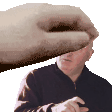 | Абдаджандадзе |
|  | Алиев |
| 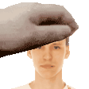 | Балакшин |
|  | Балканский |
|  | Бессмертный |
|  | Блохина |
|  | Бострикова |
|  | Быковский |
| 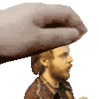 | Дурнев |
| 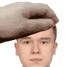 | Егошин |
|  | Гаврилов |
| 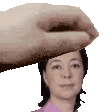 | Горбенко |
|  | Харитонова |
| 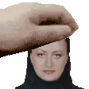 | Холодова |
|  | Карпов |
|  | Карташев |
| 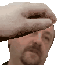 | Клименков |
| 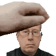 | Ключев |
|  | Коробков |
|  | Косяков |
|  | Кривоносов |
|  | Кудашов |
|  | Кугаевских |
|  | Малышева |
|  | Маркина |
|  | Миху |
|  | Николаев |
|  | Пастор |
|  | Пенской |
| 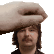 | Перл |
|  | Письмак |
|  | Погребняк |
|     | Поляков |
| 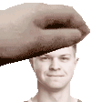 | Правдин |
|  | Птицын |
|  | Райла |
| 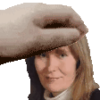 | Селина |
|  | Смирнов |
|  | Соснило |
|  | Свинцов |
|  | Сысоенко |
|  | Тропченко |
| 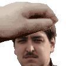 | Цопа |
|  | Жирков |

---

## Лицензия 

Проект доступен с открытым исходным кодом на условиях [Лицензии GNU GPL 3](https://opensource.org/license/gpl-3-0/). \
*Авторские права 2025 Max Barsukov*

**Поставьте звезду :star:, если вы нашли этот проект полезным.**
