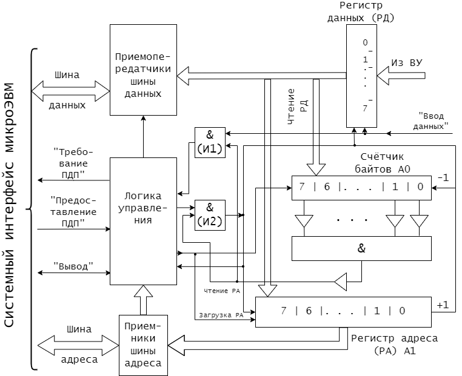

# Режим прямого доступа к памяти

Режим прямого доступа к памяти (**ПДП**, или **DMA** — *Direct Memory Access*) используется, если необходимо произвести пересылку значительного массива данных между ОЗУ и каким-либо внешним устройством. В этом режиме обмен данными между устройствами и основной памятью происходит без участия процессора. Реализация такой пересылки с помощью соответствующей программы обмена потребовала бы выполнения отдельной команды пересылки для передачи каждого байта или слова. При этом необходим определенный объем памяти для хранения программы, а также значительное время для ее выполнения.

Обменом информацией в режиме ПДП управляет не программа, выполняемая процессором, а электронные схемы, внешние по отношению к ядру процессора. Обычно схемы, управляющие обменом данными в режиме ПДП, размещаются или в специальном контроллере, который называется контроллером прямого доступа к памяти, или в контроллере самого внешнего устройства.

Обмен данными в режиме ПДП позволяет использовать в микропроцессорном устройстве быстродействующие внешние запоминающие устройства, поскольку ПДП может обеспечить время обмена одним байтом данных между памятью и внешним запоминающим устройством, равное циклу обращения к памяти, в отличие от процессора, которому может потребоваться больше времени, в частности, из-за подготовки и дешифрации команд.

Для реализации режима ПДП необходимо обеспечить непосредственную связь контроллера ПДП и памяти микропроцессорного устройства. Для этой цели можно было бы использовать специально выделенные шины адреса и данных, связывающие контроллер ПДП с основной памятью, но такое решение приведет к значительному усложнению устройства в целом, особенно при подключении нескольких внешних запоминающих устройств. Для сокращения количества линий в шинах микропроцессорного устройства контроллер ПДП подключается к памяти посредством уже имеющегося системного интерфейса. При этом возникает проблема совместного использования шин системного интерфейса процессором и контроллером ПДП. Можно выделить два основных способа ее решения: реализация обмена в режиме ПДП с захватом цикла и с блокировкой процессора.

Существуют две разновидности ПДП с захватом цикла:

1. Применяющий шину данных в те моменты, когда процессор ее не использует;
2. Применяющий дополнительные управляющие сигналы контроля обмена данными.

Первый способ организации ПДП состоит в том, что для обмена используются те машинные циклы процессора, в которых он не обменивается данными с памятью. В такие циклы контроллер ПДП может обмениваться данными с памятью, не мешая работе процессора. Однако возникает необходимость выделения таких циклов, чтобы не произошло временного перекрытия обмена ПДП с обменом, инициируемым процессором. В некоторых процессорах формируется специальный управляющий сигнал, указывающий циклы, в которых процессор не обращается к системному интерфейсу. При использовании других процессоров для выделения таких циклов необходимо применение в контроллерах ПДП специальных селектирующих схем, что усложняет их конструкцию.

Применение рассмотренного способа организации ПДП не снижает производительности микропроцессорной системы, но при этом обмен в режиме ПДП возможен только в случайные по отношению к устройству, формирующему запрос, моменты времени одиночными байтами или словами.

Второй способ организации ПДП с захватом цикла — принудительное отключение процессора от шин системного интерфейса. В этом случае системный интерфейс микропроцессорной системы дополняется двумя линиями для передачи управляющих сигналов запроса прямого доступа к памяти (ЗПДП) и разрешения прямого доступа к памяти (РПДП).

Управляющий сигнал ЗПДП формируется контроллером ПДП. Процессор, получив этот сигнал, приостанавливает выполнение очередной команды, выдает на системный интерфейс управляющий сигнал РПДП и отключается от шин системного интерфейса. Во время передачи информации по каналу ПДП процессор переводит схемы управления магистралями в высокоомное состояние и тем самым изолируется от остальной части системы. Состояния внутренних регистров замораживаются, т. е. процессор в режиме ожидания сохраняет то информационное состояние, которое было в нем к моменту удовлетворения запроса канала ПДП. С этого момента все шины системного интерфейса управляются контроллером ПДП. Контроллер ПДП, используя шины системного интерфейса, осуществляет обмен одним байтом или словом данных с памятью микропроцессорной системы и затем, сняв сигнал ЗПДП, возвращает управление системным интерфейсом процессору. Как только контроллер ПДП готов к обмену следующим байтом, он вновь «захватывает» цикл процессора и т. д. В интервалах между сигналами ЗПДП процессор продолжает выполнять команды программы. Тем самым выполнение программы замедляется, но в меньшей степени, чем при обмене в режиме прерываний.

Применение в микропроцессорной системе обмена данными с ВУ в режиме ПДП всегда требует предварительной подготовки, а именно: для каждого ВУ необходимо выделить область памяти, используемую при обмене, и указать ее размер, т. е. количество записываемых в память или читаемых из памяти байтов (слов) информации. Следовательно, контроллер ПДП обязательно должен иметь в своем составе регистр адреса (РА) и счетчик байтов (слов). Перед началом обмена с ВУ в режиме ПДП процессор должен выполнить программу загрузки. Эта программа обеспечивает запись в указанные регистры контроллера ПДП начального адреса выделенной ВУ памяти и ее размера в байтах или словах в зависимости от того, какими порциями информации ведется обмен.

Вышеизложенное не относится к начальной загрузке программ в память в режиме ПДП. В этом случае содержимое РА и счетчика байтов (слов) устанавливается переключателями или перемычками непосредственно на плате контроллера.

Блок-схема контроллера ПДП, обеспечивающего ввод данных в память микропроцессорной системы по инициативе ВУ в режиме ПДП с захватом цикла, приведена на *рис. 1*.

Перед началом очередного сеанса ввода данных из ВУ процессор загружает в регистры его контроллера следующую информацию: в счетчик байтов — количество принимаемых байтов данных; в РА — начальный адрес области памяти для вводимых данных. Тем самым контроллер подготавливается к выполнению операции ввода данных из ВУ в память микропроцессорной системы в режиме ПДП.

Байты данных из ВУ поступают в регистр данных (РД) контроллера в постоянном темпе. При этом каждый байт сопровождается управляющим сигналом из ВУ «Ввод данных», который обеспечивает запись байта данных в РД контроллера. По этому же сигналу и при ненулевом состоянии счетчика байтов контроллер формирует сигнал ЗПДП. По ответному сигналу процессора РПДП контроллер выставляет на шины адреса и данных системного интерфейса содержимое своих РА и РД соответственно. Формируя управляющий сигнал «Вывод», контроллер ПДП обеспечивает запись байта данных из своего РД в общую память. Сигнал РПДП используется в контроллере и для модификации счетчика байтов и РА. По каждому сигналу РПДП из содержимого счетчика байтов вычитается единица, и как только содержимое счетчика становится равным нулю, контроллер прекращает формирование сигналов ЗПДП.

На примере простого контроллера ПДП мы рассмотрели только процесс подготовки контроллера и непосредственно передачу данных в режиме ПДП. На практике любой сеанс обмена данными с ВУ в режиме ПДП всегда инициируется программой, выполняемой процессором, и включает два следующих этапа:

1. Этап подготовки ВУ к очередному сеансу обмена, когда процессор опрашивает состояние ВУ (проверяет его готовность к обмену) и посылает в ВУ команды, обеспечивающие подготовку ВУ к обмену. Затем выполняется загрузка регистров контроллера ПДП. На этом подготовка к обмену в режиме ПДП завершается, и процессор переключается на выполнение другой программы;
2. Этап обмена данными в режиме ПДП, который начинается после завершения подготовительных операций в ВУ по инициативе либо ВУ, как это было рассмотрено выше, либо процессора. В этом случае контроллер ПДП необходимо дополнить регистром состояния и управления, содержимое которого будет определять режим работы контроллера ПДП. Один из разрядов этого регистра будет инициировать обмен данными с ВУ. Загрузка информации в регистр состояния и управления контроллера ПДП производится программным путем. Наиболее распространенным является обмен в режиме ПДП с блокировкой процессора. В этом случае управление системным интерфейсом передается контроллеру ПДП не на время обмена одним байтом, а на время обмена блоком данных. Такой режим ПДП применяется в тех случаях, когда время обмена одним байтом с ВУ сопоставимо с циклом системной шины.
