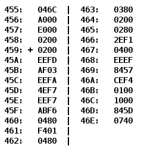

# Лабораторная работа #3

По выданному преподавателем варианту восстановить текст заданного варианта программы, определить предназначение и составить описание программы, определить область представления и область допустимых значений исходных данных и результата, выполнить трассировку программы.

**Ход работы, содержание отчета и контрольные вопросы описаны в методических указаниях.**

## Вариант 15311

- [Отчёт](./docs/report.pdf)
