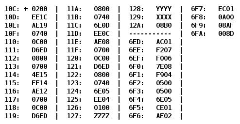

# Лабораторная работа #4

По выданному преподавателем варианту восстановить текст заданного варианта программы и подпрограммы (программного комплекса), определить предназначение и составить его описание, определить область представления и область допустимых значений исходных данных и результата, выполнить трассировку программного комплекса.

**Ход работы, содержание отчета и контрольные вопросы описаны в методических указаниях.**

## Вариант 19821

- [Отчёт](./docs/report.pdf)
