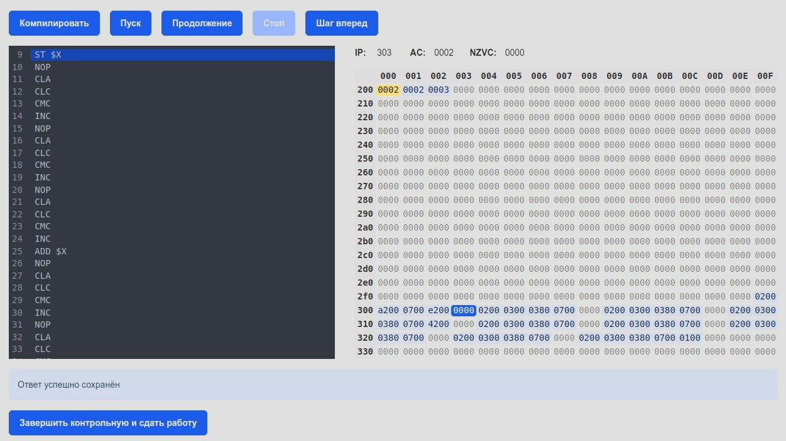

# Рубежная работа №3 по ОПД (2025)

## Задание

**2 варианта заданий**. Задания генерируются в зависимости от ИД студента и SID генератора, так что все варианты уникальны.

## Редактор

Синтаксис не подсвечивает и не подсказывает, но при пошаговом выполнении выделяет строку, на которую указывает IP. А если программа длинная, ещё и прокручивается до этой строки.

## Память

Решили отображать таблицей по 16 ячеек в ряду. Ячейки, значение которых не 0, выделены голубым. Синяя - положение IP, желтая - положение AR. Плюс там есть "умная" прокрутка, которая пытается показать кусок памяти таким образом, чтобы по возможности вместить в видимый фрейм IP, AR и адрес начала программы. Если не получается, приоритет у положения AR.

## Кнопки управления

- *Компиляция* - загружает программу в память, устанавливает положение IP, сохраняет текущее содержимое редактора (внизу видно сообщение о том, что ответ сохранён). В случае  ошибок под кнопками выводится желтое сообщение.
- *Пуск* - запускает программу, очищая перед этим регистры
- *Продолжение* - запускает с текущего IP без очистки регистров
- *Шаг вперед* - покомандное выполнение
- *Стоп* - в текущей реализации оказался не нужен, ниже объясню, почему.
- Кнопка "*Завершить контрольную и сдать работу*". Отменить это действия нельзя.

---

### Что важно знать

1. По кнопкам Пуск и Продолжение уходит запрос на сервер, в это время интерфейс не отображает процесс выполнения (ничего не подсвечивается и не прокручивается ни в редакторе, ни в памяти). Кнопки действий на время запроса должны блокироваться.

2. За один раз выполняется 1000 команд, если за это время программа не дошла до HLT, она прерывается. На клиент возвращается текущее состояние памяти и регистров, а также сообщение о том, что программа была прервана. Если студент уверен, что ошибок в коде нет, он может продолжить выполнение кнопкой Продолжить (ещё 1000 команд выполнится). Это контроль зацикливания программ + потребления ресурсов сервера. Собственно, поэтому Стоп никогда не актуален и не активен, но убирать кнопку пока не стала.

3. Значение ячеек памяти, а также IP, AC и флагов можно менять напрямую, ткнув в них курсором.
