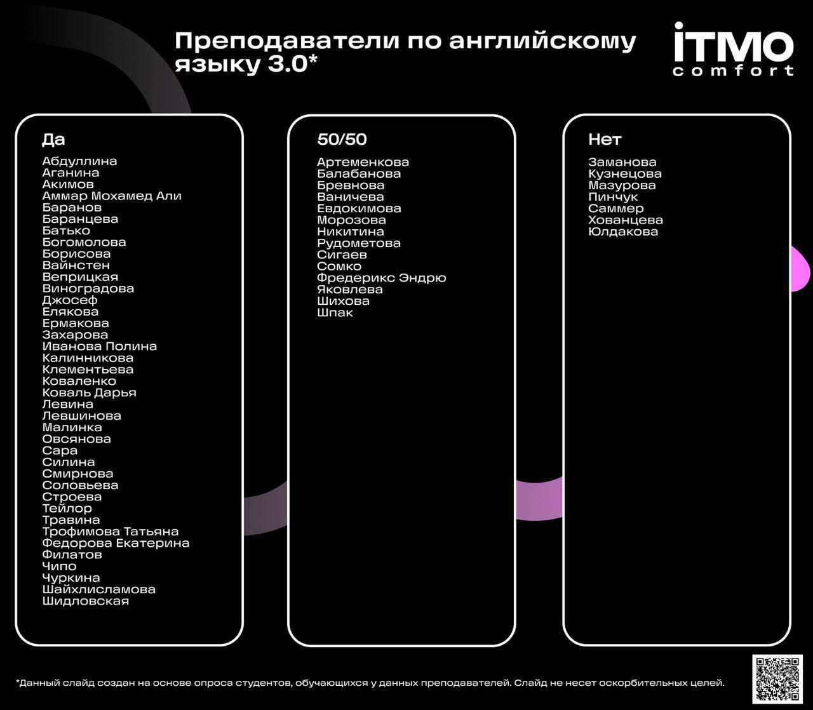

# Английский язык

> [!NOTE]
> London is the capital of Great Britain.

---

## Результаты

- 1 семестр (B1.2): **зачёт** (80/100 баллов);
- 2 семестр (B1.2): **зачёт** (78/100 баллов);
- 3 семестр (B2): **зачёт** (74/100 баллов);
- 4 семестр (B2): **зачёт** (69/100 баллов);
- 5 семестр (C1): **зачёт** (77/100 баллов);
- 6 семестр (C1): **зачёт** (73/100 баллов).

## Как выбрать преподавателя?

- [Отзывы на преподавателей английского](https://docs.google.com/spreadsheets/d/1RviqQKBDMehUyDSnRAdBELmzpu2oup0S0E4DRiFOA6A/edit?gid=2003242714#gid=2003242714) ([форма](https://docs.google.com/forms/d/e/1FAIpQLSepUz1X7kNBCxSn6TjspRml_zuD8ToNhmoseV7J7T3GgUf7pQ/viewform) для заполнения);
- [Отзывы на преподавателей (в том числе английского)](https://docs.google.com/spreadsheets/d/1XhGK-qY_Fk4U4uGpuOhLuWbsTqHXCgl4-h5gcN7-C7o/edit);
- [Отзывы на преподавателей (в том числе английского)](https://docs.google.com/spreadsheets/d/1TFTOKxqml1agwgo6Vp0Ql6Rgj9f9ciyOqQPF8VvUkJQ/edit?usp=drivesdk).

## Английский язык в профессиональной деятельности

На 3 курсе студенты, владеющие английским языком на уровне В1.2, могут выбрать не просто «Английский язык» (как предыдущие 2 года), а **«Английский язык в профессиональной деятельности»**.

Основное **отличие** в акценте на профессиональные темы (например, алгоритмы на английском, как проходить собеседования, как нетехническому специалисту объяснить техническую тему и т.д.), но в целом тот же английский.

Несколько мнений:
- «Намного лучше и интереснее обычного английского. Проходили всякие крутые фишки и сдавали их, типа использования AI, скорости печати на английском. Делали проект в команде и сдавали его (для других предметов, но презентовали его на английском), архитектуру на английском презентовали, чертили БД, учились материться правильно. Но мне кажется у нашей учительницы — [Дины Левиной](https://my.itmo.ru/persons/269155), строго рекомендую выбирать именно её — другая программа, потому что у нее муж айтишник вроде и она сама дает задания»;
- «Наверно чуть пополезнее относительно обычных англов, но зависит от препода. 6.5/10»;
- «Хренью страдали на этом профессиональном английском, очень сырой материал. Был какой-то план на [fltc.itmo.ru](https://fltc.itmo.ru) и мы по нему какие-то задания решали, какие-то домашки еще были, то есть без учебника. Мне вообще не понравилось, ну может еще из-за препода».

В общем, как и всегда, всё зависит от преподавателя, так что решайте сами, тем более что это не самый важный выбор за время обучения.

---

## Полезные ссылки

| Ссылка | Описание |
| --- | --- |
| [github.com/FutureXpo/Chrome-Extension-LMS-Answers](https://github.com/FutureXpo/Chrome-Extension-LMS-Answers) | Аддон к браузеру для автоматического прорешивания заданий в электронной рабочей тетради по английскому |

## Лицензия 

Проект доступен с открытым исходным кодом на условиях [Лицензии GNU GPL 3](https://opensource.org/license/gpl-3-0/). \
*Авторские права 2025 Max Barsukov*

**Поставьте звезду :star:, если вы нашли этот проект полезным.**
