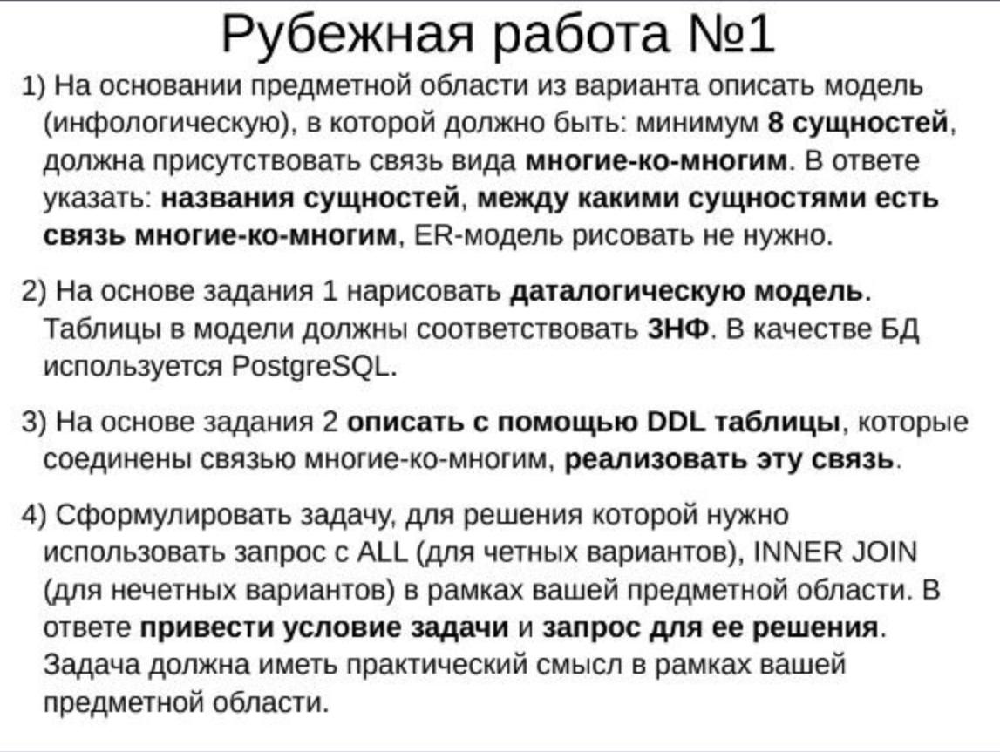

# Базы данных

## Рубежная работа

> [!TIP]
> Why did the DBA leave her wife? She found out it was a one-to-many relationship.

---

## Задание

- [Задание рубежки (2023)](./rubezh-23.pdf);
- [Задание рубежки (2025)](https://github.com/petrovviacheslav/myitmo/blob/main/Databases/rubezh1-25.pdf).

Всем выдают либо текст, либо просто тему для предметной области.

Давался всего **1 час**, при этом настоятельно рекомендую спешить, поскольку некоторые не успели приступить даже к третьему пункту.

### Вариант

Вариант определялся по **номеру ИСУ** (последняя цифра), поэтому всего было **10 вариантов**, в каждом из которых своя область, например, сервис по аренде самокатов/доставке еды, метеорологическая станция и т.д., в общем какая-то область человеческой деятельности.

### Вопросы

1) На основании предметной области из варианта продумать инфологическую модель (минимум **8 сущностей**, в одной из сущностей минимум **6 атрибутов**, связь вида **многие-ко-многим**) / Create model: 8 Entities, in one of entities – 6 attributes (minimum), Many-To-Many relationship.
2) Построить **даталогическую модель**. Описать **ограничения** для обеспечения целостности БД / Draw datalogical model, describe constraints.
3) Описать не менее **трех** связанных сущностей на языке **DDL** (+ ограничения целостности) / Write DDL: 3 Entities + constraints
4) Пример использования языка **DML** / Write DML example.
4) Напишите 2 или более примера использования языка DML (join, where, group by, order by) / Write DML example.
5) Создайте представление, которое позволяет узнать число записей в отношении, у которого 6 (или больше) атрибутов / Create view that counts number of records in relation with 6 (or more) attributes.
5) Создайте материализованное представление, которое позволяет узнать число записей в отношении, у которого 6 (или больше) атрибутов. Будет ли оно обновляться? Если нет, то как обновить его? / Create materialized view that counts number of records in relation with 6 (or more) attributes. How refresh it?

### Основные проблемы

1) Неудобная предметная область (у кого как), тяжело выделить много сущностей, но за 30 минут можно додумать и сделать хорошую диаграммку – просто надо буквально всё выдумать :grin:;
2) Слишком долго сидеть на 1 и 2 задании. Нет, в целом так и надо, просто советую сделать сразу же 4 и 5, ибо они простые и делаются за 2 минуты, а потом уже строить диаграммы и к ним на DDL создавать таблицы.

---

## Полезные ссылки

| Ссылка | Описание |
| --- | --- |
| [github.com/petrovviacheslav/myitmo/Databases/rubezh1-25.pdf](https://github.com/petrovviacheslav/myitmo/blob/main/Databases/rubezh1-25.pdf) | Полный текст задания от [*@AstroSoup*](https://github.com/AstroSoup) |

## Лицензия 

Проект доступен с открытым исходным кодом на условиях [Лицензии GNU GPL 3](https://opensource.org/license/gpl-3-0/). \
*Авторские права 2025 Max Barsukov*

**Поставьте звезду :star:, если вы нашли этот проект полезным.**
