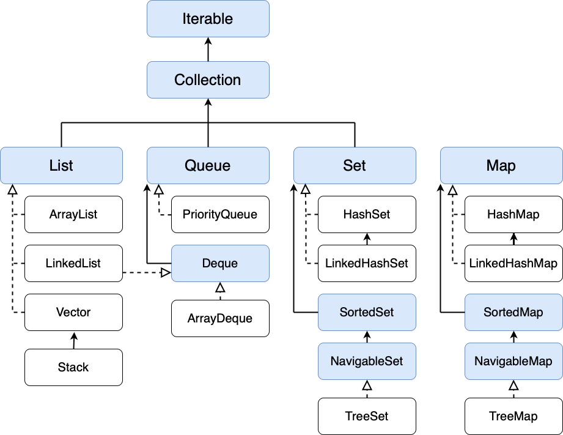

# Микроконтрольная №1

## Вариант 16 

### 1. Множественное наследование в Java.

Множественное наследование – способность создавать классы с множеством классов-родителей. В отличии от других  популярных объектно-ориентированных языков, вроде С++,  язык Java не поддерживает множественное наследование классов.

```
          SuperClass
     abstract doSomething()
        /           \
    ClassA        ClassB
  doSomething()  doSomething()
        \           /
            ClassC
      вызов doSomething()
```

Вызывается метод родительского класса, что приведет к неопределенности, так как компилятор не знает о том, метод  какого именно суперкласса должен быть вызван. Благодаря очертаниям диаграммы наследования классов в этой ситуации, напоминающим очертания граненого алмаза проблема получила название «проблема Алмаза».

### 2. Модификаторы доступа в Java.

Модификаторы доступа — это ключевые слова (или их отстутствие), которые регулируют уровень доступа к разным частям твоего кода.
`default` установлен по умолчанию и не обозначается ключевым словом

Всего в Java есть четыре модификатора доступа. Перечислим их в порядке от самых строгих до самых «мягких»:

- `private`: закрытый класс или член класса, противоположность модификатору public. Закрытый класс или член класса доступен только из кода в том же классе.
- `protected`: такой класс или член класса доступен из любого места в текущем классе или пакете или в производных классах, даже если они находятся в других пакетах
- Модификатор по умолчанию. Отсутствие модификатора у поля или метода класса предполагает применение к нему модификатора по умолчанию. Такие поля или методы видны всем классам в текущем пакете.
- `public`: публичный, общедоступный класс или член класса. Поля и методы, объявленные с модификатором public, видны другим классам из текущего пакета и из внешних пакетов.

### 3. Программа, выводящая список аргументов командной строки.

```java
public class Main {
    public static void main(String[] args) {
        for (int i = 0; i < args.length; i++) {
            System.out.println(args[i]);
        }
    }
}
```

## Вариант 27

### 1. Модель состояний потока в Java.


1. **New** (новорожденное состояние, newborn state) возникает, когда вы создаете объект Thread в классе Thread. Поток создается и находится в “новорожденном” состоянии. То есть при возникновении потока он входит в новое состояние, но метод start() при этом еще не вызван для экземпляра.

2. **Runnable**. Это состояние означает, что поток готов к выполнению. Когда метод start() вызывается для нового потока, он становится готовым к запуску. В данном состоянии поток ожидает, пока процессор не станет доступным (CPU time, процессорное время). То есть поток становится в очередь (серию) потоков, ожидающих выполнения.

3. **Running** (состояние выполнения). Выполнение означает, что процессор выделил временной интервал для выполнения потока. Это состояние, в котором поток выполняет свою фактическую функцию.

4. **Blocked** (заблокированное состояние). Поток находится в заблокированном состоянии, когда он приостанавливается, спит или ждет некоторое время, чтобы удовлетворить поставленное условие.

5. **Dead State**. Это состояние возникает, когда метод run() завершает выполнение инструкций. Поток автоматически останавливается или переходит в мертвое состояние (Dead State). Иными словами, когда поток выходит из метода run(), он либо завершается, либо переходит в состояние dead.

### 2. Виды полиморфизма в Java.

1. **Переопределение** (**Overriding**) методов. Он жк **полиморфизм времени выполнения** (или *динамический полиморфизм*). Ссылочная переменная суперкласса вызывает переопределенный метод. Как следует из названия «динамический», динамический полиморфизм происходит между разными классами, в отличие от статического полиморфизма. Динамический полиморфизм облегчает переопределение методов в Java, что является основой полиморфизма во время выполнения.
2. **Перегрузка** (**Overloading**, **Ad-hoc-полиморфизм**). Перегрузка — синтаксический механизм, позволяющий по единому идентификатору вызывать разные функции. Перегрузка метода означает, что в классе есть несколько методов, имеющих одинаковое имя, но разные типы / порядок / количество параметров.  Он же **полиморфизм времени компиляции** (или *статический полиморфизм*);
3. **Коварианты возвращаемых типов**. Начиная с Java SE 5 типы возвращаемых результатов из методов ковариантны (covariant). Это означает, что мы можем в переопределенном методе (overriden) в качестве типа результата использовать подтип результата переопределяемого метода (например, метод `clone`).

### 3. Программа, выводящая текущие время и дату.

```java
import java.time.LocalDateTime;
import java.time.format.DateTimeFormatter;

public class Main {
    public static void main(String[] args) {
        DateTimeFormatter formatter = DateTimeFormatter.ofPattern("EEEE, MMMM dd, yyyy HH:mm:ss");
        System.out.println("Current Date & Time: " + LocalDateTime.now().format(formatter));
    }
}
```

## Вариант 38

### 1. Примитивные и ссылочные типы.

В Java типы данных делят на две большие группы: примитивные и ссылочные. В состав примитивных типов (или просто примитивов) входят четыре подвида и восемь типов данных:
1. целые числа (`byte`, `short`, `int`, `long`);
2. числа с плавающей точкой (`float`, `double`);
3. логический (`boolean`);
4. символьный (`char`).

Ссылочные типы - это все остальные типы: классы, перечисления и интерфейсы, например, объявленные в стандартной библиотеке Java, а также массивы.

| Примитивные переменные | Ссылочные переменные |
| - | - |
| Хранят значение |	Хранят адрес объекта в памяти, на который ссылаются (отсюда и название). Используются для доступа к объектам (его нельзя получить, если на объект нет ссылки)|
| Создаются присваиванием значения | Создаются через конструкторы классов (присваивание только создаёт вторую ссылку на существующий объект)|
|Имеют строго заданный диапазон допустимых значений | По умолчанию их значение — null|
| В аргументы методов попадают копии значения переменной (это передача по значению)|В методы передаётся значение ссылки — операция выполняется над оригинальным объектом, на который ссылается переменная. Могут использоваться для ссылки на любой объект объявленного или совместимого типа |

Если требуется создать ссылку на один из примитивных типов данных, необходимо использовать соответствующий класс-обертку. Также в таких классах есть некоторые полезные методы и константы, например минимальное значение типа int можно узнать использовав константу Integer.MIN_VALUE. Оборачивание примитива в объект называется упаковкой (boxing), а обратный процесс распаковкой (unboxing).

С Java 5 у вас есть понятие, называемое «автобокс». Это означает, что оболочка может автоматически «упаковывать» примитивную переменную в объектную версию или «распаковывать» объектный примитив. В зависимости от того, что требуется.

### 2. Блоки инициализации.

Блоки инициализации используются для инициализации переменных внутри класса.

Существует всего два типа блоков:
- **нестатический** (*instance* initializer) `{}`;
- **статический** (*class* initializer) `static {}`;

Класс может иметь любое количество статических блоков инициализации, и они могут появляться в любом месте тела класса. Система времени выполнения гарантирует, что статические блоки инициализации вызываются в том порядке, в котором они появляются в исходном коде.

Как можно догадаться по названию, статический блок используется для инициализации статических переменных, а "обычный" - для всех остальных.

Обычно вы помещаете код для инициализации переменной экземпляра в конструктор. Существует две альтернативы использованию конструктора для инициализации переменных экземпляра: блоки инициализатора и конечные методы.

Компилятор Java копирует блоки инициализатора в каждый конструктор. Следовательно, этот подход можно использовать для совместного использования блока кода несколькими конструкторами.

### 3. Программа, записывающая строку "Hello!" в файл world.txt.

```java
import java.io.PrintWriter;

public class Main {
    public static void main(String[] args) {
        try (PrintWriter out = new PrintWriter("world.txt")) {
            out.println("Hello!");
        } catch(Exception e) {
            System.out.println(e.getMessage());
        }
    }
}
```

## Вариант 49

### 1. Классификация потоков ввода/вывода.

Находятся в пакете `java.io`.
Потоки ввода/вывода (streams) в Java IO являются блокирующими (синхронными).

1. Потоки делятся по направлению: потоки ввода и потоки вывода
2. Потоки делятся по типу данных: работают с байтами или работают с символами.

| | Поток ввода | Поток вывода |
|-|-| - |
| Работает с байтами | InputStream | OutputStream |
| Работает с символами |Reader | Writer |

Если объект реализует интерфейс **InputStream**, значит, он поддерживает последовательное чтение из него байт (**byte**).

Если объект реализует интерфейс **OutputStream**, значит, он поддерживает последовательную запись в него байт (**byte**).

Если объект реализует интерфейс **Reader**, значит, он поддерживает последовательное чтение из него символов (**char**).

Если объект реализует интерфейс **Writer**, значит, он поддерживает последовательную запись в него символов (**char**).

### 2. Ключевое слово import.

Ключевое слово `import` в Java полезно для использования класса или всех классов, видимых для программы, указанной в пакете.

Оператор импорта не является обязательным, и мы можем использовать полное имя класса для ссылки на класс или пакет в программе. Этот метод сообщает компилятору, что класс определен в определенном пакете, и мы хотим использовать этот класс или классы в нашей программе. Каждый раз, когда мы хотим использовать член данных или функцию-член, определенную в классе, нам нужно обращаться к нему, используя полное имя. Это увеличивает размер кода нашей программы и, следовательно, делает ее менее читаемой.
Например, `java.util.ArrayList<String> arrayList = new java.util.ArrayList<String>();`.

Также возможно импортировать все доступные классы и интерфейсы именованного пакета, класса или интерфейса по мере необходимости, указав каноническое имя пакета, класса или интерфейса, например `import java.util.*;`

Также существует `import static`, который позволяет всякий раз, когда вы используете статический класс, статическую переменную или перечисление, вы можете импортировать их и избавить себя от необходимости вводить текст.
Например,
```java
import static java.lang.System.out;
import static java.lang.Math.*;
...
out.println("min " + min(60,102));
```

### 3. Программа, выводящая в консоль количество переданных ей аргументов.

```java
public class Main {
    public static void main(String[] args) {
        System.out.println(args.length);
    }
}
```

## Вариант 50

### 1. Массивы и коллекции.

#### Массивы

Массив – самая простая и наиболее широко используемая структура.
Коллекции `Java Сollections Framework` являются производными от массивов.

`Java Collections Framework` — это набор связанных классов и интерфейсов, реализующих широко используемые структуры данных — Коллекции.
Он был спроектирован и разработан, в первую очередь, Джошуа Блохом.

Массив – это структура данных, состоящая из упорядоченных ячеек, расположенных друг за другом в памяти, которые могут хранить в себе элементы только одного, заранее заданного типа.

Может хранить данные примитивных типов, строки (String) и ссылки на объекты класса.

```java
int[] numbers = new int[100];         // массив чисел на 100 ячеек
```

Размер массива задается при его создании.
Тип данных и длину массива в дальнейшем изменить нельзя.

Элементы массива доступны по индексу ячейки.
Значение по умолчанию для ячеек – null, 0 или false
Отсчет индексов ведется от 0

В памяти элементы массива размещаются в едином блоке.
Это сделано для более эффективного и быстрого доступа к ним.

Массивы бывают одномерные и многомерные.

``` java
int[][] numbers = new int[3][];                    // двумерный массив

String[][][] threeDimArray = new String[3][][];    // трехмерный массив

String[][] strings = new String[3][5];	           // таблица 3 столбца 5 строк
```

Класс `Arrays` содержит различные статические методы для работы с Массивами (например, сортировка и поиск).

#### Коллекции



Два главных интерфейса коллекций – Collection и Map

Интерфейс `Collection` наследует интерфейс `Iterable`, который имеет один метод `Iterator<T> iterator()`, позволяет последовательно обходить элементы.

```java
public interface Collection<E> extends Iterable<E>
```

`Map` не наследует интерфейс Collection, но входит в состав Java Collections Framework.
Map хранит данные в виде пары ключ – значение.

Интерфейс Collection расширяет интерфейс Iterable – благодаря этому все классы наследники Collection могут получить Итератор.

```java
public interface Collection<E> extends Iterable<E>
```

Этот интерфейс содержит основные методы, для работы с коллекциями.
Поэтому общие принципы работы с коллекциями будут общие для всех его классов наследников.
`add`, `addAll`, `clear`, `contains`, `containsAll`, `isEmpty`, `remove`, `removeAll`, `retainAll`, `size`, `stream`, `toArray`.

Интерфейс List расширяет интерфейс Collection.
Используется для создания простых списков.

ArrayList поддерживает динамические массивы.
По мере добавления элементов в список, емкость внутреннего массива автоматически увеличивается.

LinkedList использует для хранения двусвязный список.
Поэтому Итератор поддерживает обход в обе стороны.

Класс Vector является реализацией динамического массива – похож на ArrayList.
Но в отличие от ArrayList, класс Vector синхронизирован, а размер его внутреннего массива увеличивается в 2 раза.

Класс Stack является подклассом Vector.
Представляет собой стек объектов last-in-first-out (LIFO).

Интерфейс Queue расширяет Collection.
Определяет поведение класса в качестве однонаправленной очереди.
Работает по принципу first-in-first-out (FIFO).

Класс PriorityQueue – очередь с приоритетами.

Интерфейс Deque расширяет интерфейс Queue – появился в Java 6.
Определяет поведение двунаправленной очереди.

Класс ArrayDeque представляет обобщенную двунаправленную очередь, наследуя функционал от класса AbstractCollection и реализуя интерфейс Deque.

Set – это множество однотипных элементов.
Добавляет ограничение, которое запрещает повторяющиеся элементы.

Класс HashSet реализует интерфейс Set. Основан на хэш таблице, элементы не упорядочены, порядок элементов может меняться, под капотом HashMap с заглушками значений

LinkedHashSet поддерживает связанный список элементов множества, в том порядке, в котором они были добавлены.
Это позволяет выполнять упорядоченную итерацию по множеству.

Интерфейс SortedSet расширяет интерфейс Set
Описывает упорядоченное множество, отсортированное в возрастающем порядке или по порядку, заданному реализацией интерфейса Comparator.

Интерфейс NavigableSet появился в Java 6.
Расширяет SortedSet и добавляет методы для более удобного поиска по коллекции.

Класс TreeSet реализует интерфейс NavigableSet, который поддерживает элементы в отсортированном по возрастанию порядке.

По умолчанию под капотом Map массив на 16 buckets (корзин)
Внутри каждого бакета данные хранятся в LinkedList
Массив автоматически расширяется: 16 – 32 – 64

HashMap использует хэш - таблицу, в которой ключи отсортированы относительно значений их хэш-кодов.

LinkedHashMap расширяет HashMap.
Поддерживает связанный список записей в том порядке, в котором они добавлены.
Это позволяет организовать итерацию по карте в порядке вставки.

Реализация интерфейса Map со слабыми ключами.
Запись в WeakHashMap будет автоматически удалена GK по ключу, ссылка на который вышла из области видимости приложения (ключ со слабой ссылкой).

По-умолчанию TreeMap сортируется по ключам с использованием принципа натуральной сортировки, но это поведение может быть настроено под конкретную задачу при помощи объекта класса Comparator.

Concurrent Collections – это набор коллекций, более эффективно работающих в многопоточной среде чем стандартные коллекции из пакета java.util

Вместо базового враппера (обертки) Collections.synchronizedCollection с блокированием доступа ко всей коллекции используются блокировки по сегментам данных или же оптимизируется работа для параллельного чтения данных по wait-free алгоритмам.

Пакет `java.util.concurrent` предоставляет реализации Конкурентных коллекций:


### 2. Классы StringBuilder и StringBuffer.

`StringBuffer` – потокобезопасный, а ``StringBuilder`` нет.

Для работы со строками в Java есть три основных класса: `String`, `StringBuilder` и `StringBuffer`.

Классы `StringBuilder` и `StringBuffer` во многом похожи. Оба класса являются мутабельными, то есть содержимое строки может быть изменено после ее создания.
Они также имеют схожие конструкторы и методы, позволяющие выполнять конкатенацию строк, вставку, удаление и многое другое.
Они даже наследуются от одного класса `AbstractStringBuilder`.

`StringBuilder` быстрее `StringBuffer` в однопоточных приложениях, так как не имеет встроенных механизмов синхронизации. Однако это также означает, что он не является потокобезопасным и не должен использоваться в многопоточных средах, если не приняты дополнительные меры по синхронизации.

С точки зрения производительности, `StringBuilder` обычно быстрее `StringBuffer`, поскольку не имеет накладных расходов на синхронизацию. Однако в большинстве приложений разница в скорости обычно незначительна, и выбор между этими двумя классами должен быть основан на том, является ли безопасность потоков проблемой.


### 3. Программа, записывающая содержимое файла in.txt в файл out.txt.

```java
import java.io.*;
 
public class Main { 
    public static void main(String[] args) {
        try (BufferedReader in = new BufferedReader(new InputStreamReader(new FileInputStream("in.txt")));
             PrintWriter out = new PrintWriter(new OutputStreamWriter(new FileOutputStream("out.txt")))
        ) {
            String line;
            while((line = in.readLine()) != null) {
                out.println(line);
            }
        } catch (IOException e) {
            System.out.println(e);
        }
    }
}
```
