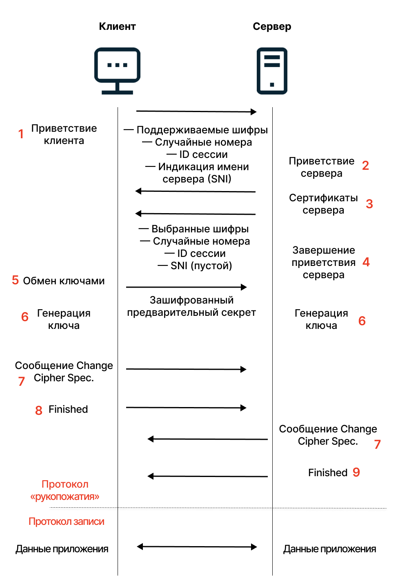

# Микроконтрольная №2

## Вариант 02468

### 1. Отличия протокола http от протокола https.

Основное отличие HTTP и HTTPS — шифрование данных. При использовании HTTP данные передаются в открытом виде, что небезопасно. При передаче данных по протоколу HTTP их может перехватить злоумышленник с помощью атаки Man-in-the-Middle. Чтобы злоумышленники не перехватили конфиденциальную информацию, сайты используют протокол HTTPS, который шифрует данные.

HTTPS — это не совсем протокол. Это расширение HTTP-протокола — объединение двух протоколов: HTTP и SSL или HTTP и TLS. 

Протоколы **TLS** (**Transport Layer Security**) и **SSL** (***Secure Socket Layer***) — криптографические. Это значит, что они позволяют шифровать данные, в нашем случае те, что передаются между браузером и сервером. Расшифровать эти данные могут только сервер и браузер, для всех остальных это будет набор нечитаемых символов.

У ресурса/сайта, поддерживающего HTTPS, есть SSL/TLS-сертификат, который выдается центром сертификации.

Как правило, SSL/TLS-сертификат — это подтверждение, что ресурс настоящий. Но могут быть исключения: сертификат может быть выдан легитимным центром на фишинговый сайт. В таком случае важно совпадение CN в сертификате с доменным именем сайта и уверенность пользователя в этом имени.

Перед тем как запустить HTTP-соединение, браузер обращается к серверу, чтобы наладить защищенное соединение. Сервер отправляет копию сертификата безопасности в ответ. 

Браузер проверяет данные по своим спискам доверенных центров (список есть в каждом браузере), проверяет совпадение CN с доменным именем, даты выпуска и срока окончания сертификата, отсутствие в CRL, поддерживаемые алгоритмы, наличие издателя в списке доверенных корневых сертификатов и в списке доверенных издателей. В случае проблем на любой из этих проверок сертификат считается невалидным.

Если все хорошо, то браузер считает ресурс безопасным: они выбирают алгоритм шифрования, обмениваются ключом шифрования и потом данными по протоколу HTTP. Схематически это выглядит так:




### 2. В каких типах приложений логично использовать RPC, и почему?

Удаленный вызов процедур (RPC) — это одна из простейших парадигм API, в которой клиент вызывает исполнение блока кода на сервере. В то время как REST рассматривает всё как ресурсы, RPC рассматривает действия. Клиенты обычно передают имя метода и аргументы серверу и получают обратно JSON или XML.

- **Удаленный вызов**: Вызов функции в RPC осуществляется клиентом на удаленном сервере так, как если бы она была вызвана локально.
- **Передача параметров**: Клиент обычно передает параметры в серверную функцию, аналогично локальной функции.
- **Заглушки**: Функции-заглушки существуют как на стороне клиента, так и на стороне сервера. На стороне клиента они вызывают функцию, а на стороне сервера – фактическую функцию.

Тогда как REST API обычно используется для выполнения операций создания, чтения, обновления и удаления (CRUD) объекта данных на сервере, **RPC** обычно используется для вызова удаленных функций на сервере, требующих результата действия. Этот сервис можно использовать, когда требуются сложные вычисления или вы хотите запустить удаленную процедуру на сервере, скрыв процесс от клиента.

Ниже перечислены действия, для которых RPC подходит наилучшим образом.

- Съемка с помощью камеры удаленного устройства.
- Использование на сервере алгоритма машинного обучения для выявления мошенничества.
- Перевод денег с одного счета на другой в системе дистанционного банковского обслуживания.
- Удаленный перезапуск сервера.

RPC — подходящий выбор для отправки команд в удаленную систему. Например, Slack API очень командно-ориентирован: зайти на канал, покинуть канал, отправить сообщение. Разработчики Slack API как раз и смоделировали его в стиле RPC, сделав его маленьким, компактным и простым в использовании.

Что касается gRPC, в большинстве сторонних инструментов по-прежнему отсутствуют встроенные функции для совместимости с gRPC. Таким образом, gRPC в основном используется для создания внутренних систем, то есть инфраструктуры, закрытой для внешних пользователей. С учетом этого предостережения, API-интерфейсы gRPC могут быть полезны в следующих случаях:
- Соединения с микросервисами: связь с низкой задержкой и высокой пропускной способностью gRPC делает его особенно полезным для подключения архитектур, состоящих из легких микросервисов, где эффективность передачи сообщений имеет первостепенное значение.
- Системы где используется несколько языков программирования: благодаря поддержке генерации собственного кода для широкого спектра языков разработки, gRPC отлично подходит для управления соединениями в среде с наличием нескольких языков.
- Потоковая передача в реальном времени: когда требуется связь в реальном времени, способность gRPC управлять двунаправленной потоковой передачей позволяет вашей системе отправлять и получать сообщения в режиме реального времени, не дожидаясь ответа отдельного клиента.
- Сети с низким энергопотреблением и низкой пропускной способностью: использование gRPC сериализованных сообщений Protobuf обеспечивает легкий обмен сообщениями, большую эффективность и скорость для сетей с ограниченным диапазоном пропускания и маломощных сетей (особенно по сравнению с JSON). Интернет вещей может быть примером такой сети, в которой могут быть полезны API gRPC.

### 3. Код, к которому применится CSS-селектор `a + b > p`.

- **Селектор** `+`: Позволяет выбрать элемент, который идет сразу же после указанного элемента;
- **Селектор** `>`: Позволяет выбрать только тот элемент, который является прямым потомком указанного элемента.

```css
a + b > p {
  color: red;
}
```

То есть селектор применится к элементу `p` прямому потомку элемента `b`, следующему после элемента `a`.

```html
<a href="google.com">
    <b>1</b>
</a>
<b>
    2
    <p>3</p>
    <u>
        <p>4</p>
    </u>
</b>
<b>
    <p>5</p>
</b>
```

То есть, из кода выше стили применятся только к `<p>3</p>`.

## Вариант 13579

### 1. Отличия метода `POST` от метода `PUT`.

Разница между `PUT` и `POST` - это вопрос семантики.
Всегда можно поменять `PUT` и `POST` местами, и работоспособность приложения не изменится.
Коль скоро для операций используются разные глаголы, то и смысл у них должен быть разным.

В соответствии со стандартом `RFC 2616` метод `POST` следует использовать для запроса на сервер принять вложенный объект в качестве подчиненного существующего ресурса, идентифицированного `Request-URI`. Это означает , что вызов метода `POST` создаст дочерний ресурс в наборе ресурсов.

С другой стороны, следует использовать метод `PUT`, чтобы запросить у сервера сохранение вложенного объекта под предоставленным `Request-URI`. Если `Request-URI` указывает на существующий ресурс на сервере, предоставленный объект будет считаться измененной версией существующего ресурса. Следовательно, вызов метода `PUT` либо создаст новый ресурс, либо обновит существующий .

Другое важное различие между методами заключается в том, что `PUT` является **идемпотентным** методом, а `POST` — нет . Например, многократный вызов метода `PUT` либо создаст, либо обновит один и тот же ресурс. Напротив, несколько запросов `POST` приведут к созданию одного и того же ресурса несколько раз.

### 2. В чём разница между селекторами `a#id` и `a.id`?

Селектор `a#id` применит стили к элементу `a` с идентификатором `id="id"`, а `a.id` к элементу `a` с классом `class="id"`.

### 3. HTML-форма, отправляющая на URL https://google.com/secure методом GET массив адресов электронной почты и паролей пользователей.

```html
<form action="https://google.com/secure" method="get">
    <label>User 1</label>
    <br/>
    <input type="email" name="emails[]">
    <input type="password" name="passwords[]">
    <br/>

    <label>User 2</label>
    <br/>
    <input type="email" name="emails[]">
    <input type="password" name="passwords[]">
    <br/>

    <label>User 3</label>
    <br/>
    <input type="email" name="emails[]">
    <input type="password" name="passwords[]">
    <br/>

    <button type="submit">Submit</button>
</form>
```
На PHP-сервере в `$_GET['emails']` будет находиться массив электронных почт, а в `$_GET['passwords']` — массив паролей.

<details>
  <summary>Более правильный вариант</summary>

```html
<!DOCTYPE html>
<html>
<head>
  <title>Email and Password Form</title>
</head>
<body>

  <form id="myForm" action="http://www.example.com/secure" method="GET">
    <label for="email">Email:</label>
    <input type="text" id="email" name="currentEmail"><br>
    
    <label for="password">Password:</label>
    <input type="password" id="password" name="currentPassword"><br>
    
    <input type="submit" value="Submit">
  </form>

  <script>
    // Имеющиеся массивы email и паролей
    let emails = ['email1@example.com', 'email2@example.com'];
    let passwords = ['pass1', 'pass2'];

    // Перехват события submit
    document.getElementById('myForm').addEventListener('submit', function(event) {
      event.preventDefault();  // Предотвратить стандартное поведение формы

      // Добавляем текущие значения в массивы
      const email = document.getElementById('email').value;
      const password = document.getElementById('password').value;

      emails.push(email);
      passwords.push(password);

      // Формируем новый URL для GET-запроса
      const emailString = emails.join(',');
      const passwordString = passwords.join(',');

      const newActionURL = `${this.action}?emails=${emailString}&passwords=${passwordString}`;
      
      // Отправляем запрос
      window.location.href = newActionURL;
    });
  </script>

</body>
</html>
```

Однако удачи написать хотя бы половину этого на микрокр.
</details>
