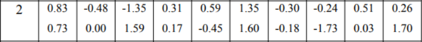

# Практическая работа №5

## Вариант `2`

> Вчера, на симпозиуме по высшей математике Автандил Гогоберидзе опроверг
> теорию вероятностей при помощи трех наперстков и одного шарика.

|.pdf|.docx|
|--- | --- |
| [report](./docs/report.pdf) | [report](./docs/report.docx) |

### Задание

- [_Практическая работа 5.pdf_](./docs/Практическая%20работа%205.pdf)

Каждый студент получает выборку из **20 чисел**.

Необходимо определить следующие статистические характеристики:

- вариационный ряд,
- экстремальные значения,
- размах,
- оценки математического ожидания,
- среднеквадратического отклонения,
- эмпирическую **функцию распределения** и её **график**,
- **гистограмму** и **полигон** приведенных частот группированной выборки.

Для расчета характеристик и построения графиков нужно написать **программу на одном из языков
программирования**. Листинг программы и результаты работы должны быть представлены в отчете
по практической работе

### Варианты исходных данных

В таблице **15** строк и **10** столбцов. Адрес каждой ячейки задается парой чисел – 
номером строки и номером столбца.

Вариант исходных данных определяем по номеру в журнале следующим образом:

| № студента в списке группы | Адреса 10 ячеек из таблиц исходных данных |
| --- | --- |
| 1 | `(1, 16) - (1, 25)` |
| 2 | `(2, 16) - (2, 25)` |
| ... | ... |
| 15 | `(15, 16) - (15, 25)` |
| 16 | `(1, 16) - (1, 20), (2, 16) - (2, 20)` |
| 17 | `(2, 16) - (2, 20), (3, 16) - (3, 20)` |
| ... | ... |
| 20 | `(5, 16) - (5, 20), (6, 16) - (6, 20)` |
| ... | ... |
| 25 | `(10, 16) - (10, 20), (11, 16) - (11, 20)` |

### Как запустить?

Изменить файл `src/main/resources/input.txt`, содержащий выборку чисел.

Запустить:

    ./gradlew run

## Лицензия 

Проект доступен с открытым исходным кодом на условиях [Лицензии MIT](https://opensource.org/licenses/MIT).
*Авторские права 2023 Max Barsukov*

**Поставьте звезду :star:, если вы нашли этот проект полезным.**
