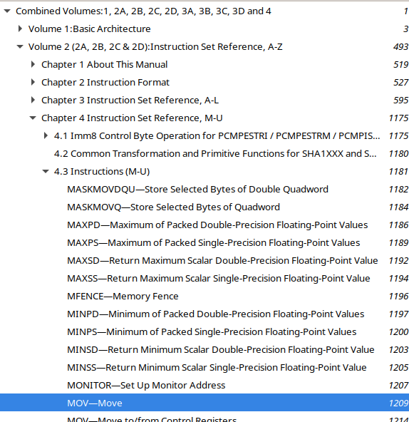

# Assignment: Input/Output library in assembly
---
Лабораторная работа: библиотека ввода-вывода на Assembler

Реализуйте библиотеку процедур, которые будут выполнять простые действия со строками, числами и их текстовыми представлениями.

# Подготовка

* Прочитайте первые две главы "Low-level programming: C, assembly and program execution".

* Ознакомьтесь с [документацией на следующие инструкции](https://gitlab.se.ifmo.ru/programming-languages/cse-programming-languages-fall-2021/main/-/blob/main/docs/intel-manual.pdf).

  - `xor`
  - `jmp`, `ja` и другими командами условного перехода
  - `cmp`
  - `mov`
  - `inc`, `dec`
  - `add`, `imul`, `mul`, `sub`, `idiv`, `div`
  - `neg`
  - `call`, `ret`
  - `push`, `pop`
  
  Документация &mdash; огромный документ. В просмотрщике PDF файлов найдите панель с оглавлением документа; там ищите второй том "Instruction Set Reference", где для каждой инструкции есть отдельная страничка.

 

* Прочитайте документацию на системный вызов `read` с помощью `man`. Его номер (который кладётся в `rax`) 0.

# Написание

- Впишите в `lib.inc` код вместо заглушек функций. По возможности переиспользуйте уже реализованные функции.
- Используйте `test.py` чтобы протестировать работу. 

Скрипт `test.py` будет генерировать исполняемый файл с тестом для каждой функции, вы можете отладить его; также см. Appendix A в "Low-level programming: C, assembly and program execution".
 
# Список распространённых ошибок

- Для строки размером `n` байт необходимы `n+1` байт из-за нуль-терминатора.
- Метки функций должны быть глобальными, остальные &mdash; локальными.
- Регистры не хранят ноль "по умолчанию".
- Если вы используете callee-saved регистры, вы должны сохранить их значения.
- Если вы используете caller-saved регистры, вы должны сохранить их значения перед `call` и затем восстанавливать.
- Не используйте буферы в секции `.data`. Вместо этого аллоцируйте место в стеке, уменьшая значение `rsp`.
- Функции принимают аргументы в `rdi`, `rsi`, `rdx`, `rcx`, `r8` и `r9`.
- Не выводите числа символ за символом. Сформируйте строку в памяти и вызовите `print_string`.
- Проверьте, что `parse_int` и `parse_uint` корректно устанавливают `rdx` (очень важно для следующего задания)
- Проверьте, что функции `parse_int`, `parse_uint` и `read_word` правильно работают когда ввод завершается с помощью `Ctrl-D`.
- При использовании стека надо не забывать уменшать `rsp`.
- Обратные кавычки позволяют использовать специальные символы в С-стиле (`\n`, `\t`).

Код решения занимает порядка 250 строк.

