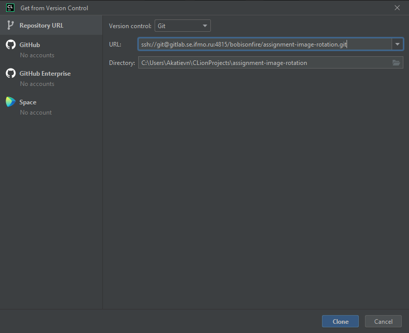
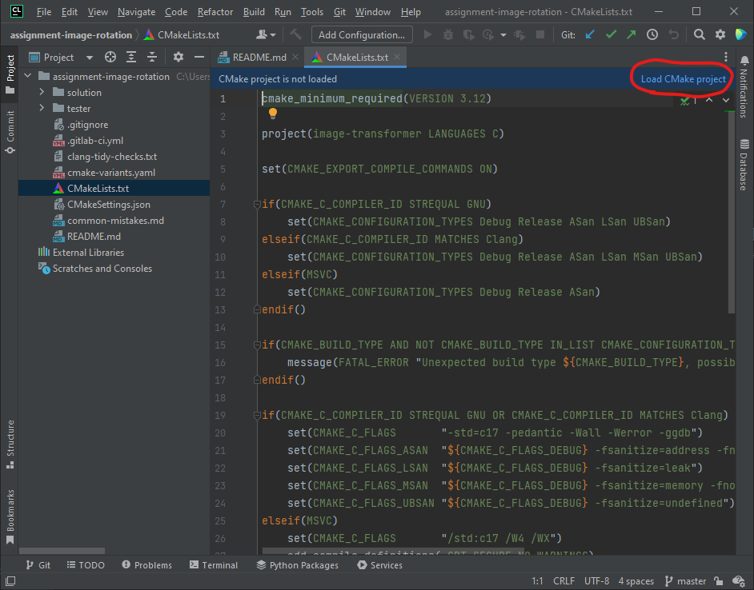
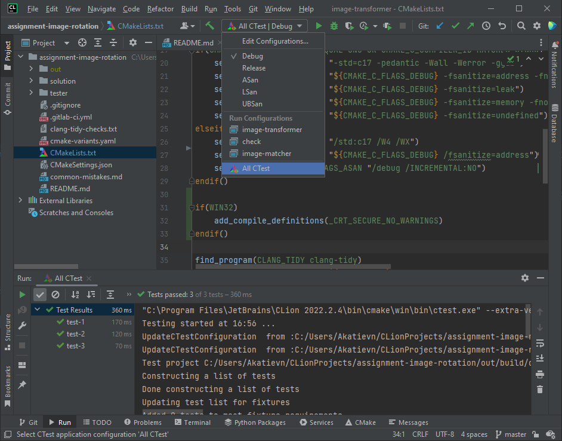

# Разработка с CLion

## 1. Выберите и склонируйте ваш форк с GitLab

## 2. В окне проекта, выберите `CMakeLists.txt` на панели слева

Сверху окна с редактором появится подсказка, предлагающая загрузить CMake в проект. Нажмите **`Load CMake project`**.

В окне сборки может появиться ошибка, например: `Unexpected build type MSan, possible values: Debug;Release;ASan;LSan;UBSan`.
Она означает, что данной конфигурации на вашей ОС или с вашим компилятором не предусмотрено,
но разработке с другими конфигурациями она не помешает.

## 3. Выберите необходимую конфигурацию в раскрывающемся списке

- **`Debug`** быстро компилируется и подходит для разработки.
- **`ASan, LSan, MSan, UBSan`** подходят для отладки ошибок сегментации и других проблем с памятью. Рекомендуется 
  запустить ваш код с санитайзерами перед отправкой на проверку!
- **`Release`** нужен для сборки кода с оптимизациями и проверки скорости выполнения.

В качестве цели для сборки выберите **`All CTest`**. Теперь вы можете собирать проект и
запускать его через кнопки сверху справа как обычно.

Если при сборке вы получили ошибку вроде `C:\CLion 2022.2.4\bin\mingw\bin/ld.exe: cannot find -lasan`, значит, у вас
нет нужной библиотеки для запуска данного профиля. Можете просто выбрать другую конфигурацию.
