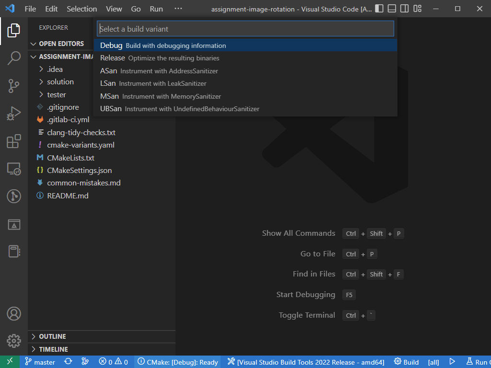

# Разработка с Visual Studio Code

Для разработки требуются расширения:

- **`CMake`** от `twxs` 
- **`CMakeTools`** от `Microsoft` 
- **`C/C++`** от `Microsoft` 

Перезагрузите VSCode после установки расширений.

## 1. Выберите и склонируйте ваш форк с GitLab

## 2. В окне проекта, выберите компилятор

VSCode предложит выбрать компилятор при открытии проекта. Если он этого не сделал,
кликните по кнопке с гаечным ключом на нижней панели.

На Windows, вероятнее всего, вам нужен компилятор `Visual Studio` с версией `amd64`.

## 3. Выберите конфигурацию на нижней панели

- **`Debug`** быстро компилируется и подходит для разработки.
- **`ASan, LSan, MSan, UBSan`** подходят для отладки ошибок сегментации и других проблем с памятью. Рекомендуется 
  запустить ваш код с санитайзерами перед отправкой на проверку!
- **`Release`** нужен для сборки кода с оптимизациями и проверки скорости выполнения.

На той же нижней панели, используйте кнопку **`Build`** для сборки кода и **`Run CTests tests`** для запуска тестов.

Если во время сборки вы видите ошибку вроде `...\Microsoft.CppBuild.targets(457,5): error MSB8013: This project doesn't contain the Configuration and Platform combination of MSan|x64`, это означает что выбранная конфигурация на вашей системе не поддержана - выберите другую.
