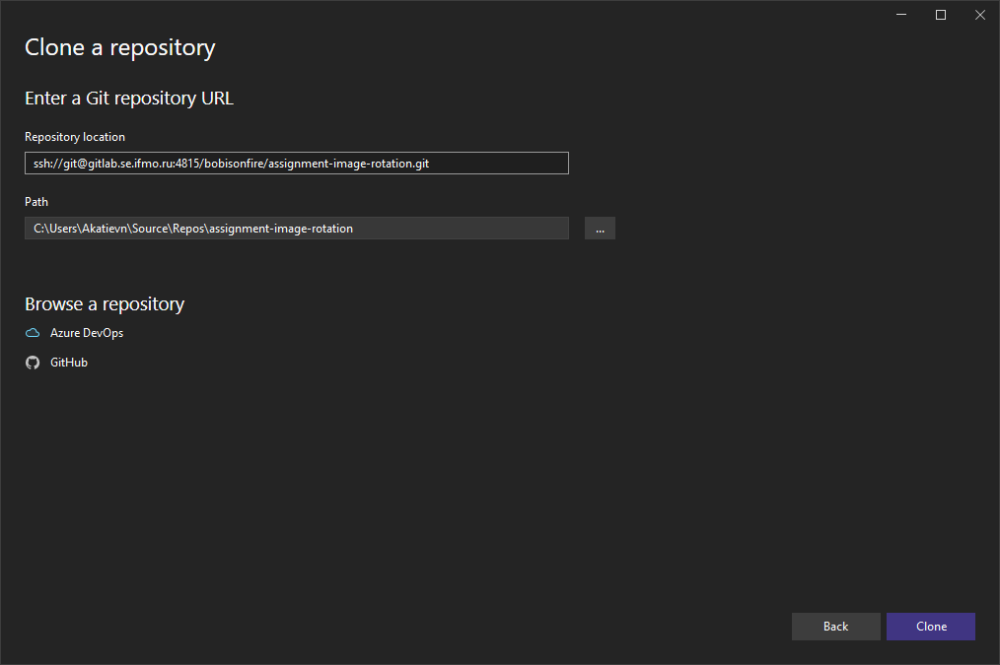
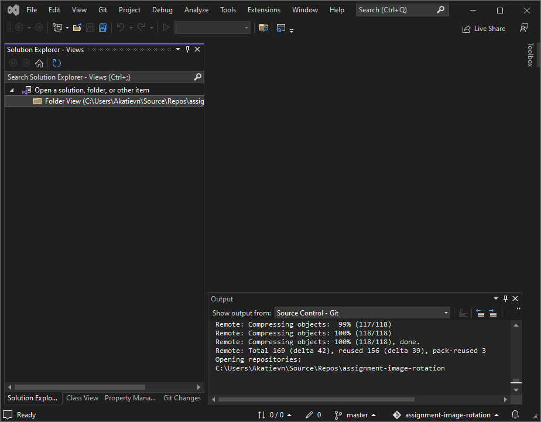
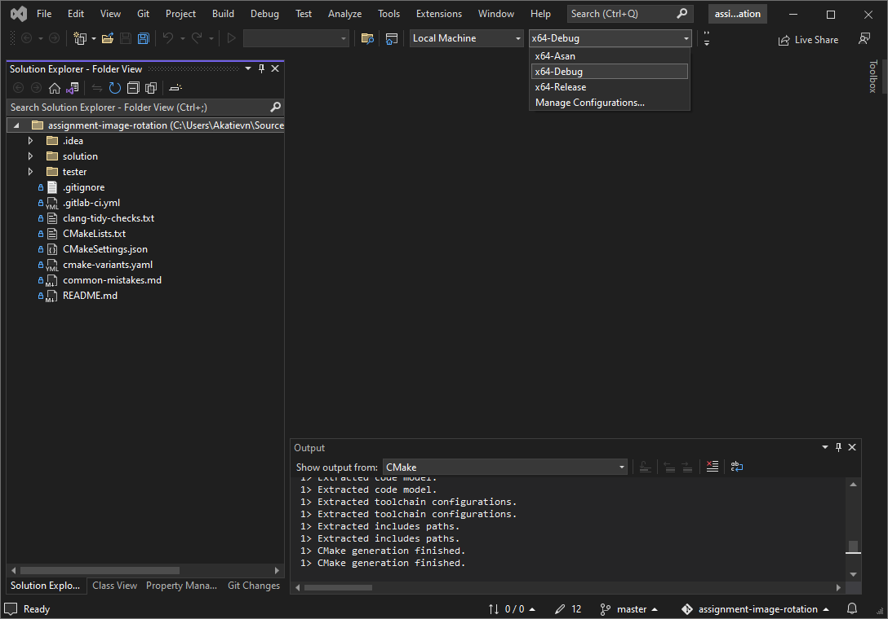
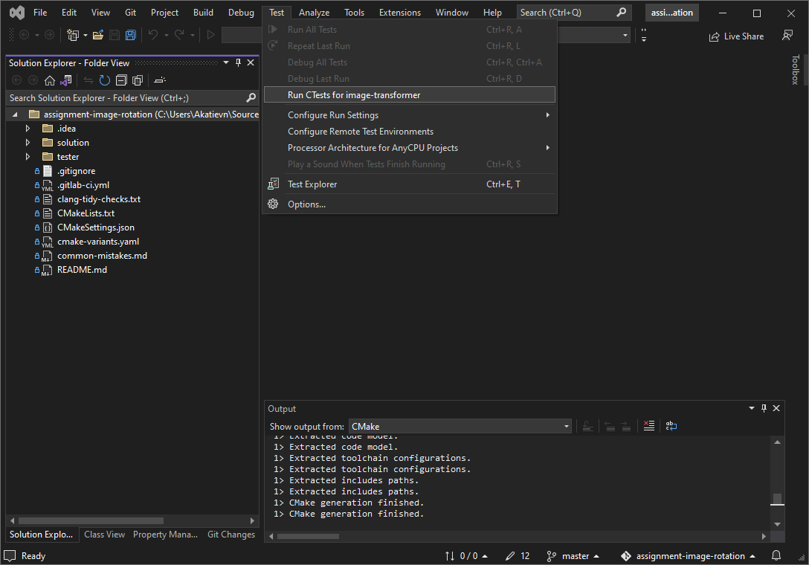

# Разработка с Visual Studio

## 1. Выберите и склонируйте ваш форк с GitLab

## 2. В окне решения, выберите `Folder View` на панели слева

Visual Studio запустит конфигурацию проекта с помощью CMake в профиле по умолчанию (**`x64-Debug`**).

## 3. Выберите необходимую конфигурацию в раскрывающемся списке

- **`x64-Debug`** быстро компилируется и подходит для разработки.
- **`x64-Asan`** подходит для отладки ошибок сегментации и других проблем с памятью. Рекомендуется 
  запустить ваш код в Asan перед отправкой на проверку!
- **`x64-Release`** нужен для сборки кода с оптимизациями и проверки скорости выполнения.

## 4. Используйте панели сверху для запуска сборки и тестирования

- Варианты для сборки находятся в меню **`Build`**. Для сборки всего решения нажмите **`F7`**.
- Для запуска тестов выберите **`Run CTests for ...`** в меню **`Test`**.
