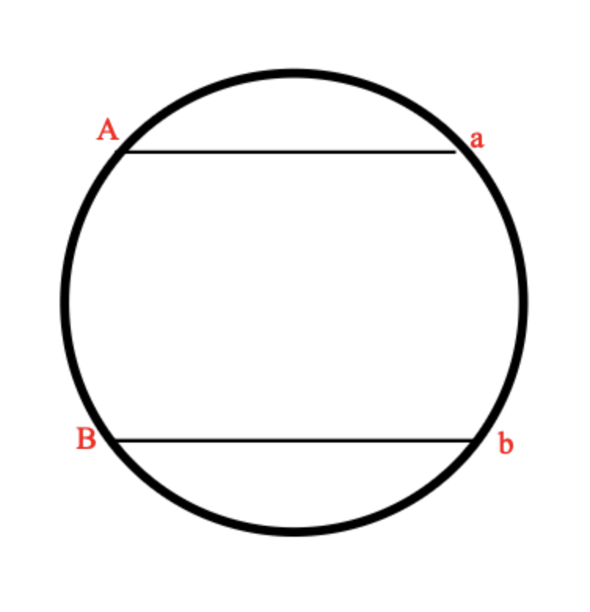

# B. Зоопарк Глеба

<table>
    <tr>
        <td>Ограничение времени</td>
        <td>1 секунда</td>
    </tr>
    <tr>
        <td>Ограничение памяти</td>
        <td>256Mb</td>
    </tr>
    <tr>
        <td>Ввод</td>
        <td>стандартный ввод или input.txt</td>
    </tr>
    <tr>
        <td>Вывод</td>
        <td>стандартный вывод или output.txt</td>
    </tr>
</table>

[Решение задачи](./solution.cpp)

Недавно Глеб открыл зоопарк. Он решил построить его в форме круга и, естественно, обнёс забором. Глеб взял вас туда начальником охраны. Казалось бы все началось так хорошо, но именно в вашу первую смену все животные разбежались. В зоопарке $n$ животных различных видов, также под каждый из видов есть свои ловушки. К сожалению некоторые животные враждуют с друг другом в природе (они обозначены разными буквами), а зоопарк обнесён забором и имеет форму круга. С помощью камер, удалось выяснить, где находятся все животные. Умная система поддержки жизнедеятельности зоопарка уже просканировала зоопарк и вывела id всех животных и ловушек в том порядке, в котором они видны из центра зоопарка. Получилось так, что все животные и все ловушки находятся на краю зоопарка. Вы хотите понять, могут ли животные прийти в свою ловушку так, чтобы их путь не пересекался с другими. Если да, также предъявите какую-нибудь из схем поимки животных.

## Формат ввода

На вход подается строчка из $2 ⋅ n$ символов латинского алфавита, где маленькая буква - животное, а большая - ловушка.Размер строки не более $100000$.

## Формат вывода

Требуется вывести `Impossible`, если решения не существует или `Possible`, если можно вернуть всех животных в клетки.
В случае если можно, то для каждой ловушки в порядке обхода требуется вывести индекс животного в ней.

### Пример 1

| Ввод | Вывод |
| -- | -- |
| ABba   | Possible 2 1 |

### Пример 2

| Ввод | Вывод |
| -- | -- |
| ABab | Impossible |

---

## Примечания

**Первый пример:**

Животное b идёт в ловушку B, а животное a ловится в ловушку A. Их пути не пересекаются, поэтому

**Второй пример:**

Пути животных пересекаются, поэтому поймать их невозможно

[Скачать условие задачи](https://contest.yandex.ru/contest/35179/download/B/)
