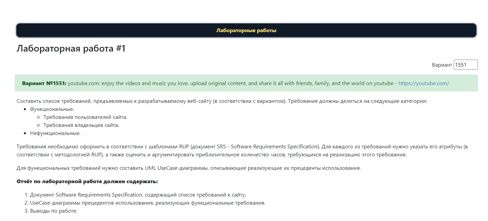

# Лабораторная работа 1

## Вариант `1551`

> [!TIP]
> **Вариант №1551**: youtube.com: enjoy the videos and music you love, upload original content, and share it all with friends, family, and the world on youtube - https://youtube.com/

|.pdf|.docx|
|-|-|
| [report](./docs/report.pdf) | [report](./docs/report.docx) |

## Задание

Составить список требований, предъявляемых к разрабатываемому веб-сайту (в соответствии с вариантом). Требования должны делиться на следующие категории:

- Функциональные.
  - Требования пользователей сайта.
  - Требования владельцев сайта.
- Нефункциональные.

Требования необходимо оформить в соответствии с шаблонами RUP (документ SRS - [Software Requirements Specification](https://github.com/rick4470/IEEE-SRS-Tempate)). Для каждого из требований нужно указать его атрибуты (в соответствии с методологией RUP), а также оценить и аргументировать приблизительное количество часов, требующихся на реализацию этого требования.

Для функциональных требований нужно составить UML UseCase-диаграммы, описывающие реализующие их прецеденты использования.

### Отчёт по лабораторной рабое должен содержать:

1. Документ Software Requirements Specification, содержащий список требований к сайту.
2. UseCase-диаграммы прецедентов использования, реализующих функциональные требования.
3. Выводы по работе.

### Вопросы к защите лабораторной работы:

1. Методологии разработки ПО. Унифицированный процесс.
2. Требования и их категоризация. Атрибуты требований.
3. Язык UML.
4. Прецеденты использования. UseCase-диаграммы - состав, виды связей.

---

## Полезные ссылки

| Ссылка | Описание |
| --- | --- |
| https://github.com/VeraKasianenko/Fundamentals_of_SE/tree/main/lab1 | Пример хорошей ЛР1 |
| [Конспект лекций v1.4.0](https://se.ifmo.ru/documents/10180/671657/%D0%9B%D0%B5%D0%BA%D1%86%D0%B8%D0%B8+%D0%BF%D0%BE+%D0%9E%D0%9F%D0%98+v1.3.3.pdf/50ce1e06-00d9-4900-be9c-a3316a746d6d) | Конспект лекций |
| [ОПИ, весна 23/24, 2 курс](https://docs.google.com/spreadsheets/d/1G5DiqM7wJt3m5EmKG1V1vv9qNsdL3ztSSQO-QfhJ1WM/edit#gid=1166494430) | Журнал 2024 |

## Лицензия 

Проект доступен с открытым исходным кодом на условиях [Лицензии GNU GPL 3](https://opensource.org/license/gpl-3-0/).

*Авторские права 2024 Max Barsukov*

**Поставьте звезду :star:, если вы нашли этот проект полезным.**
