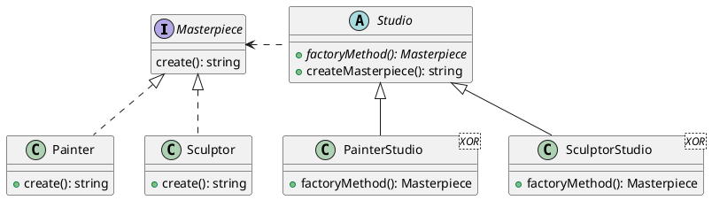

**Factory Method** (Фабричный метод) - это порождающий (creational) паттерн проектирования, который определяет общий интерфейс для создания объектов в суперклассе, позволяя подклассам изменять тип создаваемых объектов.

Все возвращаемые объекты должны иметь общий интерфейс. Подклассы смогут производить объекты различных классов, следующих одному и тому же интерфейсу.

### Задачи

В целом, для хорошо продуманной иерархии объектов Factory Method позволяет создавать гибкие, расширяемые системы и решает несколько ключевых задач:

1. Позволяет отделить логику создания объектов от кода, который использует эти объекты.
2. С помощью фабричного метода легко добавлять новые классы объектов, не изменяя существующий код. Это достигается за счет создания новых подклассов, которые реализуют фабричный метод, что упрощает поддержку и расширение системы.
3.Клиентский код работает с абстракциями (интерфейсами или абстрактными классами), что уменьшает зависимость от конкретных реализаций.
4. Фабричный метод инкапсулирует процесс создания объектов, что позволяет легко управлять изменениями в процессе создания без необходимости вносить изменения в клиентский код.
5. Клиентский код может работать с созданием объектов, не заботясь о том, как именно эти объекты создаются. Это делает код более чистым и уменьшает количество дублирования.

А все это способствовует достижению в системе
- низкой связанности (Low Coupling): изменения в классе, создающем объекты, не требуют изменений в клиентском коде, ксли в будущем потребуется изменить способ создания объектов или добавить новые типы объектов, это можно сделать, изменив только реализацию фабричного метода, не затрагивая код, который использует эти объекты. Это снижает связанность между компонентами системы.
- и высокого зацепления (High Cohesion): Каждый класс, реализующий фабричный метод, отвечает за создание конкретного типа объектов. Это означает, что классы имеют четко определенные обязанности; фабричный метод позволяет сгруппировать логику создания объектов в одном месте; облегчает тестирование отдельных компонентов, так как каждый класс выполняет четко определенные функции.

Можно считать применение Factory Method удачным в условиях:

- Когда заранее неизвестны типы и зависимости объектов, с которыми должен работать ваш код. Благодаря этому, код производства можно расширять, не трогая основной. Так, чтобы добавить поддержку нового продукта, вам нужно создать новый подкласс и определить в нём фабричный метод, возвращая оттуда экземпляр нового продукта.
- Когда вы хотите дать возможность пользователям расширять части вашего фреймворка или библиотеки. Можно дать пользователям возможность расширять не только желаемые компоненты, но и классы, которые создают эти компоненты. А для этого создающие классы должны иметь конкретные создающие методы, которые можно определить.
- Когда вы хотите экономить системные ресурсы, повторно используя уже созданные объекты, вместо порождения новых. Такая проблема обычно возникает при работе с тяжёлыми ресурсоёмкими объектами, такими, как подключение к базе данных, файловой системе и т. д.

### Ограничения

Как и всегда, недостатки напрямую вытекают из преимуществ:

1. Увеличение количества классов: Может привести к созданию больших параллельных иерархий классов, так как для каждого класса продукта надо создать свой подкласс создателя. Каждый тип создаваемого объекта требует создания отдельного класса (или подкласса) и, возможно, интерфейса. Это может привести к значительному увеличению объема кода и усложнению структуры проекта. Например, если у вас есть несколько типов автомобилей (легковые, грузовые, спортивные), вам придется создать отдельные классы для каждого типа.

2. Сложность поддержки: С увеличением количества классов и интерфейсов поддержка кода может стать более сложной. Разработчикам может быть трудно следить за всеми реализациями и изменениями, особенно если они не знакомы с архитектурой проекта.

3. Если фабричный метод требует конфигурации для создания объектов (например, через внешние файлы или параметры), это может усложнить управление настройками.

### Пример

В данном примере классы `Painter` и `Sculptor` реализуют интерфейс `Masterpiece`, который определяет метод create. Каждый из этих классов предоставляет свою уникальную реализацию метода: `Painter` создает картины, а `Sculptor` — скульптуры.

Фабричный метод в абстрактном классе `Studio` возвращает объект соответствующего класса произведения искусства. Конкретные реализации, такие как `PainterStudio` и `SculptorStudio`, переопределяют этот метод, чтобы возвращать объекты `Painter` и `Sculptor` соответственно. Таким образом, клиентский код может взаимодействовать с абстрактным классом `Studio`, не зная о конкретных реализациях, что упрощает расширение системы для добавления новых типов.

