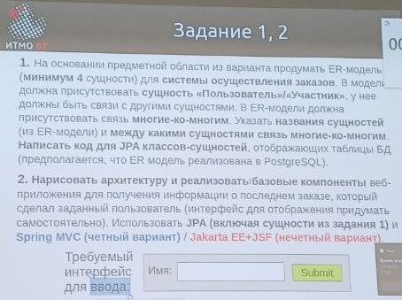

# Информационные системы

## Рубежная работа №1


> [!TIP]
> Я т-тебя в куб склею. У меня есть на районе д-друзья, они тебе з-за нечёткую логику пояснят! \
> — chad Поляков \
> Короче, ...э... база даных... Э... Это... Э... Это как база... э... Но только с... Э... Данными. \
> — virgin Николаев \
> © мем by Даниил Бабенко

---

## Вариант

[Предметная область по варианту](https://docs.google.com/spreadsheets/d/1d8I2OBxrKVKroPqx6H4ldubav7IWp8E9UIeCWBMs124/edit?gid=901106186#gid=901106186)

В первом потоке вариант определялся по дню рождения:

- `31.12.5678 -> Вариант 1`

Во втором потоке вариант определялся по последней цифре ИСУ:

- `ИСУ 367081 -> Вариант 1` 

## Задание

<details> 
  <summary>📸 <b>Фото задания</b></summary>

  
</details>

### Задание 1.

> [!NOTE]
> Первое задание было одинаковое у обоих потоков.

На основании предметной области из варианта продумать ER-модель (**минимум 4** сущности) для **системы осуществления заказов**. В модели должна присутствовать **сущность «Пользователь»/«Участник»**, у нее должны быть связи с другими сущностями. В ER-модели должна присутствовать связь **многие-ко-многим**. Указать **названия сущностей** (из ER-модели) и **между какими сущностями связь многие-ко-многим**. **Написать код для JPA классов-сущностей**, отображающих таблицы БД (предполагается, что ER-модель реализована в PostgreSQL).

### Задание 2.

> [!NOTE]
> Во втором потоке задание было почти такое же, но нужно было создать введенного пользователя, если он ещё не существует.

**Нарисовать архитектуру и реализовать базовые компоненты** веб-приложения для получения информации о последнем заказе, который сделал заданный пользователь (интерфейс для отображения придумать самостоятельно). Использовать **JPA (включая сущности из задания 1)** и **Spring MVC** (чётный вариант) / **Jakarta EE + JSF** (нечётный вариант).

Требуемый интерфейс для ввода:

```
     +----------------+
Имя: | Введите имя... |
     +----------------+

        +--------+
        | Submit |
        +--------+
```

---

## Разбор

- Рассмотрим вариант с предметной областью `Кинозал`.

### Задание 1.

Проектирование ER-модели для кинозала.

Основные сущности:
- **Пользователь (User)** – клиент системы, осуществляющий заказы.
- **Фильм (Movie)** – фильм, показываемый в кинотеатре.
- **Сеанс (Session)** – конкретный показ фильма в определенное время.
- **Заказ (Order)** – заказ, оформленный пользователем на определенный сеанс.
- **Место (Seat)** – место в зале, которое пользователь бронирует.
- **Кинотеатр (Cinema)** – кинотеатр, где проходят сеансы.

Связи:
- **Пользователь** может сделать **множество заказов**, и каждый заказ может быть связан **с одним пользователем** (*связь один-ко-многим*).
- **Фильм** может быть показан на **многих сеансах**, и каждый сеанс относится **к одному фильму** (*связь один-ко-многим*).
- **Сеанс** связан с **многими местами**, и каждое место может быть связано **с многими сеансами** (*связь многие-ко-многим*).
- **Кинотеатр** содержит **множество сеансов**, и каждый сеанс привязан **к одному кинотеатру** (*связь один-ко-многим*).

Связь многие-ко-многим:
- Между сущностями **Сеанс (Session)** и **Место (Seat)**: одно место может участвовать в нескольких сеансах, и один сеанс может содержать множество мест.

**Код для JPA классов-сущностей**

1. Сущность `User`:

```java
import jakarta.persistence.*;
import java.util.List;

@Entity
@Table(name = "users")
public class User {
    @Id
    @GeneratedValue(strategy = GenerationType.IDENTITY)
    private Long id;

    @Column(nullable = false)
    private String name;

    @Column(nullable = false, unique = true)
    private String email;

    @OneToMany(mappedBy = "user", cascade = CascadeType.ALL)
    private List<Order> orders;

    // Getters and Setters
}
```

2. Сущность `Movie`:

```java
import jakarta.persistence.*;
import java.util.List;

@Entity
@Table(name = "movies")
public class Movie {
    @Id
    @GeneratedValue(strategy = GenerationType.IDENTITY)
    private Long id;

    @Column(nullable = false)
    private String title;

    @Column(nullable = false)
    private String genre;

    @OneToMany(mappedBy = "movie", cascade = CascadeType.ALL)
    private List<Session> sessions;

    // Getters and Setters
}
```

3. Сущность `Cinema`:

```java
import jakarta.persistence.*;
import java.util.List;

@Entity
@Table(name = "cinemas")
public class Cinema {
    @Id
    @GeneratedValue(strategy = GenerationType.IDENTITY)
    private Long id;

    @Column(nullable = false)
    private String name;

    @OneToMany(mappedBy = "cinema", cascade = CascadeType.ALL)
    private List<Session> sessions;

    // Getters and Setters
}
```

4. Сущность `Session`:

```java
import jakarta.persistence.*;
import java.util.List;

@Entity
@Table(name = "sessions")
public class Session {
    @Id
    @GeneratedValue(strategy = GenerationType.IDENTITY)
    private Long id;

    @ManyToOne
    @JoinColumn(name = "movie_id", nullable = false)
    private Movie movie;

    @ManyToOne
    @JoinColumn(name = "cinema_id", nullable = false)
    private Cinema cinema;

    @ManyToMany
    @JoinTable(
        name = "session_seats",
        joinColumns = @JoinColumn(name = "session_id"),
        inverseJoinColumns = @JoinColumn(name = "seat_id")
    )
    private List<Seat> seats;

    @OneToMany(mappedBy = "session", cascade = CascadeType.ALL)
    private List<Order> orders;

    // Getters and Setters
}
```

5. Сущность `Seat`:

```java
import jakarta.persistence.*;
import java.util.List;

@Entity
@Table(name = "seats")
public class Seat {
    @Id
    @GeneratedValue(strategy = GenerationType.IDENTITY)
    private Long id;

    @Column(nullable = false)
    private String seatNumber;

    @ManyToMany(mappedBy = "seats")
    private List<Session> sessions;

    // Getters and Setters
}
```

6. Сущность `Order`:

```java
import jakarta.persistence.*;

@Entity
@Table(name = "orders")
public class Order {
    @Id
    @GeneratedValue(strategy = GenerationType.IDENTITY)
    private Long id;

    @ManyToOne
    @JoinColumn(name = "user_id", nullable = false)
    private User user;

    @ManyToOne
    @JoinColumn(name = "session_id", nullable = false)
    private Session session;

    @Column(nullable = false)
    private String seatNumber;

    // Getters and Setters
}
```

### Задание 2.

#### Spring MVC

**Архитектура веб-приложения:**

```
+--------------------------+
|        Веб-браузер       |
|    (HTML-форма: Имя)     |
+------------+-------------+
             |
             v
+--------------------------+
|   Spring MVC Controller  |
|     (OrderController)    |
+------------+-------------+
             |
             v
+--------------------------+
|      Service Layer       |
|      (OrderService)      |
+------------+-------------+
             |
             v
+--------------------------+
|      Repository Layer    |
|     (OrderRepository)    |
|    (EntityManager API)   |
+------------+-------------+
             |
             v
+--------------------------+
|        PostgreSQL        |
|        (Database)        |
+--------------------------+
```

**Реализация компонентов:**

1. HTML-Форма

Форма принимает имя пользователя для поиска последнего заказа.

`index.html`

```html
<!DOCTYPE html>
<html lang="en">
<head>
    <meta charset="UTF-8">
    <title>Last Order</title>
</head>
<body>
    <form action="/orders/last" method="get">
        <label for="name">Имя:</label>
        <input type="text" id="name" name="name" placeholder="Введите имя..." required />
        <button type="submit">Submit</button>
    </form>
</body>
</html>
```

2. Spring MVC Controller

Контроллер обрабатывает запросы от пользователя и вызывает сервис для получения последнего заказа.

`OrderController.java`

```java
import org.springframework.beans.factory.annotation.Autowired;
import org.springframework.stereotype.Controller;
import org.springframework.ui.Model;
import org.springframework.web.bind.annotation.GetMapping;
import org.springframework.web.bind.annotation.RequestParam;

@Controller
public class OrderController {

    private final OrderService orderService;

    @Autowired
    public OrderController(OrderService orderService) {
        this.orderService = orderService;
    }

    @GetMapping("/orders/last")
    public String getLastOrder(@RequestParam("name") String userName, Model model) {
        Order lastOrder = orderService.findLastOrderForUser(userName);
        model.addAttribute("order", lastOrder);
        return "last-order"; // HTML-страница для отображения
    }
}
```

3. Service Layer

Сервис вызывает репозиторий для выполнения бизнес-логики.

`OrderService.java`

```java
import org.springframework.beans.factory.annotation.Autowired;
import org.springframework.stereotype.Service;

@Service
public class OrderService {

    private final OrderRepository orderRepository;

    @Autowired
    public OrderService(OrderRepository orderRepository) {
        this.orderRepository = orderRepository;
    }

    public Order findLastOrderForUser(String userName) {
        return orderRepository.findLastOrderByUserName(userName);
    }
}
```

4. Repository Layer (без Spring Data JPA)

Репозиторий реализован с использованием EntityManager.

`OrderRepository.java`

```java
import jakarta.persistence.EntityManager;
import jakarta.persistence.PersistenceContext;
import jakarta.persistence.TypedQuery;
import org.springframework.stereotype.Repository;

@Repository
public class OrderRepository {

    @PersistenceContext
    private EntityManager entityManager;

    public Order findLastOrderByUserName(String userName) {
        String query = "SELECT o FROM Order o JOIN o.user u WHERE u.name = :name ORDER BY o.id DESC";
        TypedQuery<Order> typedQuery = entityManager.createQuery(query, Order.class);
        typedQuery.setParameter("name", userName);
        typedQuery.setMaxResults(1); // Только последний заказ
        return typedQuery.getSingleResult();
    }
}
```

5. Thymeleaf-шаблон для отображения результата

Шаблон отображает информацию о последнем заказе.

`last-order.html`

```html
<!DOCTYPE html>
<html lang="en">
<head>
    <meta charset="UTF-8">
    <title>Last Order</title>
</head>
<body>
    <h1>Последний заказ</h1>
    <p><strong>Пользователь:</strong> <span th:text="${order.user.name}"></span></p>
    <p><strong>Сеанс:</strong> <span th:text="${order.session.movie.title}"></span></p>
    <p><strong>Место:</strong> <span th:text="${order.seatNumber}"></span></p>
</body>
</html>
```

**Объяснение работы приложения:**

1. Пользователь вводит свое имя в **HTML-форму** и нажимает `Submit`.
2. Данные отправляются на `/orders/last`, где их обрабатывает `OrderController`.
3. **Контроллер** вызывает `OrderService` для поиска последнего заказа.
4. **Сервис** использует `OrderRepository` для выполнения SQL-запроса через `EntityManager`.
5. Результат (последний заказ) возвращается **контроллеру**.
6. **Контроллер** передает результат в **шаблон** `last-order.html`, где данные отображаются пользователю.

#### Jakarta EE + JSF

**Архитектура веб-приложения:**

```
+---------------------------+
|        Веб-браузер        |
|     (JSF-форма: Имя)      |
+------------+--------------+
             |
             v
+---------------------------+
|     JSF Managed Bean      |
|    (OrderManagedBean)     |
+------------+--------------+
             |
             v
+---------------------------+
|       Service Layer       |
|      (OrderService)       |
+------------+--------------+
             |
             v
+---------------------------+
|     Repository Layer      |
|     (OrderRepository)     |
|    (EntityManager API)    |
+------------+--------------+
             |
             v
+---------------------------+
|         PostgreSQL        |
|         (Database)        |
+---------------------------+
```

**Реализация компонентов:**

1. JSF-форма для ввода имени пользователя

Создадим простой интерфейс на JSF для получения имени пользователя и отображения последнего заказа.

`order.xhtml`

```html
<!DOCTYPE html>
<html xmlns="http://www.w3.org/1999/xhtml"
      xmlns:h="http://xmlns.jcp.org/jsf/html">
<head>
    <title>Последний заказ</title>
</head>
<body>
    <h1>Найти последний заказ пользователя</h1>
    <h:form>
        <h:outputLabel for="name" value="Имя:" />
        <h:inputText id="name" value="#{orderBean.userName}" required="true" placeholder="Введите имя..." />
        <h:commandButton value="Submit" action="#{orderBean.findLastOrder}" />
    </h:form>

    <h:panelGroup rendered="#{not empty orderBean.lastOrder}">
        <h2>Последний заказ</h2>
        <p><strong>Пользователь:</strong> #{orderBean.lastOrder.user.name}</p>
        <p><strong>Сеанс:</strong> #{orderBean.lastOrder.session.movie.title}</p>
        <p><strong>Место:</strong> #{orderBean.lastOrder.seatNumber}</p>
    </h:panelGroup>
</body>
</html>
```

2. JSF Managed Bean

`OrderManagedBean.java`

```java
import jakarta.enterprise.context.RequestScoped;
import jakarta.inject.Inject;
import jakarta.inject.Named;

@Named("orderBean")
@RequestScoped
public class OrderManagedBean {

    @Inject
    private OrderService orderService;

    private String userName;
    private Order lastOrder;

    public String getUserName() {
        return userName;
    }

    public void setUserName(String userName) {
        this.userName = userName;
    }

    public Order getLastOrder() {
        return lastOrder;
    }

    public void setLastOrder(Order lastOrder) {
        this.lastOrder = lastOrder;
    }

    public String findLastOrder() {
        this.lastOrder = orderService.findLastOrderForUser(userName);
        return null; // Остаемся на той же странице
    }
}
```

3. Сервисный слой

`OrderService.java`

```java
import jakarta.ejb.Stateless;
import jakarta.inject.Inject;

@Stateless
public class OrderService {

    @Inject
    private OrderRepository orderRepository;

    public Order findLastOrderForUser(String userName) {
        return orderRepository.findLastOrderByUserName(userName);
    }
}
```

4. Репозиторий (с использованием EntityManager)

`OrderRepository.java`

```java
java
import jakarta.persistence.EntityManager;
import jakarta.persistence.PersistenceContext;
import jakarta.persistence.TypedQuery;
import jakarta.ejb.Stateless;

@Stateless
public class OrderRepository {

    @PersistenceContext
    private EntityManager entityManager;

    public Order findLastOrderByUserName(String userName) {
        String query = "SELECT o FROM Order o JOIN o.user u WHERE u.name = :name ORDER BY o.id DESC";
        TypedQuery<Order> typedQuery = entityManager.createQuery(query, Order.class);
        typedQuery.setParameter("name", userName);
        typedQuery.setMaxResults(1);
        return typedQuery.getSingleResult();
    }
}
```

5. JPA-классы (используются из Задания 1)

Мы повторно используем классы-сущности из Задания 1, такие как Order, User, Session, и другие. Убедитесь, что в конфигурации persistence указано подключение к PostgreSQL.

6. Конфигурация

`persistence.xml`

```xml
xml
<persistence xmlns="http://xmlns.jcp.org/xml/ns/persistence"
             xmlns:xsi="http://www.w3.org/2001/XMLSchema-instance"
             xsi:schemaLocation="http://xmlns.jcp.org/xml/ns/persistence
             http://xmlns.jcp.org/xml/ns/persistence/persistence_2_1.xsd"
             version="2.1">
    <persistence-unit name="cinemaPU">
        <class>com.example.entities.User</class>
        <class>com.example.entities.Order</class>
        <class>com.example.entities.Session</class>
        <class>com.example.entities.Movie</class>
        <class>com.example.entities.Seat</class>
        <properties>
            <property name="jakarta.persistence.jdbc.driver" value="org.postgresql.Driver" />
            <property name="jakarta.persistence.jdbc.url" value="jdbc:postgresql://localhost:5432/cinema_db" />
            <property name="jakarta.persistence.jdbc.user" value="postgres" />
            <property name="jakarta.persistence.jdbc.password" value="password" />
            <property name="hibernate.dialect" value="org.hibernate.dialect.PostgreSQLDialect" />
            <property name="hibernate.hbm2ddl.auto" value="update" />
        </properties>
    </persistence-unit>
</persistence>
```

**Объяснение работы:**

1. **Пользователь** вводит имя в форму на странице `/order.xhtml`.
2. После нажатия кнопки `Submit` данные передаются в `OrderManagedBean`, который вызывает `OrderService` для получения последнего заказа.
3. **Сервис** вызывает `OrderRepository`, который с помощью `EntityManager` выполняет запрос к **базе данных**.
4. Последний заказ возвращается в `OrderManagedBean`, где сохраняется в поле `lastOrder`.
5. На странице отображается информация о **последнем заказе пользователя**.
6. Этот подход использует Jakarta EE технологии, такие как JSF для интерфейса, CDI для внедрения зависимостей, и JPA для взаимодействия с базой данных.

---

## Полезные ссылки

| Ссылка | Описание |
| --- | --- |
| [practicum.yandex.ru/blog/chto-takoe-er-diagramma/](https://practicum.yandex.ru/blog/chto-takoe-er-diagramma/) | Сущности и связи: что такое ER‑диаграмма? |
| [java-online.ru/jsf-components.xhtml](https://java-online.ru/jsf-components.xhtml) | Стандартные JSF components |

## Лицензия <a name="license"></a>

Проект доступен с открытым исходным кодом на условиях [Лицензии GNU GPL 3](https://opensource.org/license/gpl-3-0/). \
*Авторские права 2024 Max Barsukov*

**Поставьте звезду :star:, если вы нашли этот проект полезным.**
