# Лабораторная 4. Метод k-ближайших соседей

Импорт библиотек


```python
import numpy as np
import pandas as pd
import matplotlib.pyplot as plt
import seaborn as sb
import random
import math
```

**1. Выбор датасетов**: Студенты с **нечетным** порядковым номером в группе должны использовать датасет про **диабет**.


```python
data = pd.read_csv('data/diabetes.csv')
data
```


<div>
<table border="1" class="dataframe">
  <thead>
    <tr style="text-align: right;">
      <th></th>
      <th>Pregnancies</th>
      <th>Glucose</th>
      <th>BloodPressure</th>
      <th>SkinThickness</th>
      <th>Insulin</th>
      <th>BMI</th>
      <th>Pedigree</th>
      <th>Age</th>
      <th>Outcome</th>
    </tr>
  </thead>
  <tbody>
    <tr>
      <th>0</th>
      <td>6</td>
      <td>148</td>
      <td>72</td>
      <td>35</td>
      <td>0</td>
      <td>33.6</td>
      <td>0.627</td>
      <td>50</td>
      <td>1</td>
    </tr>
    <tr>
      <th>1</th>
      <td>1</td>
      <td>85</td>
      <td>66</td>
      <td>29</td>
      <td>0</td>
      <td>26.6</td>
      <td>0.351</td>
      <td>31</td>
      <td>0</td>
    </tr>
    <tr>
      <th>2</th>
      <td>8</td>
      <td>183</td>
      <td>64</td>
      <td>0</td>
      <td>0</td>
      <td>23.3</td>
      <td>0.672</td>
      <td>32</td>
      <td>1</td>
    </tr>
    <tr>
      <th>3</th>
      <td>1</td>
      <td>89</td>
      <td>66</td>
      <td>23</td>
      <td>94</td>
      <td>28.1</td>
      <td>0.167</td>
      <td>21</td>
      <td>0</td>
    </tr>
    <tr>
      <th>4</th>
      <td>0</td>
      <td>137</td>
      <td>40</td>
      <td>35</td>
      <td>168</td>
      <td>43.1</td>
      <td>2.288</td>
      <td>33</td>
      <td>1</td>
    </tr>
    <tr>
      <th>...</th>
      <td>...</td>
      <td>...</td>
      <td>...</td>
      <td>...</td>
      <td>...</td>
      <td>...</td>
      <td>...</td>
      <td>...</td>
      <td>...</td>
    </tr>
    <tr>
      <th>763</th>
      <td>10</td>
      <td>101</td>
      <td>76</td>
      <td>48</td>
      <td>180</td>
      <td>32.9</td>
      <td>0.171</td>
      <td>63</td>
      <td>0</td>
    </tr>
    <tr>
      <th>764</th>
      <td>2</td>
      <td>122</td>
      <td>70</td>
      <td>27</td>
      <td>0</td>
      <td>36.8</td>
      <td>0.340</td>
      <td>27</td>
      <td>0</td>
    </tr>
    <tr>
      <th>765</th>
      <td>5</td>
      <td>121</td>
      <td>72</td>
      <td>23</td>
      <td>112</td>
      <td>26.2</td>
      <td>0.245</td>
      <td>30</td>
      <td>0</td>
    </tr>
    <tr>
      <th>766</th>
      <td>1</td>
      <td>126</td>
      <td>60</td>
      <td>0</td>
      <td>0</td>
      <td>30.1</td>
      <td>0.349</td>
      <td>47</td>
      <td>1</td>
    </tr>
    <tr>
      <th>767</th>
      <td>1</td>
      <td>93</td>
      <td>70</td>
      <td>31</td>
      <td>0</td>
      <td>30.4</td>
      <td>0.315</td>
      <td>23</td>
      <td>0</td>
    </tr>
  </tbody>
</table>
<p>768 rows × 9 columns</p>
</div>


```python
data.describe()
```


<div>
<table border="1" class="dataframe">
  <thead>
    <tr style="text-align: right;">
      <th></th>
      <th>Pregnancies</th>
      <th>Glucose</th>
      <th>BloodPressure</th>
      <th>SkinThickness</th>
      <th>Insulin</th>
      <th>BMI</th>
      <th>Pedigree</th>
      <th>Age</th>
      <th>Outcome</th>
    </tr>
  </thead>
  <tbody>
    <tr>
      <th>count</th>
      <td>768.000000</td>
      <td>768.000000</td>
      <td>768.000000</td>
      <td>768.000000</td>
      <td>768.000000</td>
      <td>768.000000</td>
      <td>768.000000</td>
      <td>768.000000</td>
      <td>768.000000</td>
    </tr>
    <tr>
      <th>mean</th>
      <td>3.845052</td>
      <td>120.894531</td>
      <td>69.105469</td>
      <td>20.536458</td>
      <td>79.799479</td>
      <td>31.992578</td>
      <td>0.471876</td>
      <td>33.240885</td>
      <td>0.348958</td>
    </tr>
    <tr>
      <th>std</th>
      <td>3.369578</td>
      <td>31.972618</td>
      <td>19.355807</td>
      <td>15.952218</td>
      <td>115.244002</td>
      <td>7.884160</td>
      <td>0.331329</td>
      <td>11.760232</td>
      <td>0.476951</td>
    </tr>
    <tr>
      <th>min</th>
      <td>0.000000</td>
      <td>0.000000</td>
      <td>0.000000</td>
      <td>0.000000</td>
      <td>0.000000</td>
      <td>0.000000</td>
      <td>0.078000</td>
      <td>21.000000</td>
      <td>0.000000</td>
    </tr>
    <tr>
      <th>25%</th>
      <td>1.000000</td>
      <td>99.000000</td>
      <td>62.000000</td>
      <td>0.000000</td>
      <td>0.000000</td>
      <td>27.300000</td>
      <td>0.243750</td>
      <td>24.000000</td>
      <td>0.000000</td>
    </tr>
    <tr>
      <th>50%</th>
      <td>3.000000</td>
      <td>117.000000</td>
      <td>72.000000</td>
      <td>23.000000</td>
      <td>30.500000</td>
      <td>32.000000</td>
      <td>0.372500</td>
      <td>29.000000</td>
      <td>0.000000</td>
    </tr>
    <tr>
      <th>75%</th>
      <td>6.000000</td>
      <td>140.250000</td>
      <td>80.000000</td>
      <td>32.000000</td>
      <td>127.250000</td>
      <td>36.600000</td>
      <td>0.626250</td>
      <td>41.000000</td>
      <td>1.000000</td>
    </tr>
    <tr>
      <th>max</th>
      <td>17.000000</td>
      <td>199.000000</td>
      <td>122.000000</td>
      <td>99.000000</td>
      <td>846.000000</td>
      <td>67.100000</td>
      <td>2.420000</td>
      <td>81.000000</td>
      <td>1.000000</td>
    </tr>
  </tbody>
</table>
</div>


```python
data.info()
```

    <class 'pandas.core.frame.DataFrame'>
    RangeIndex: 768 entries, 0 to 767
    Data columns (total 9 columns):
     #   Column         Non-Null Count  Dtype  
    ---  ------         --------------  -----  
     0   Pregnancies    768 non-null    int64  
     1   Glucose        768 non-null    int64  
     2   BloodPressure  768 non-null    int64  
     3   SkinThickness  768 non-null    int64  
     4   Insulin        768 non-null    int64  
     5   BMI            768 non-null    float64
     6   Pedigree       768 non-null    float64
     7   Age            768 non-null    int64  
     8   Outcome        768 non-null    int64  
    dtypes: float64(2), int64(7)
    memory usage: 54.1 KB
    

### Визуализация


```python
data.hist(bins=100, figsize=(20, 10))
```


    array([[<Axes: title={'center': 'Pregnancies'}>,
            <Axes: title={'center': 'Glucose'}>,
            <Axes: title={'center': 'BloodPressure'}>],
           [<Axes: title={'center': 'SkinThickness'}>,
            <Axes: title={'center': 'Insulin'}>,
            <Axes: title={'center': 'BMI'}>],
           [<Axes: title={'center': 'Pedigree'}>,
            <Axes: title={'center': 'Age'}>,
            <Axes: title={'center': 'Outcome'}>]], dtype=object)


    
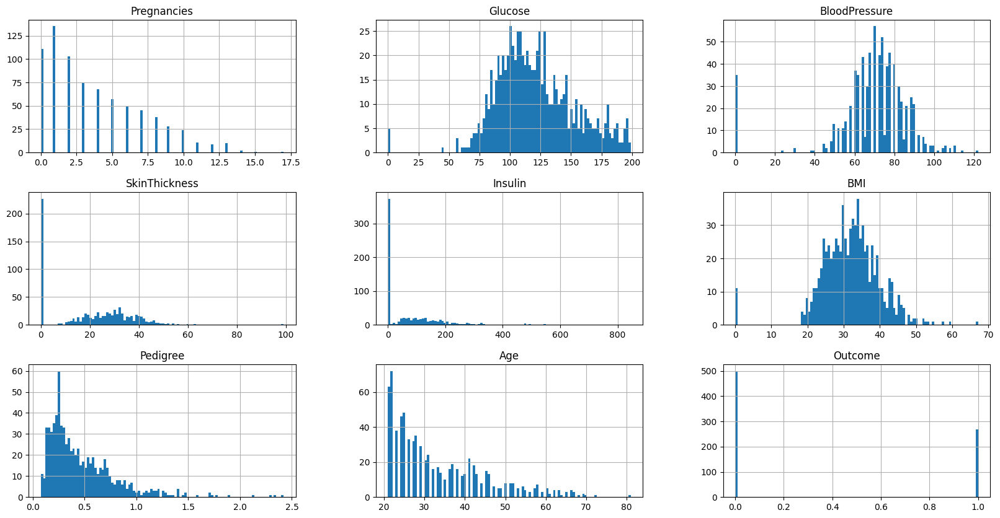
    


```python
data.isnull().sum()
```


    Pregnancies      0
    Glucose          0
    BloodPressure    0
    SkinThickness    0
    Insulin          0
    BMI              0
    Pedigree         0
    Age              0
    Outcome          0
    dtype: int64


Все значения не являются пустыми, нужно исключить нулевые значения

**Outcome** - категориальный признак.

--> Не все признаки обладают нормальным распределением, подлежат нормализации. Исключим записи с нулевыми значениями.


```python
# data = data[~data[['Glucose', 'BloodPressure', 'SkinThickness', 'Insulin', 'BMI']].isin([0]).any(axis=1)]
```

Избавимся от выбросов.

--> Колонка возраста не будет иметь выбросов, так как не имеет погрешности измерения.


```python
# columns_to_cut_low = ['Glucose', 'BloodPressure']
# columns_to_cut_high = ['SkinThickness', 'Insulin', 'BMI', 'Pedigree']

# low_percentiles = data[columns_to_cut_low].quantile(0.05)
# high_percentiles = data[columns_to_cut_high].quantile(0.95)

# low = data[columns_to_cut_low] < low_percentiles
# high = data[columns_to_cut_high] > high_percentiles

# combined_mask = low.any(axis=1) | high.any(axis=1)

# data = data[~combined_mask]
```

Построим матрицу корреляции.


```python
corr = data.corr()
plt.matshow(corr)
plt.yticks(range(len(data.columns)), data.columns)
plt.xticks(range(len(data.columns)), data.columns, rotation=90)
plt.colorbar()
for (i, j), val in np.ndenumerate(corr):
    plt.text(j, i, f'{val:.2f}', ha='center', va='center', color='white' if abs(val) > 0.5 else 'black')
plt.show()
```


    
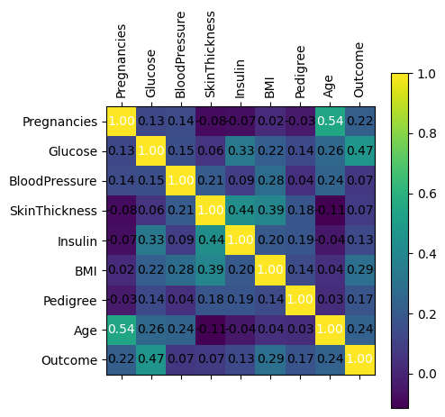
    


Признаки `Age` и `Pregnancies` имеют высокую корреляцию.

--> Использование матрицы корреляции позволяет оценить степень взаимосвязи между признаками в выборке. Если два или более признака сильно коррелируют друг с другом, это может привести к мультиколлинеарности, что может искажать результаты анализа и делать модель менее точной и надежной. Уберем второй признак.


```python
# data.drop('Pregnancies', axis=1, inplace=True)
```

Снова посмотрим на данные


```python
data.hist(bins=100, figsize=(20, 10))
```


    array([[<Axes: title={'center': 'Pregnancies'}>,
            <Axes: title={'center': 'Glucose'}>,
            <Axes: title={'center': 'BloodPressure'}>],
           [<Axes: title={'center': 'SkinThickness'}>,
            <Axes: title={'center': 'Insulin'}>,
            <Axes: title={'center': 'BMI'}>],
           [<Axes: title={'center': 'Pedigree'}>,
            <Axes: title={'center': 'Age'}>,
            <Axes: title={'center': 'Outcome'}>]], dtype=object)


    

    


### Нормализация

Заметим, что записей `Outcome` с отрицательным результатом больше остальных.

--> Балансирование датасета до равенства исходов категориального признака может быть необходимо в случае, если в исходных данных присутствует значительный дисбаланс между классами этого признака. Например, если у нас есть классификационная задача, и один класс встречается гораздо чаще других, модель может быть склонна к предсказыванию этого класса, игнорируя менее часто встречающиеся классы. Сбалансируем датасет до равенства исходов `Outcome` путем случайной выборки строк из основного класса.


```python
# desired_samples = data['Outcome'].value_counts().min()
# data = data.groupby('Outcome').apply(lambda x: x.sample(desired_samples)).reset_index(drop=True)
```

Используем min-max нормализацию.


```python
def min_max_standardize_data(data, columns=[]):
    standardized_data = data.copy()
    for column in columns:
        # x' = (x - min(x)) / (max(x) - min(x))
        standardized_data[column] = (data[column] - np.min(data[column])) / (np.max(data[column]) - np.min(data[column]))
    return standardized_data

data = min_max_standardize_data(data, data.columns)
data.hist(bins=100, figsize=(20, 10))
```


    array([[<Axes: title={'center': 'Pregnancies'}>,
            <Axes: title={'center': 'Glucose'}>,
            <Axes: title={'center': 'BloodPressure'}>],
           [<Axes: title={'center': 'SkinThickness'}>,
            <Axes: title={'center': 'Insulin'}>,
            <Axes: title={'center': 'BMI'}>],
           [<Axes: title={'center': 'Pedigree'}>,
            <Axes: title={'center': 'Age'}>,
            <Axes: title={'center': 'Outcome'}>]], dtype=object)


    

    


## Метод K-ближайших соседей

#### Разделение данных на обучающий и тестовый наборы


```python
X = data.drop('Outcome', axis=1)
Y = data['Outcome']
```


```python
def train_test_split(X, Y, seed, test_percent=0.2):
  random.seed(seed)
  random.shuffle(list(range(len(X))))

  test_size = int(len(X) * test_percent)

  x_train = X[test_size:]
  x_test = X[:test_size]
  y_train = Y[test_size:]
  y_test = Y[:test_size]

  return x_train, x_test, y_train, y_test
```

Реализация KNN


```python
class KNN:
  def __init__(self, k=3):
    self.k = k

  def fit(self, x_train, y_train):
    self.x_train = x_train
    self.y_train = y_train

  def predict(self, x_test):
    return np.array([self.predict_test(x) for x in x_test])

  def predict_test(self, x):
    dists = [np.sqrt(np.sum((x - x_train_idx)**2)) for x_train_idx in self.x_train]
      
    k_idx = np.argsort(dists)[:self.k]
    k_nearest_labels = [self.y_train[i] for i in k_idx]

    most_common = np.bincount(k_nearest_labels).argmax()
    return most_common
```

Определение оценки модели


```python
def accuracy_score(y_test, y_pred):
    correct_predictions = np.sum(y_test == y_pred)
    total_predictions = len(y_test)
    return correct_predictions / total_predictions

def error_matrix(pred_y, true_y, n):
    res = np.zeros((n, n))
    for pred, true in zip(pred_y, true_y):
        res[int(pred), int(true)] += 1
    return res

def show_matrix(ax, pred_y, true_y, n):
    res = error_matrix(pred_y, true_y, n)
    ax.matshow(res)
    ax.set_xlabel('True class')
    ax.set_ylabel('Predicted class')
    for (i, j), z in np.ndenumerate(res):
        ax.text(j, i, str(int(z)), ha='center', va='center')
```

#### Модель 1 (Модель с случайным набором признаков)


```python
def random_features_knn(X, Y, k, subplot_i):
    selected_features = random.sample(list(X.columns), random.randint(2, len(X.columns)))
    new_data = X[selected_features]
    display(new_data.head())
    
    x_train, x_test, y_train, y_test = train_test_split(np.array(new_data), np.array(Y), 42, 0.2)
    print(f"Train size: {len(x_train)}")
    print(pd.DataFrame(y_train).value_counts())
    print()
    print(f"Test size: {len(x_test)}")
    print(pd.DataFrame(y_test).value_counts())

    knn = KNN(k=k)
    knn.fit(x_train, y_train)
    y_pred = knn.predict(x_test)
    
    print("Оценка модели: ", accuracy_score(y_test, y_pred))

    ax = plt.subplot(1, 3, i)
    ax.set_title('K = %d' %k)
    show_matrix(ax, y_pred, y_test, 2)
```


```python
for i, k in enumerate([3, 5, 10], 1):
    random_features_knn(X, Y, k, i)
```


<div>
<table border="1" class="dataframe">
  <thead>
    <tr style="text-align: right;">
      <th></th>
      <th>BMI</th>
      <th>Pregnancies</th>
      <th>Pedigree</th>
      <th>BloodPressure</th>
      <th>Age</th>
      <th>Insulin</th>
    </tr>
  </thead>
  <tbody>
    <tr>
      <th>0</th>
      <td>0.500745</td>
      <td>0.352941</td>
      <td>0.234415</td>
      <td>0.590164</td>
      <td>0.483333</td>
      <td>0.000000</td>
    </tr>
    <tr>
      <th>1</th>
      <td>0.396423</td>
      <td>0.058824</td>
      <td>0.116567</td>
      <td>0.540984</td>
      <td>0.166667</td>
      <td>0.000000</td>
    </tr>
    <tr>
      <th>2</th>
      <td>0.347243</td>
      <td>0.470588</td>
      <td>0.253629</td>
      <td>0.524590</td>
      <td>0.183333</td>
      <td>0.000000</td>
    </tr>
    <tr>
      <th>3</th>
      <td>0.418778</td>
      <td>0.058824</td>
      <td>0.038002</td>
      <td>0.540984</td>
      <td>0.000000</td>
      <td>0.111111</td>
    </tr>
    <tr>
      <th>4</th>
      <td>0.642325</td>
      <td>0.000000</td>
      <td>0.943638</td>
      <td>0.327869</td>
      <td>0.200000</td>
      <td>0.198582</td>
    </tr>
  </tbody>
</table>
</div>


    Train size: 615
    0.0    401
    1.0    214
    dtype: int64
    
    Test size: 153
    0.0    99
    1.0    54
    dtype: int64
    Оценка модели:  0.7058823529411765
    


<div>
<table border="1" class="dataframe">
  <thead>
    <tr style="text-align: right;">
      <th></th>
      <th>BloodPressure</th>
      <th>SkinThickness</th>
      <th>Glucose</th>
      <th>Insulin</th>
      <th>Age</th>
      <th>Pedigree</th>
      <th>BMI</th>
    </tr>
  </thead>
  <tbody>
    <tr>
      <th>0</th>
      <td>0.590164</td>
      <td>0.353535</td>
      <td>0.743719</td>
      <td>0.000000</td>
      <td>0.483333</td>
      <td>0.234415</td>
      <td>0.500745</td>
    </tr>
    <tr>
      <th>1</th>
      <td>0.540984</td>
      <td>0.292929</td>
      <td>0.427136</td>
      <td>0.000000</td>
      <td>0.166667</td>
      <td>0.116567</td>
      <td>0.396423</td>
    </tr>
    <tr>
      <th>2</th>
      <td>0.524590</td>
      <td>0.000000</td>
      <td>0.919598</td>
      <td>0.000000</td>
      <td>0.183333</td>
      <td>0.253629</td>
      <td>0.347243</td>
    </tr>
    <tr>
      <th>3</th>
      <td>0.540984</td>
      <td>0.232323</td>
      <td>0.447236</td>
      <td>0.111111</td>
      <td>0.000000</td>
      <td>0.038002</td>
      <td>0.418778</td>
    </tr>
    <tr>
      <th>4</th>
      <td>0.327869</td>
      <td>0.353535</td>
      <td>0.688442</td>
      <td>0.198582</td>
      <td>0.200000</td>
      <td>0.943638</td>
      <td>0.642325</td>
    </tr>
  </tbody>
</table>
</div>


    Train size: 615
    0.0    401
    1.0    214
    dtype: int64
    
    Test size: 153
    0.0    99
    1.0    54
    dtype: int64
    Оценка модели:  0.7581699346405228
    


<div>
<table border="1" class="dataframe">
  <thead>
    <tr style="text-align: right;">
      <th></th>
      <th>BloodPressure</th>
      <th>SkinThickness</th>
      <th>Glucose</th>
      <th>Insulin</th>
      <th>Age</th>
      <th>Pedigree</th>
      <th>BMI</th>
    </tr>
  </thead>
  <tbody>
    <tr>
      <th>0</th>
      <td>0.590164</td>
      <td>0.353535</td>
      <td>0.743719</td>
      <td>0.000000</td>
      <td>0.483333</td>
      <td>0.234415</td>
      <td>0.500745</td>
    </tr>
    <tr>
      <th>1</th>
      <td>0.540984</td>
      <td>0.292929</td>
      <td>0.427136</td>
      <td>0.000000</td>
      <td>0.166667</td>
      <td>0.116567</td>
      <td>0.396423</td>
    </tr>
    <tr>
      <th>2</th>
      <td>0.524590</td>
      <td>0.000000</td>
      <td>0.919598</td>
      <td>0.000000</td>
      <td>0.183333</td>
      <td>0.253629</td>
      <td>0.347243</td>
    </tr>
    <tr>
      <th>3</th>
      <td>0.540984</td>
      <td>0.232323</td>
      <td>0.447236</td>
      <td>0.111111</td>
      <td>0.000000</td>
      <td>0.038002</td>
      <td>0.418778</td>
    </tr>
    <tr>
      <th>4</th>
      <td>0.327869</td>
      <td>0.353535</td>
      <td>0.688442</td>
      <td>0.198582</td>
      <td>0.200000</td>
      <td>0.943638</td>
      <td>0.642325</td>
    </tr>
  </tbody>
</table>
</div>


    Train size: 615
    0.0    401
    1.0    214
    dtype: int64
    
    Test size: 153
    0.0    99
    1.0    54
    dtype: int64
    Оценка модели:  0.7712418300653595
    


    
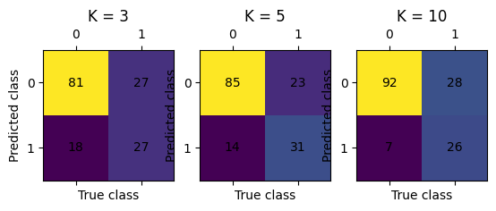
    


#### Модель 2 (Фиксированный набор признаков, который выбирается заранее)


```python
import itertools

x_train, x_test, y_train, y_test = train_test_split(X, Y, 42, 0.2)
columns = list(x_train.columns)
combinations = itertools.combinations(columns, 2)

for i_column_name, j_column_name in combinations:
    data.plot.scatter(x=i_column_name, y=j_column_name, c='Outcome', colormap='rainbow', edgecolor='black');
```

    C:\Data\Programming\Python310\lib\site-packages\pandas\plotting\_matplotlib\core.py:512: RuntimeWarning: More than 20 figures have been opened. Figures created through the pyplot interface (`matplotlib.pyplot.figure`) are retained until explicitly closed and may consume too much memory. (To control this warning, see the rcParam `figure.max_open_warning`). Consider using `matplotlib.pyplot.close()`.
      fig = self.plt.figure(figsize=self.figsize)
    


    
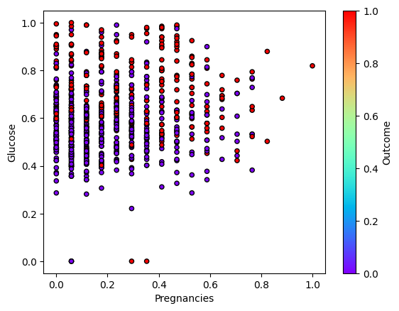
    


    
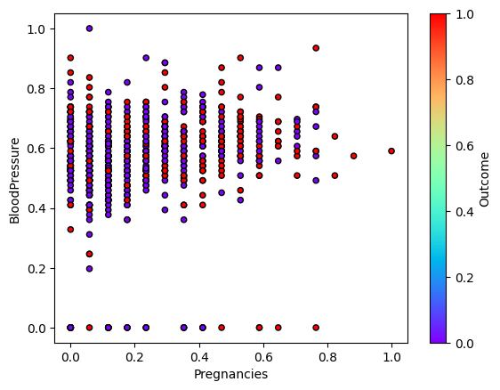
    


    
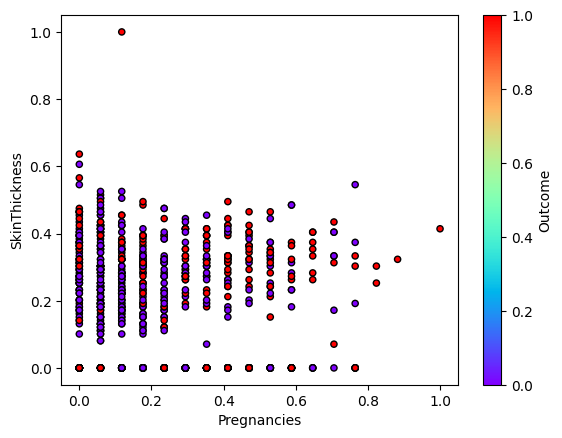
    


    
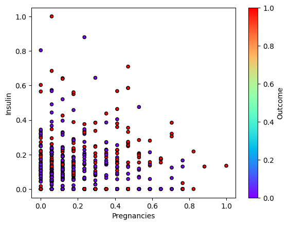
    


    
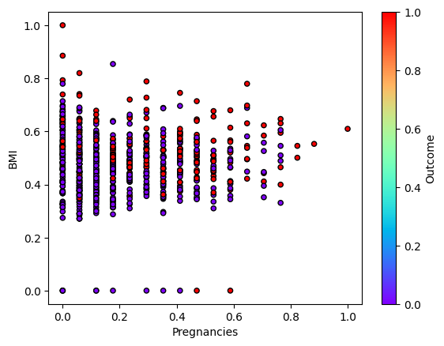
    


    
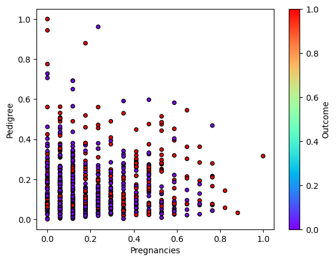
    


    
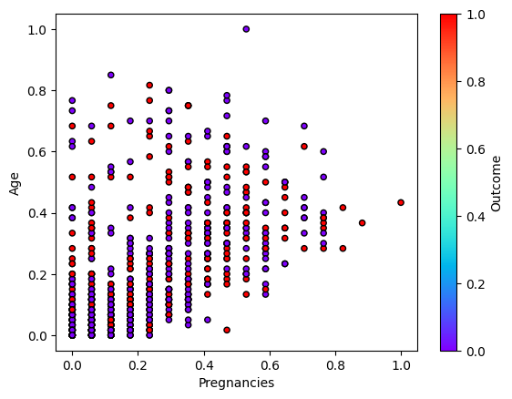
    


    

    


    
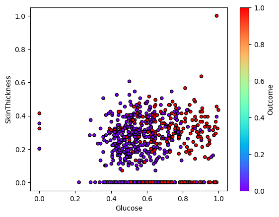
    


    
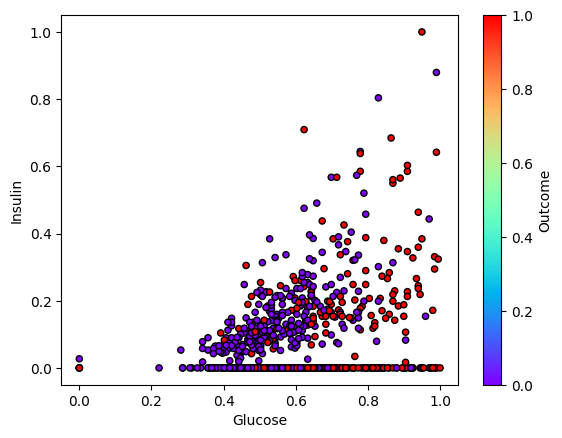
    


    
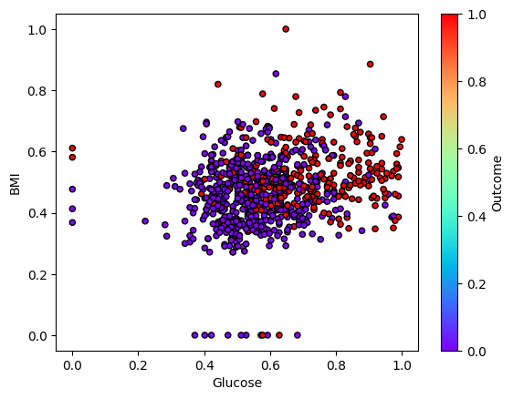
    


    
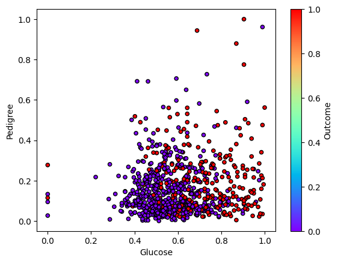
    


    
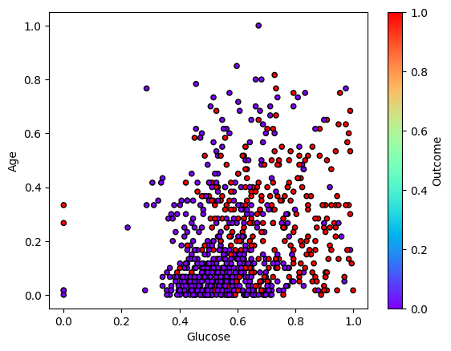
    


    
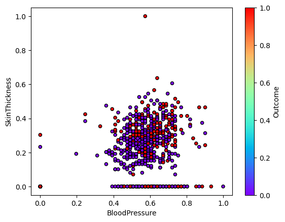
    


    
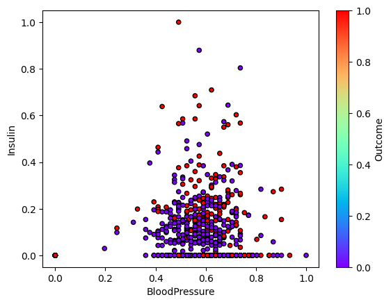
    


    
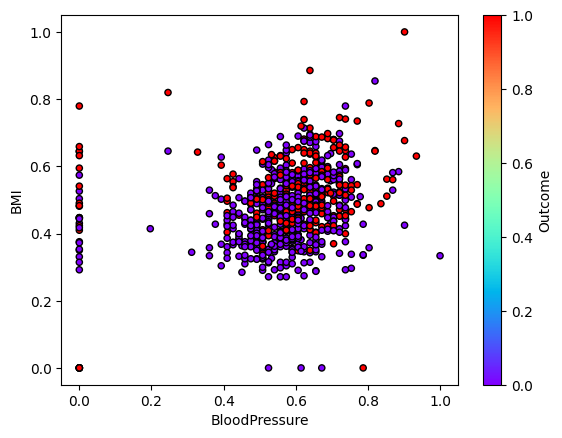
    


    
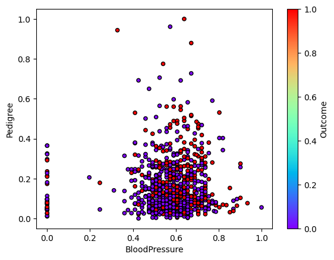
    


    
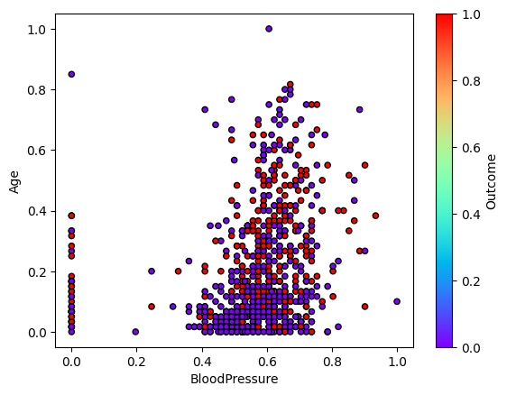
    


    
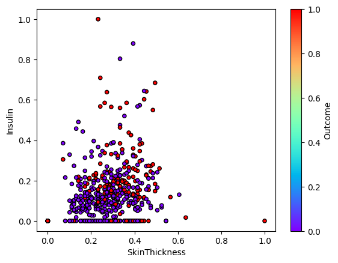
    


    
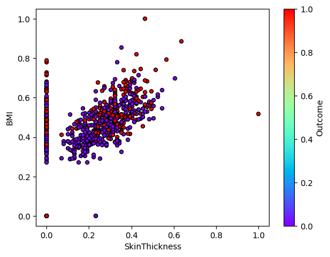
    


    
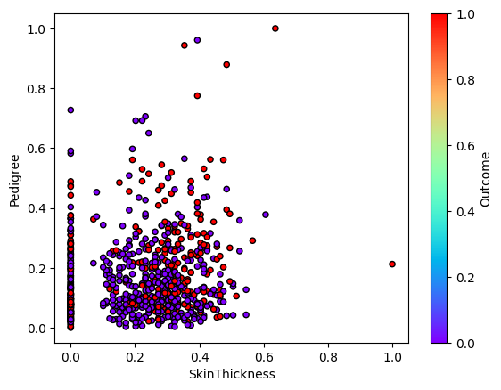
    


    
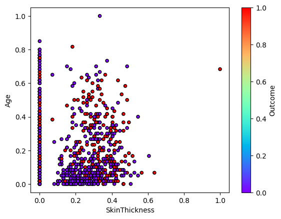
    


    
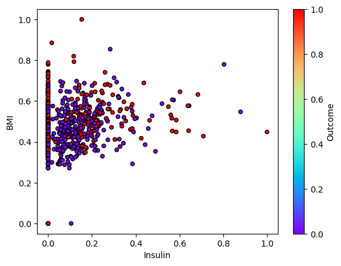
    


    
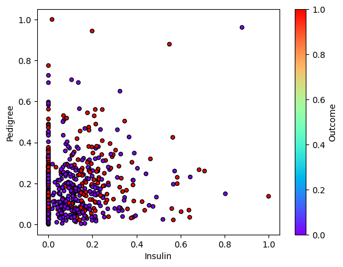
    


    
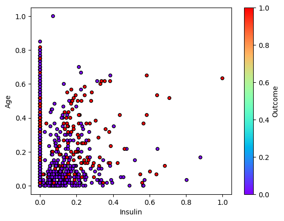
    


    
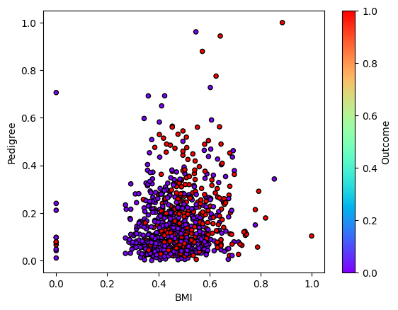
    


    
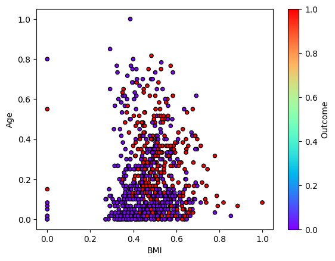
    


    
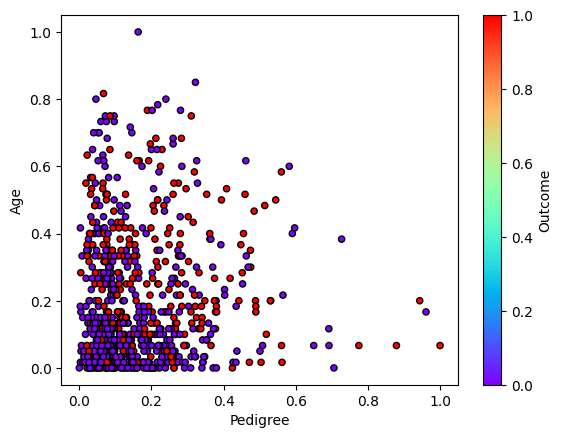
    


```python
from itertools import combinations

def fix_features_knn(X, Y, k, i):
    x_train, x_test, y_train, y_test = train_test_split(X, Y, 42, 0.2)
    best_accuracy = 0
    best_feature_subset = []
    best_matrix=[]
    print(len(combinations(X.columns, 3)))
    for subset in combinations(X.columns, 3):
        selected_features = list(subset)
        
        X_train_subset = np.array(x_train[selected_features].values)
        X_test_subset = np.array(x_test[selected_features].values)
        
        knn = KNN(k=k)
        knn.fit(X_train_subset, np.array(y_train))
        y_pred = knn.predict(X_test_subset)
        
        accuracy = accuracy_score(np.array(y_test), y_pred)
        
        if accuracy > best_accuracy:
            best_accuracy = accuracy
            best_feature_subset = selected_features
            best_matrix=error_matrix(np.array(y_test), y_pred, 2)
    
    print(f"Лучший набор признаков: {best_feature_subset}")
    print(f"Точность: {best_accuracy}")

    ax = plt.subplot(1, 3, i)
    ax.set_title('K = %d' %k)
    show_matrix(ax, y_pred, y_test, 2)

```


```python
for i, k in enumerate([3, 5, 10], 1):
    print("K =", k)
    fix_features_knn(X, Y, k, i)
```

    K = 3
    Лучший набор признаков: ['Pregnancies', 'Glucose', 'Age']
    Точность: 0.7647058823529411
    K = 5
    Лучший набор признаков: ['Pregnancies', 'BMI', 'Age']
    Точность: 0.7712418300653595
    K = 10
    Лучший набор признаков: ['Pregnancies', 'Glucose', 'BMI']
    Точность: 0.7843137254901961
    


    
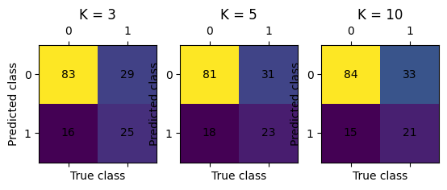
    


```python
from mpl_toolkits.mplot3d import Axes3D

def plot_3d(X, y, features_indices):
    fig = plt.figure(figsize=(8, 6))
    ax = fig.add_subplot(111, projection="3d")
    
    ax.scatter([x[0] for x in X], [x[1] for x in X], [x[2] for x in X], c=y, cmap="viridis")
    ax.set_xlabel("Признак 1: " + features_indices[0])
    ax.set_ylabel("Признак 2: " + features_indices[1])
    ax.set_zlabel("Признак 3: " + features_indices[2])
    plt.show()

fixed_features_list = {
    3: ['Pregnancies', 'Glucose', 'Age'],
    5: ['Pregnancies', 'BMI', 'Age'],
    10: ['Pregnancies', 'Glucose', 'BMI']
}
for k in [3, 5, 10]:
    fixed_features = fixed_features_list[k]
    print(f"K = {k}, Fixed features: {fixed_features}")
    x_train, x_test, y_train, y_test = train_test_split(X, Y, 42, 0.2)
    x_train_subset = np.array(x_train[fixed_features].values)
    plot_3d(x_train_subset, np.array(y_train), fixed_features)

```

    K = 3, Fixed features: ['Pregnancies', 'Glucose', 'Age']
    


    
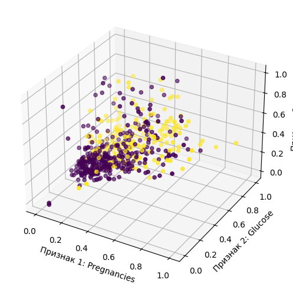
    


    K = 5, Fixed features: ['Pregnancies', 'BMI', 'Age']
    


    
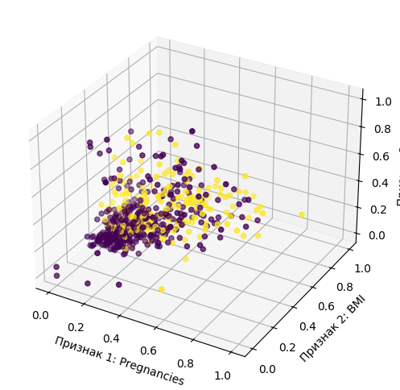
    


    K = 10, Fixed features: ['Pregnancies', 'Glucose', 'BMI']
    


    
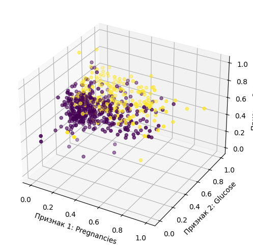
    

