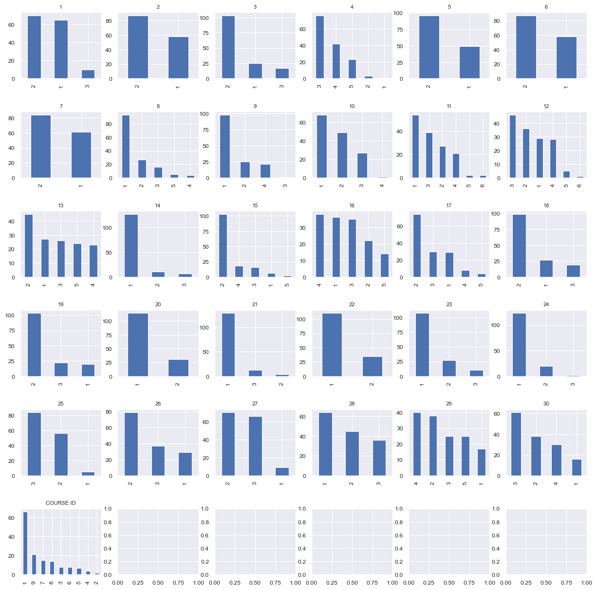
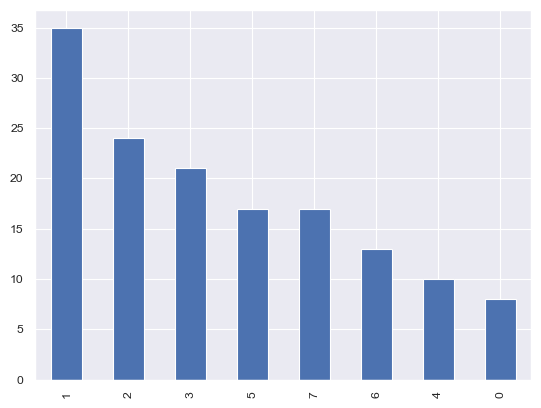
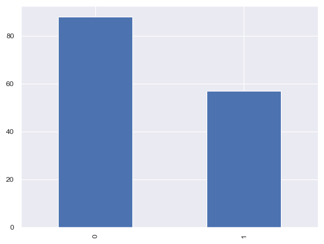
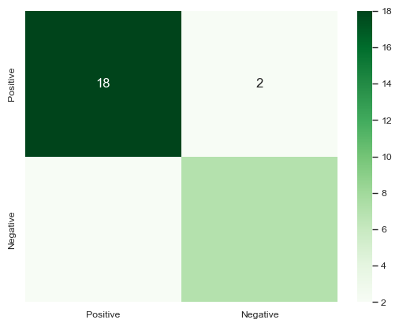
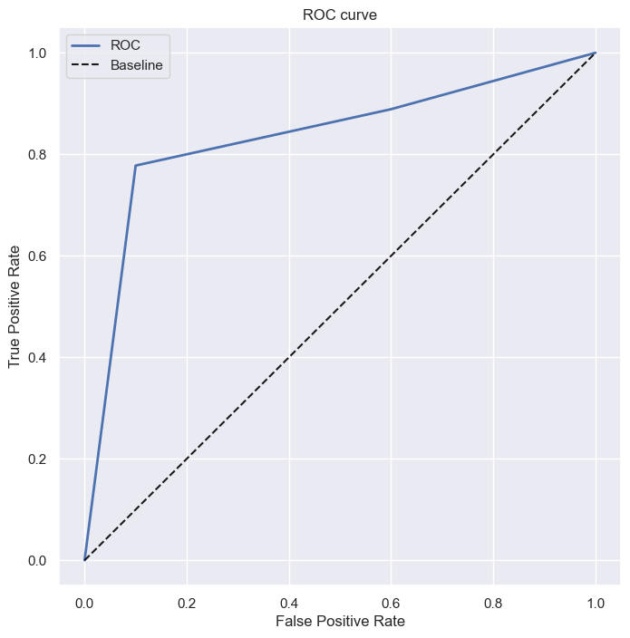
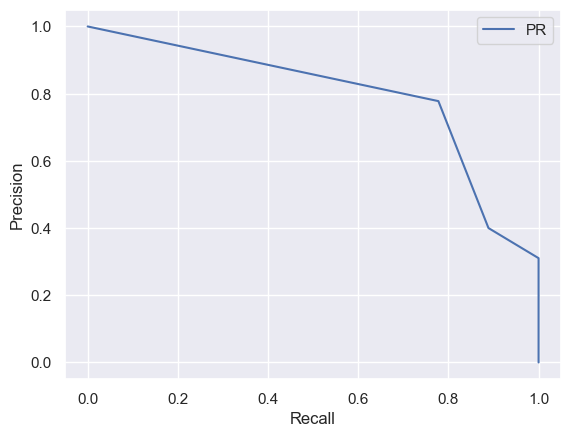

# Лабораторная 5. Деревья решений

Импорт библиотек


```python
import numpy as np
import pandas as pd
import matplotlib.pyplot as plt
import random
from math import sqrt, ceil, log2
```

**Выбор датасетов**: Студенты с **нечетным** порядковым номером в группе должны использовать датасет **с данными про оценки студентов инженерного и педагогического факультетов**.


```python
seed = 421337
```


```python
data = pd.read_csv('data/higher_education_students_performance_evaluation.csv')
data
```


<div>
<style scoped>
    .dataframe tbody tr th:only-of-type {
        vertical-align: middle;
    }

    .dataframe tbody tr th {
        vertical-align: top;
    }

    .dataframe thead th {
        text-align: right;
    }
</style>
<table border="1" class="dataframe">
  <thead>
    <tr style="text-align: right;">
      <th></th>
      <th>STUDENT ID</th>
      <th>1</th>
      <th>2</th>
      <th>3</th>
      <th>4</th>
      <th>5</th>
      <th>6</th>
      <th>7</th>
      <th>8</th>
      <th>9</th>
      <th>...</th>
      <th>23</th>
      <th>24</th>
      <th>25</th>
      <th>26</th>
      <th>27</th>
      <th>28</th>
      <th>29</th>
      <th>30</th>
      <th>COURSE ID</th>
      <th>GRADE</th>
    </tr>
  </thead>
  <tbody>
    <tr>
      <th>0</th>
      <td>STUDENT1</td>
      <td>2</td>
      <td>2</td>
      <td>3</td>
      <td>3</td>
      <td>1</td>
      <td>2</td>
      <td>2</td>
      <td>1</td>
      <td>1</td>
      <td>...</td>
      <td>1</td>
      <td>1</td>
      <td>3</td>
      <td>2</td>
      <td>1</td>
      <td>2</td>
      <td>1</td>
      <td>1</td>
      <td>1</td>
      <td>1</td>
    </tr>
    <tr>
      <th>1</th>
      <td>STUDENT2</td>
      <td>2</td>
      <td>2</td>
      <td>3</td>
      <td>3</td>
      <td>1</td>
      <td>2</td>
      <td>2</td>
      <td>1</td>
      <td>1</td>
      <td>...</td>
      <td>1</td>
      <td>1</td>
      <td>3</td>
      <td>2</td>
      <td>3</td>
      <td>2</td>
      <td>2</td>
      <td>3</td>
      <td>1</td>
      <td>1</td>
    </tr>
    <tr>
      <th>2</th>
      <td>STUDENT3</td>
      <td>2</td>
      <td>2</td>
      <td>2</td>
      <td>3</td>
      <td>2</td>
      <td>2</td>
      <td>2</td>
      <td>2</td>
      <td>4</td>
      <td>...</td>
      <td>1</td>
      <td>1</td>
      <td>2</td>
      <td>2</td>
      <td>1</td>
      <td>1</td>
      <td>2</td>
      <td>2</td>
      <td>1</td>
      <td>1</td>
    </tr>
    <tr>
      <th>3</th>
      <td>STUDENT4</td>
      <td>1</td>
      <td>1</td>
      <td>1</td>
      <td>3</td>
      <td>1</td>
      <td>2</td>
      <td>1</td>
      <td>2</td>
      <td>1</td>
      <td>...</td>
      <td>1</td>
      <td>2</td>
      <td>3</td>
      <td>2</td>
      <td>2</td>
      <td>1</td>
      <td>3</td>
      <td>2</td>
      <td>1</td>
      <td>1</td>
    </tr>
    <tr>
      <th>4</th>
      <td>STUDENT5</td>
      <td>2</td>
      <td>2</td>
      <td>1</td>
      <td>3</td>
      <td>2</td>
      <td>2</td>
      <td>1</td>
      <td>3</td>
      <td>1</td>
      <td>...</td>
      <td>2</td>
      <td>1</td>
      <td>2</td>
      <td>2</td>
      <td>2</td>
      <td>1</td>
      <td>2</td>
      <td>2</td>
      <td>1</td>
      <td>1</td>
    </tr>
    <tr>
      <th>...</th>
      <td>...</td>
      <td>...</td>
      <td>...</td>
      <td>...</td>
      <td>...</td>
      <td>...</td>
      <td>...</td>
      <td>...</td>
      <td>...</td>
      <td>...</td>
      <td>...</td>
      <td>...</td>
      <td>...</td>
      <td>...</td>
      <td>...</td>
      <td>...</td>
      <td>...</td>
      <td>...</td>
      <td>...</td>
      <td>...</td>
      <td>...</td>
    </tr>
    <tr>
      <th>140</th>
      <td>STUDENT141</td>
      <td>2</td>
      <td>1</td>
      <td>2</td>
      <td>3</td>
      <td>1</td>
      <td>1</td>
      <td>2</td>
      <td>1</td>
      <td>1</td>
      <td>...</td>
      <td>1</td>
      <td>1</td>
      <td>2</td>
      <td>1</td>
      <td>2</td>
      <td>1</td>
      <td>3</td>
      <td>3</td>
      <td>9</td>
      <td>5</td>
    </tr>
    <tr>
      <th>141</th>
      <td>STUDENT142</td>
      <td>1</td>
      <td>1</td>
      <td>2</td>
      <td>4</td>
      <td>2</td>
      <td>2</td>
      <td>2</td>
      <td>1</td>
      <td>4</td>
      <td>...</td>
      <td>1</td>
      <td>1</td>
      <td>3</td>
      <td>2</td>
      <td>2</td>
      <td>1</td>
      <td>5</td>
      <td>3</td>
      <td>9</td>
      <td>5</td>
    </tr>
    <tr>
      <th>142</th>
      <td>STUDENT143</td>
      <td>1</td>
      <td>1</td>
      <td>1</td>
      <td>4</td>
      <td>2</td>
      <td>2</td>
      <td>2</td>
      <td>1</td>
      <td>1</td>
      <td>...</td>
      <td>1</td>
      <td>1</td>
      <td>3</td>
      <td>3</td>
      <td>2</td>
      <td>1</td>
      <td>4</td>
      <td>3</td>
      <td>9</td>
      <td>1</td>
    </tr>
    <tr>
      <th>143</th>
      <td>STUDENT144</td>
      <td>2</td>
      <td>1</td>
      <td>2</td>
      <td>4</td>
      <td>1</td>
      <td>1</td>
      <td>1</td>
      <td>5</td>
      <td>2</td>
      <td>...</td>
      <td>2</td>
      <td>1</td>
      <td>2</td>
      <td>1</td>
      <td>2</td>
      <td>1</td>
      <td>5</td>
      <td>3</td>
      <td>9</td>
      <td>4</td>
    </tr>
    <tr>
      <th>144</th>
      <td>STUDENT145</td>
      <td>1</td>
      <td>1</td>
      <td>1</td>
      <td>5</td>
      <td>2</td>
      <td>2</td>
      <td>2</td>
      <td>3</td>
      <td>1</td>
      <td>...</td>
      <td>2</td>
      <td>1</td>
      <td>3</td>
      <td>2</td>
      <td>3</td>
      <td>1</td>
      <td>5</td>
      <td>4</td>
      <td>9</td>
      <td>3</td>
    </tr>
  </tbody>
</table>
<p>145 rows × 33 columns</p>
</div>


```python
data.describe()
```


<div>
<style scoped>
    .dataframe tbody tr th:only-of-type {
        vertical-align: middle;
    }

    .dataframe tbody tr th {
        vertical-align: top;
    }

    .dataframe thead th {
        text-align: right;
    }
</style>
<table border="1" class="dataframe">
  <thead>
    <tr style="text-align: right;">
      <th></th>
      <th>1</th>
      <th>2</th>
      <th>3</th>
      <th>4</th>
      <th>5</th>
      <th>6</th>
      <th>7</th>
      <th>8</th>
      <th>9</th>
      <th>10</th>
      <th>...</th>
      <th>23</th>
      <th>24</th>
      <th>25</th>
      <th>26</th>
      <th>27</th>
      <th>28</th>
      <th>29</th>
      <th>30</th>
      <th>COURSE ID</th>
      <th>GRADE</th>
    </tr>
  </thead>
  <tbody>
    <tr>
      <th>count</th>
      <td>145.000000</td>
      <td>145.000000</td>
      <td>145.000000</td>
      <td>145.000000</td>
      <td>145.000000</td>
      <td>145.000000</td>
      <td>145.000000</td>
      <td>145.000000</td>
      <td>145.000000</td>
      <td>145.000000</td>
      <td>...</td>
      <td>145.000000</td>
      <td>145.000000</td>
      <td>145.000000</td>
      <td>145.000000</td>
      <td>145.000000</td>
      <td>145.000000</td>
      <td>145.000000</td>
      <td>145.000000</td>
      <td>145.000000</td>
      <td>145.000000</td>
    </tr>
    <tr>
      <th>mean</th>
      <td>1.620690</td>
      <td>1.600000</td>
      <td>1.944828</td>
      <td>3.572414</td>
      <td>1.662069</td>
      <td>1.600000</td>
      <td>1.579310</td>
      <td>1.627586</td>
      <td>1.620690</td>
      <td>1.731034</td>
      <td>...</td>
      <td>1.337931</td>
      <td>1.165517</td>
      <td>2.544828</td>
      <td>2.055172</td>
      <td>2.393103</td>
      <td>1.806897</td>
      <td>3.124138</td>
      <td>2.724138</td>
      <td>4.131034</td>
      <td>3.227586</td>
    </tr>
    <tr>
      <th>std</th>
      <td>0.613154</td>
      <td>0.491596</td>
      <td>0.537216</td>
      <td>0.805750</td>
      <td>0.474644</td>
      <td>0.491596</td>
      <td>0.495381</td>
      <td>1.020245</td>
      <td>1.061112</td>
      <td>0.783999</td>
      <td>...</td>
      <td>0.614870</td>
      <td>0.408483</td>
      <td>0.564940</td>
      <td>0.674736</td>
      <td>0.604343</td>
      <td>0.810492</td>
      <td>1.301083</td>
      <td>0.916536</td>
      <td>3.260145</td>
      <td>2.197678</td>
    </tr>
    <tr>
      <th>min</th>
      <td>1.000000</td>
      <td>1.000000</td>
      <td>1.000000</td>
      <td>1.000000</td>
      <td>1.000000</td>
      <td>1.000000</td>
      <td>1.000000</td>
      <td>1.000000</td>
      <td>1.000000</td>
      <td>1.000000</td>
      <td>...</td>
      <td>1.000000</td>
      <td>1.000000</td>
      <td>1.000000</td>
      <td>1.000000</td>
      <td>1.000000</td>
      <td>1.000000</td>
      <td>1.000000</td>
      <td>1.000000</td>
      <td>1.000000</td>
      <td>0.000000</td>
    </tr>
    <tr>
      <th>25%</th>
      <td>1.000000</td>
      <td>1.000000</td>
      <td>2.000000</td>
      <td>3.000000</td>
      <td>1.000000</td>
      <td>1.000000</td>
      <td>1.000000</td>
      <td>1.000000</td>
      <td>1.000000</td>
      <td>1.000000</td>
      <td>...</td>
      <td>1.000000</td>
      <td>1.000000</td>
      <td>2.000000</td>
      <td>2.000000</td>
      <td>2.000000</td>
      <td>1.000000</td>
      <td>2.000000</td>
      <td>2.000000</td>
      <td>1.000000</td>
      <td>1.000000</td>
    </tr>
    <tr>
      <th>50%</th>
      <td>2.000000</td>
      <td>2.000000</td>
      <td>2.000000</td>
      <td>3.000000</td>
      <td>2.000000</td>
      <td>2.000000</td>
      <td>2.000000</td>
      <td>1.000000</td>
      <td>1.000000</td>
      <td>2.000000</td>
      <td>...</td>
      <td>1.000000</td>
      <td>1.000000</td>
      <td>3.000000</td>
      <td>2.000000</td>
      <td>2.000000</td>
      <td>2.000000</td>
      <td>3.000000</td>
      <td>3.000000</td>
      <td>3.000000</td>
      <td>3.000000</td>
    </tr>
    <tr>
      <th>75%</th>
      <td>2.000000</td>
      <td>2.000000</td>
      <td>2.000000</td>
      <td>4.000000</td>
      <td>2.000000</td>
      <td>2.000000</td>
      <td>2.000000</td>
      <td>2.000000</td>
      <td>2.000000</td>
      <td>2.000000</td>
      <td>...</td>
      <td>2.000000</td>
      <td>1.000000</td>
      <td>3.000000</td>
      <td>3.000000</td>
      <td>3.000000</td>
      <td>2.000000</td>
      <td>4.000000</td>
      <td>3.000000</td>
      <td>7.000000</td>
      <td>5.000000</td>
    </tr>
    <tr>
      <th>max</th>
      <td>3.000000</td>
      <td>2.000000</td>
      <td>3.000000</td>
      <td>5.000000</td>
      <td>2.000000</td>
      <td>2.000000</td>
      <td>2.000000</td>
      <td>5.000000</td>
      <td>4.000000</td>
      <td>4.000000</td>
      <td>...</td>
      <td>3.000000</td>
      <td>3.000000</td>
      <td>3.000000</td>
      <td>3.000000</td>
      <td>3.000000</td>
      <td>3.000000</td>
      <td>5.000000</td>
      <td>4.000000</td>
      <td>9.000000</td>
      <td>7.000000</td>
    </tr>
  </tbody>
</table>
<p>8 rows × 32 columns</p>
</div>


```python
data.info()
```

    <class 'pandas.core.frame.DataFrame'>
    RangeIndex: 145 entries, 0 to 144
    Data columns (total 33 columns):
     #   Column      Non-Null Count  Dtype 
    ---  ------      --------------  ----- 
     0   STUDENT ID  145 non-null    object
     1   1           145 non-null    int64 
     2   2           145 non-null    int64 
     3   3           145 non-null    int64 
     4   4           145 non-null    int64 
     5   5           145 non-null    int64 
     6   6           145 non-null    int64 
     7   7           145 non-null    int64 
     8   8           145 non-null    int64 
     9   9           145 non-null    int64 
     10  10          145 non-null    int64 
     11  11          145 non-null    int64 
     12  12          145 non-null    int64 
     13  13          145 non-null    int64 
     14  14          145 non-null    int64 
     15  15          145 non-null    int64 
     16  16          145 non-null    int64 
     17  17          145 non-null    int64 
     18  18          145 non-null    int64 
     19  19          145 non-null    int64 
     20  20          145 non-null    int64 
     21  21          145 non-null    int64 
     22  22          145 non-null    int64 
     23  23          145 non-null    int64 
     24  24          145 non-null    int64 
     25  25          145 non-null    int64 
     26  26          145 non-null    int64 
     27  27          145 non-null    int64 
     28  28          145 non-null    int64 
     29  29          145 non-null    int64 
     30  30          145 non-null    int64 
     31  COURSE ID   145 non-null    int64 
     32  GRADE       145 non-null    int64 
    dtypes: int64(32), object(1)
    memory usage: 37.5+ KB
    


```python
data.isnull().sum()
```


    STUDENT ID    0
    1             0
    2             0
    3             0
    4             0
    5             0
    6             0
    7             0
    8             0
    9             0
    10            0
    11            0
    12            0
    13            0
    14            0
    15            0
    16            0
    17            0
    18            0
    19            0
    20            0
    21            0
    22            0
    23            0
    24            0
    25            0
    26            0
    27            0
    28            0
    29            0
    30            0
    COURSE ID     0
    GRADE         0
    dtype: int64


```python
X = data.drop(['GRADE', 'STUDENT ID'], axis=1)
y = data['GRADE']
```

## Визуализация


```python
fig, axs = plt.subplots(ceil(sqrt(len(X.columns))), ceil(sqrt(len(X.columns))), figsize=(15, 15), sharex=False, sharey=False, gridspec_kw={'hspace': 0.5})
for ax, col in zip(axs.flatten(), X.columns):
    X[col].value_counts().plot(kind="bar", ax=ax).set_title(col)
plt.show()
```


    

    


```python
y.value_counts().plot(kind="bar")
```


    <Axes: >


    

    


По условию нужно ввести для данного датасета метрику: студент **успешный/неуспешный на основании грейда**


```python
# Определение порогового значения для успешности
threshold = 4

y = pd.Series([1 if i >= threshold else 0 for i in y])
y.value_counts().plot(kind="bar")
```


    <Axes: >


    

    


Успешным будем считать студента, набравшего >= 4 баллов.

## Отобрать случайным образом `sqrt(n)` признаков


```python
columns = X.columns
columns = np.random.choice(columns, ceil(sqrt(len(columns))), replace=False)
X = X[columns]
X.head()
```


<div>
<style scoped>
    .dataframe tbody tr th:only-of-type {
        vertical-align: middle;
    }

    .dataframe tbody tr th {
        vertical-align: top;
    }

    .dataframe thead th {
        text-align: right;
    }
</style>
<table border="1" class="dataframe">
  <thead>
    <tr style="text-align: right;">
      <th></th>
      <th>8</th>
      <th>COURSE ID</th>
      <th>15</th>
      <th>18</th>
      <th>30</th>
      <th>10</th>
    </tr>
  </thead>
  <tbody>
    <tr>
      <th>0</th>
      <td>1</td>
      <td>1</td>
      <td>2</td>
      <td>2</td>
      <td>1</td>
      <td>1</td>
    </tr>
    <tr>
      <th>1</th>
      <td>1</td>
      <td>1</td>
      <td>2</td>
      <td>2</td>
      <td>3</td>
      <td>1</td>
    </tr>
    <tr>
      <th>2</th>
      <td>2</td>
      <td>1</td>
      <td>2</td>
      <td>1</td>
      <td>2</td>
      <td>2</td>
    </tr>
    <tr>
      <th>3</th>
      <td>2</td>
      <td>1</td>
      <td>2</td>
      <td>1</td>
      <td>2</td>
      <td>2</td>
    </tr>
    <tr>
      <th>4</th>
      <td>3</td>
      <td>1</td>
      <td>2</td>
      <td>1</td>
      <td>2</td>
      <td>4</td>
    </tr>
  </tbody>
</table>
</div>


```python
columns
```


    array(['8', 'COURSE ID', '15', '18', '30', '10'], dtype=object)


### Разделение данных на обучающий и тестовый наборы


```python
def _train_test_split(X, Y, seed, test_percent=0.2):
  random.seed(seed)
  random.shuffle(list(range(len(X))))

  test_size = int(len(X) * test_percent)

  x_train = X[test_size:]
  x_test = X[:test_size]
  y_train = Y[test_size:]
  y_test = Y[:test_size]

  return x_train, x_test, y_train, y_test

from sklearn.model_selection import train_test_split
x_train, x_test, y_train, y_test = train_test_split(X, y, test_size=0.2, random_state=seed)

# x_train, x_test, y_train, y_test = _train_test_split(X, y, seed, 0.2)
x_train
```


<div>
<style scoped>
    .dataframe tbody tr th:only-of-type {
        vertical-align: middle;
    }

    .dataframe tbody tr th {
        vertical-align: top;
    }

    .dataframe thead th {
        text-align: right;
    }
</style>
<table border="1" class="dataframe">
  <thead>
    <tr style="text-align: right;">
      <th></th>
      <th>8</th>
      <th>COURSE ID</th>
      <th>15</th>
      <th>18</th>
      <th>30</th>
      <th>10</th>
    </tr>
  </thead>
  <tbody>
    <tr>
      <th>73</th>
      <td>1</td>
      <td>3</td>
      <td>2</td>
      <td>1</td>
      <td>3</td>
      <td>2</td>
    </tr>
    <tr>
      <th>77</th>
      <td>2</td>
      <td>4</td>
      <td>4</td>
      <td>2</td>
      <td>1</td>
      <td>2</td>
    </tr>
    <tr>
      <th>83</th>
      <td>3</td>
      <td>5</td>
      <td>1</td>
      <td>2</td>
      <td>2</td>
      <td>1</td>
    </tr>
    <tr>
      <th>94</th>
      <td>1</td>
      <td>6</td>
      <td>2</td>
      <td>2</td>
      <td>4</td>
      <td>1</td>
    </tr>
    <tr>
      <th>136</th>
      <td>1</td>
      <td>9</td>
      <td>3</td>
      <td>2</td>
      <td>2</td>
      <td>3</td>
    </tr>
    <tr>
      <th>...</th>
      <td>...</td>
      <td>...</td>
      <td>...</td>
      <td>...</td>
      <td>...</td>
      <td>...</td>
    </tr>
    <tr>
      <th>29</th>
      <td>1</td>
      <td>1</td>
      <td>4</td>
      <td>2</td>
      <td>3</td>
      <td>2</td>
    </tr>
    <tr>
      <th>18</th>
      <td>3</td>
      <td>1</td>
      <td>2</td>
      <td>3</td>
      <td>3</td>
      <td>1</td>
    </tr>
    <tr>
      <th>139</th>
      <td>2</td>
      <td>9</td>
      <td>5</td>
      <td>1</td>
      <td>2</td>
      <td>3</td>
    </tr>
    <tr>
      <th>41</th>
      <td>2</td>
      <td>1</td>
      <td>2</td>
      <td>2</td>
      <td>3</td>
      <td>2</td>
    </tr>
    <tr>
      <th>127</th>
      <td>1</td>
      <td>9</td>
      <td>3</td>
      <td>1</td>
      <td>2</td>
      <td>3</td>
    </tr>
  </tbody>
</table>
<p>116 rows × 6 columns</p>
</div>


## Дерево решений


```python
class Node:
  def __init__(self, feature, value):
    self.feature = feature
    self.value = value

  def pred(self, x):
    feature_value = x[self.feature]
    # Если значение признака отсутствует, возвращаем None
    if feature_value not in self.value:
        return None
    # Рекурсивно вызываем предсказание для следующего узла
    return self.value[feature_value].pred(x)

  def pred_proba(self, x):
    feature_value = x[self.feature]
    # Если значение признака отсутствует, возвращаем 0
    if feature_value not in self.value:
        return 0, 0
    # Рекурсивно вызываем предсказание с вероятностью для следующего узла
    return self.value[feature_value].pred_proba(x)

  def print_node(self, indent=0):
    # Выводим информацию о текущем узле и рекурсивно вызываем вывод для дочерних узлов
    for value, node in self.value.items():
        print(' ' * indent + f'{self.feature} == {value}:')
        node.print_node(indent + 2)
```


```python
class Leaf(Node):
  def __init__(self, leaf_value, proba):
      # Листовой узел не имеет feature и value
      super().__init__("", {})
      self.leaf_value = leaf_value
      self.proba = proba

  def pred(self, x):
      # Возвращаем значение листового узла
      return self.leaf_value

  def pred_proba(self, x):
      # Возвращаем значение листового узла и его вероятность
      return self.leaf_value, self.proba

  def print_node(self, indent=0):
      # Выводим информацию о листовом узле
      print(' ' * indent + f'-> {self.leaf_value} ({self.proba})')
```


```python
class DecisionTree():
  def __init__(self, columns: list[str]):
      self.columns = columns
      self.root = None

  def fit(self, x, y):
    # Построение дерева начинается с корня
    self.root = self.build_node(x[self.columns], y, DecisionTree.entropy(y))
    return self.root

  def pred(self, x):
     # Возвращаем предсказания для каждой строки входных данных
    return [self.root.pred(i) for i in x[self.columns].to_records()]

  def pred_proba(self, x):
    # Возвращаем предсказания с вероятностями для каждой строки входных данных
    return [self.root.pred_proba(i) for i in x[self.columns].to_records()]

  def print_tree(self):
    # Выводим дерево, начиная с корня
    self.root.print_node()

  @staticmethod
  def entropy(y):
    # Вычисляем энтропию для меток классов
    class_n = y.unique()
    res = 0
    for i in class_n:
      res -= (y.value_counts()[i] / len(y)) * log2(y.value_counts()[i] / len(y))
    return res

  def build_node(self, x, y, parent_entropy: float) -> Node:
    # Если в узле осталась метка только одного класса, создаем листовой узел
    if len(y.unique()) == 1:
      return Leaf(y.unique()[0], 1)

    # best_gain, best_gain_info, best_gain_col
    max_gain = 0
    gain_info = 0
    max_gain_column = ''

    # Поиск лучшего разбиения
    for column in self.columns:
        features_names =  pd.unique(x[column]) # x[column].unique()
        info = sum(x[column].value_counts()[feature] / len(x) * DecisionTree.entropy(y[x[column] == feature]) for feature in features_names)

        # Обновляем параметры лучшего разбиения
        if parent_entropy - info > max_gain:
            max_gain = parent_entropy - info
            gain_info = info
            max_gain_column = column

    # Если разделить не удается, возвращаем листовой узел с самым частым классом
    if not max_gain_column:
        mode = y.mode()[0]
        return Leaf(mode, y.value_counts()[mode] / len(y))

    values = {}

    features_names = x[max_gain_column].unique()
    for feature in features_names:
        values[feature] = self.build_node(x[x[max_gain_column] == feature], y[x[max_gain_column] == feature], gain_info)

    return Node(max_gain_column, values)
```

### Training


```python
model = DecisionTree(columns)
model.fit(x_train, y_train)
y_pred = model.pred(x_test)

print("Используются признаки:", *columns)
model.print_tree()
```

    Используются признаки: 8 COURSE ID 15 18 30 10
    COURSE ID == 3:
      -> 1 (1)
    COURSE ID == 4:
      -> 1 (1)
    COURSE ID == 5:
      -> 1 (1)
    COURSE ID == 6:
      -> 1 (1)
    COURSE ID == 9:
      10 == 3:
        -> 0 (1)
      10 == 1:
        -> 0 (1)
      10 == 2:
        30 == 4:
          -> 0 (1)
        30 == 3:
          -> 1 (1)
        30 == 2:
          -> 0 (1)
    COURSE ID == 1:
      -> 0 (0.7818181818181819)
    COURSE ID == 8:
      -> 0 (1)
    COURSE ID == 7:
      30 == 4:
        -> 1 (1)
      30 == 3:
        -> 1 (1)
      30 == 2:
        -> 1 (1)
      30 == 1:
        -> 0 (1)
    COURSE ID == 2:
      8 == 1:
        -> 1 (1)
      8 == 3:
        -> 0 (1)
    


```python
def accuracy(y_test, y_pred):
  return np.sum(y_test == y_pred) / len(y_test)
accuracy(y_test, y_pred)
```


    0.8620689655172413


```python
import seaborn as sn
def confusion_matrix(pred_y, true_y):
    matrix = np.zeros((2, 2))
    for pred, true in zip(pred_y, true_y):
        pred = 1 if pred == 1 else 0
        true = 1 if true == 1 else 0
        matrix[pred][true] += 1

    return matrix
```


```python
cm_indeces = ['Positive', 'Negative']
df_cm = pd.DataFrame(confusion_matrix(y_pred, y_test), index = cm_indeces, columns = cm_indeces)
sn.set_context("paper", rc={"font.size":12,"axes.titlesize":8,"axes.labelsize":5})
sn.heatmap(df_cm, annot=True, fmt='.0f', cmap="Greens")
plt.show()
```


    

    


```python
def accuracy(conf):
    return (conf[1][1] + conf[0][0]) / (conf[1][1] + conf[0][0] + conf[1][0] + conf[0][1])

def precision(conf):
    return conf[1][1] / (conf[1][1] + conf[1][0])

def recall(conf):
    return conf[1][1] / (conf[1][1] + conf[0][1])

def tpr(conf):
    return recall(conf)

def fpr(conf):
    return conf[1][0] / (conf[1][0] + conf[0][0])

print("Accuracy: ", accuracy(confusion_matrix(y_pred, y_test)))
print("Precision: ", precision(confusion_matrix(y_pred, y_test)))
print("Recall: ", recall(confusion_matrix(y_pred, y_test)))
```

    Accuracy:  0.8620689655172413
    Precision:  0.7777777777777778
    Recall:  0.7777777777777778
    


```python
y_pred_proba = model.pred_proba(x_test)
```


```python
def confusion_matrix_proba(y_pred_proba, true_y, threshold):
    matrix = np.zeros((2, 2))
    for pred_prob, true in zip(y_pred_proba, true_y):
        pred = 1 if pred_prob >= threshold else 0
        true = 1 if true == 1 else 0
        matrix[pred][true] += 1

    return matrix
```


```python
def probas(y_pred_proba):
  return [prob if pred == 1 else 1 - prob for pred, prob in y_pred_proba]
```


```python
import seaborn as sns
def auc_roc_plot(y_pred_proba):
    sns.set(font_scale=1)
    sns.set_color_codes("muted")
    plt.figure(figsize=(8, 8))
    tpr_arr = []
    fpr_arr = []
    for th in np.arange(1, 0, -0.01):
        conf = confusion_matrix_proba(probas(y_pred_proba), y_test, th)
        tpr_arr.append(tpr(conf))
        fpr_arr.append(fpr(conf))
    display(pd.DataFrame({'tpr': tpr_arr, 'fpr': fpr_arr}))

    plt.plot([0] + fpr_arr + [1], [0] + tpr_arr + [1], lw=2, label='ROC')
    plt.plot(np.linspace(0, 1, 100), np.linspace(0, 1, 100), 'k--', label='Baseline')
    plt.title('ROC curve')
    plt.xlabel('False Positive Rate')
    plt.ylabel('True Positive Rate')
    plt.legend()
    plt.show()
```


```python
auc_roc_plot(y_pred_proba)
```


<div>
<style scoped>
    .dataframe tbody tr th:only-of-type {
        vertical-align: middle;
    }

    .dataframe tbody tr th {
        vertical-align: top;
    }

    .dataframe thead th {
        text-align: right;
    }
</style>
<table border="1" class="dataframe">
  <thead>
    <tr style="text-align: right;">
      <th></th>
      <th>tpr</th>
      <th>fpr</th>
    </tr>
  </thead>
  <tbody>
    <tr>
      <th>0</th>
      <td>0.777778</td>
      <td>0.1</td>
    </tr>
    <tr>
      <th>1</th>
      <td>0.777778</td>
      <td>0.1</td>
    </tr>
    <tr>
      <th>2</th>
      <td>0.777778</td>
      <td>0.1</td>
    </tr>
    <tr>
      <th>3</th>
      <td>0.777778</td>
      <td>0.1</td>
    </tr>
    <tr>
      <th>4</th>
      <td>0.777778</td>
      <td>0.1</td>
    </tr>
    <tr>
      <th>...</th>
      <td>...</td>
      <td>...</td>
    </tr>
    <tr>
      <th>95</th>
      <td>0.888889</td>
      <td>0.6</td>
    </tr>
    <tr>
      <th>96</th>
      <td>0.888889</td>
      <td>0.6</td>
    </tr>
    <tr>
      <th>97</th>
      <td>0.888889</td>
      <td>0.6</td>
    </tr>
    <tr>
      <th>98</th>
      <td>0.888889</td>
      <td>0.6</td>
    </tr>
    <tr>
      <th>99</th>
      <td>0.888889</td>
      <td>0.6</td>
    </tr>
  </tbody>
</table>
<p>100 rows × 2 columns</p>
</div>


    

    


```python
def auc_pr_plot(y_pred_proba):
  p = []
  r = []

  for th in np.arange(0, 1, 0.01):
    conf = confusion_matrix_proba(probas(y_pred_proba), y_test, th)
    p.append(precision(conf))
    r.append(recall(conf))

  plt.plot([1] + r + [0], [0] + p + [1], label='PR')
  plt.xlabel('Recall')
  plt.ylabel('Precision')
  plt.legend()
```


```python
auc_pr_plot(y_pred_proba)
```


    

    
