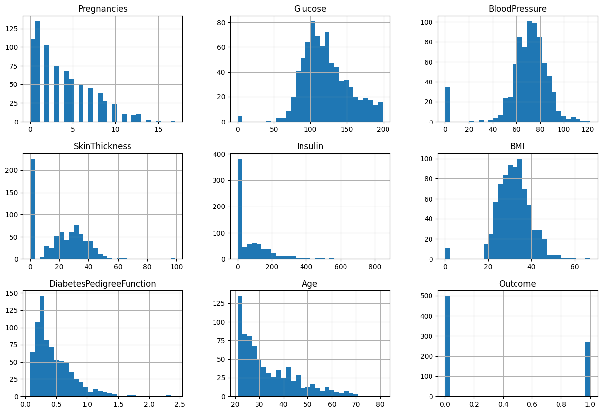
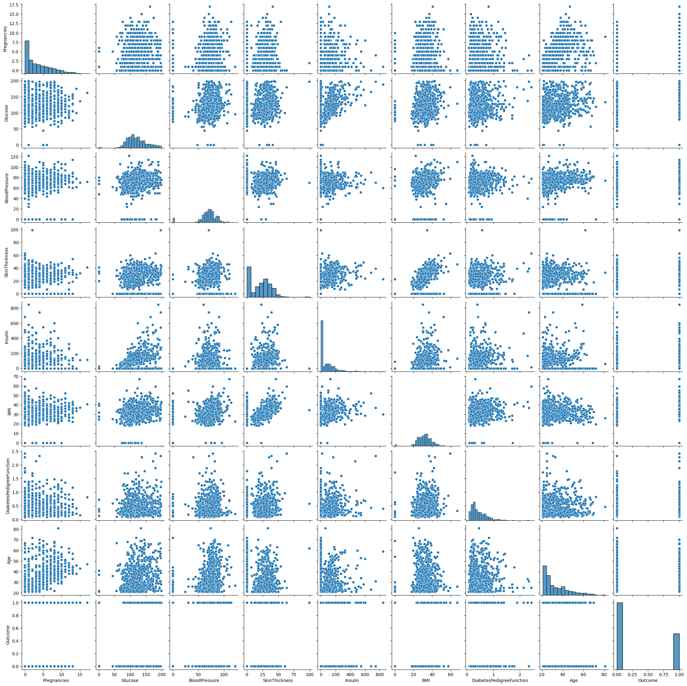
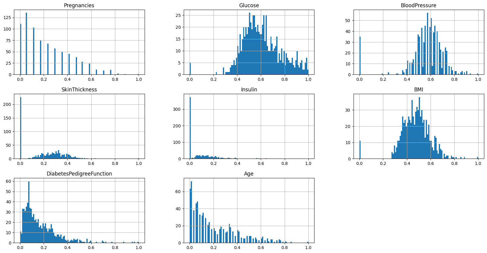

# Лабораторная 6. Логистическая регрессия

Импорт библиотек


```python
import pandas as pd
import numpy as np
import seaborn as sns
from sklearn.model_selection import train_test_split
import random
import math
from prettytable import PrettyTable
import warnings
```

**Выбор датасетов**: Студенты с **нечетным** порядковым номером в группе должны использовать датасет **о диабете**.


```python
seed = 42
```


```python
data = pd.read_csv('data/diabetes.csv')
data
```


<div>
<table border="1" class="dataframe">
  <thead>
    <tr style="text-align: right;">
      <th></th>
      <th>Pregnancies</th>
      <th>Glucose</th>
      <th>BloodPressure</th>
      <th>SkinThickness</th>
      <th>Insulin</th>
      <th>BMI</th>
      <th>DiabetesPedigreeFunction</th>
      <th>Age</th>
      <th>Outcome</th>
    </tr>
  </thead>
  <tbody>
    <tr>
      <th>0</th>
      <td>6</td>
      <td>148</td>
      <td>72</td>
      <td>35</td>
      <td>0</td>
      <td>33.6</td>
      <td>0.627</td>
      <td>50</td>
      <td>1</td>
    </tr>
    <tr>
      <th>1</th>
      <td>1</td>
      <td>85</td>
      <td>66</td>
      <td>29</td>
      <td>0</td>
      <td>26.6</td>
      <td>0.351</td>
      <td>31</td>
      <td>0</td>
    </tr>
    <tr>
      <th>2</th>
      <td>8</td>
      <td>183</td>
      <td>64</td>
      <td>0</td>
      <td>0</td>
      <td>23.3</td>
      <td>0.672</td>
      <td>32</td>
      <td>1</td>
    </tr>
    <tr>
      <th>3</th>
      <td>1</td>
      <td>89</td>
      <td>66</td>
      <td>23</td>
      <td>94</td>
      <td>28.1</td>
      <td>0.167</td>
      <td>21</td>
      <td>0</td>
    </tr>
    <tr>
      <th>4</th>
      <td>0</td>
      <td>137</td>
      <td>40</td>
      <td>35</td>
      <td>168</td>
      <td>43.1</td>
      <td>2.288</td>
      <td>33</td>
      <td>1</td>
    </tr>
    <tr>
      <th>...</th>
      <td>...</td>
      <td>...</td>
      <td>...</td>
      <td>...</td>
      <td>...</td>
      <td>...</td>
      <td>...</td>
      <td>...</td>
      <td>...</td>
    </tr>
    <tr>
      <th>763</th>
      <td>10</td>
      <td>101</td>
      <td>76</td>
      <td>48</td>
      <td>180</td>
      <td>32.9</td>
      <td>0.171</td>
      <td>63</td>
      <td>0</td>
    </tr>
    <tr>
      <th>764</th>
      <td>2</td>
      <td>122</td>
      <td>70</td>
      <td>27</td>
      <td>0</td>
      <td>36.8</td>
      <td>0.340</td>
      <td>27</td>
      <td>0</td>
    </tr>
    <tr>
      <th>765</th>
      <td>5</td>
      <td>121</td>
      <td>72</td>
      <td>23</td>
      <td>112</td>
      <td>26.2</td>
      <td>0.245</td>
      <td>30</td>
      <td>0</td>
    </tr>
    <tr>
      <th>766</th>
      <td>1</td>
      <td>126</td>
      <td>60</td>
      <td>0</td>
      <td>0</td>
      <td>30.1</td>
      <td>0.349</td>
      <td>47</td>
      <td>1</td>
    </tr>
    <tr>
      <th>767</th>
      <td>1</td>
      <td>93</td>
      <td>70</td>
      <td>31</td>
      <td>0</td>
      <td>30.4</td>
      <td>0.315</td>
      <td>23</td>
      <td>0</td>
    </tr>
  </tbody>
</table>
<p>768 rows × 9 columns</p>
</div>


### Обработка Данных


```python
data.describe()
```


<div>
<table border="1" class="dataframe">
  <thead>
    <tr style="text-align: right;">
      <th></th>
      <th>Pregnancies</th>
      <th>Glucose</th>
      <th>BloodPressure</th>
      <th>SkinThickness</th>
      <th>Insulin</th>
      <th>BMI</th>
      <th>DiabetesPedigreeFunction</th>
      <th>Age</th>
      <th>Outcome</th>
    </tr>
  </thead>
  <tbody>
    <tr>
      <th>count</th>
      <td>768.000000</td>
      <td>768.000000</td>
      <td>768.000000</td>
      <td>768.000000</td>
      <td>768.000000</td>
      <td>768.000000</td>
      <td>768.000000</td>
      <td>768.000000</td>
      <td>768.000000</td>
    </tr>
    <tr>
      <th>mean</th>
      <td>3.845052</td>
      <td>120.894531</td>
      <td>69.105469</td>
      <td>20.536458</td>
      <td>79.799479</td>
      <td>31.992578</td>
      <td>0.471876</td>
      <td>33.240885</td>
      <td>0.348958</td>
    </tr>
    <tr>
      <th>std</th>
      <td>3.369578</td>
      <td>31.972618</td>
      <td>19.355807</td>
      <td>15.952218</td>
      <td>115.244002</td>
      <td>7.884160</td>
      <td>0.331329</td>
      <td>11.760232</td>
      <td>0.476951</td>
    </tr>
    <tr>
      <th>min</th>
      <td>0.000000</td>
      <td>0.000000</td>
      <td>0.000000</td>
      <td>0.000000</td>
      <td>0.000000</td>
      <td>0.000000</td>
      <td>0.078000</td>
      <td>21.000000</td>
      <td>0.000000</td>
    </tr>
    <tr>
      <th>25%</th>
      <td>1.000000</td>
      <td>99.000000</td>
      <td>62.000000</td>
      <td>0.000000</td>
      <td>0.000000</td>
      <td>27.300000</td>
      <td>0.243750</td>
      <td>24.000000</td>
      <td>0.000000</td>
    </tr>
    <tr>
      <th>50%</th>
      <td>3.000000</td>
      <td>117.000000</td>
      <td>72.000000</td>
      <td>23.000000</td>
      <td>30.500000</td>
      <td>32.000000</td>
      <td>0.372500</td>
      <td>29.000000</td>
      <td>0.000000</td>
    </tr>
    <tr>
      <th>75%</th>
      <td>6.000000</td>
      <td>140.250000</td>
      <td>80.000000</td>
      <td>32.000000</td>
      <td>127.250000</td>
      <td>36.600000</td>
      <td>0.626250</td>
      <td>41.000000</td>
      <td>1.000000</td>
    </tr>
    <tr>
      <th>max</th>
      <td>17.000000</td>
      <td>199.000000</td>
      <td>122.000000</td>
      <td>99.000000</td>
      <td>846.000000</td>
      <td>67.100000</td>
      <td>2.420000</td>
      <td>81.000000</td>
      <td>1.000000</td>
    </tr>
  </tbody>
</table>
</div>


```python
data.info()
```

    <class 'pandas.core.frame.DataFrame'>
    RangeIndex: 768 entries, 0 to 767
    Data columns (total 9 columns):
     #   Column                    Non-Null Count  Dtype  
    ---  ------                    --------------  -----  
     0   Pregnancies               768 non-null    int64  
     1   Glucose                   768 non-null    int64  
     2   BloodPressure             768 non-null    int64  
     3   SkinThickness             768 non-null    int64  
     4   Insulin                   768 non-null    int64  
     5   BMI                       768 non-null    float64
     6   DiabetesPedigreeFunction  768 non-null    float64
     7   Age                       768 non-null    int64  
     8   Outcome                   768 non-null    int64  
    dtypes: float64(2), int64(7)
    memory usage: 54.1 KB
    


```python
data.isnull().sum()
```


    Pregnancies                 0
    Glucose                     0
    BloodPressure               0
    SkinThickness               0
    Insulin                     0
    BMI                         0
    DiabetesPedigreeFunction    0
    Age                         0
    Outcome                     0
    dtype: int64


## Визуализация


```python
data.hist(bins=30, figsize=(15, 10))
```


    array([[<Axes: title={'center': 'Pregnancies'}>,
            <Axes: title={'center': 'Glucose'}>,
            <Axes: title={'center': 'BloodPressure'}>],
           [<Axes: title={'center': 'SkinThickness'}>,
            <Axes: title={'center': 'Insulin'}>,
            <Axes: title={'center': 'BMI'}>],
           [<Axes: title={'center': 'DiabetesPedigreeFunction'}>,
            <Axes: title={'center': 'Age'}>,
            <Axes: title={'center': 'Outcome'}>]], dtype=object)


    

    


```python
sns.pairplot(data)
```


    <seaborn.axisgrid.PairGrid at 0x16d75b66e30>


    

    


`Outcome` - категориальный признак


```python
X = data.drop("Outcome", axis=1)
y = data["Outcome"]
```

### Нормализация

Используем min-max нормализацию.


```python
def min_max_standardize_data(data):
    standardized_data = data.copy()
    for column in data.columns:
        # x' = (x - min(x)) / (max(x) - min(x))
        standardized_data[column] = (data[column] - np.min(data[column])) / (np.max(data[column]) - np.min(data[column]))
    return standardized_data
    
X = min_max_standardize_data(X)

X.hist(bins=100, figsize=(20, 10))
```


    array([[<Axes: title={'center': 'Pregnancies'}>,
            <Axes: title={'center': 'Glucose'}>,
            <Axes: title={'center': 'BloodPressure'}>],
           [<Axes: title={'center': 'SkinThickness'}>,
            <Axes: title={'center': 'Insulin'}>,
            <Axes: title={'center': 'BMI'}>],
           [<Axes: title={'center': 'DiabetesPedigreeFunction'}>,
            <Axes: title={'center': 'Age'}>, <Axes: >]], dtype=object)


    

    


### Разделение данных на обучающий и тестовый наборы


```python
x_train, x_test, y_train, y_test = train_test_split(X, y, test_size=0.2, random_state=seed)
```


```python
print('x_train ->', x_train.shape)
print('x_test ->', x_test.shape)
print('y_train ->', y_train.shape)
print('y_test ->', y_test.shape)
```

    x_train -> (614, 8)
    x_test -> (154, 8)
    y_train -> (614,)
    y_test -> (154,)
    


```python
x_train.head()
```


<div>
<table border="1" class="dataframe">
  <thead>
    <tr style="text-align: right;">
      <th></th>
      <th>Pregnancies</th>
      <th>Glucose</th>
      <th>BloodPressure</th>
      <th>SkinThickness</th>
      <th>Insulin</th>
      <th>BMI</th>
      <th>DiabetesPedigreeFunction</th>
      <th>Age</th>
    </tr>
  </thead>
  <tbody>
    <tr>
      <th>60</th>
      <td>0.117647</td>
      <td>0.422111</td>
      <td>0.000000</td>
      <td>0.000000</td>
      <td>0.000000</td>
      <td>0.000000</td>
      <td>0.096499</td>
      <td>0.000000</td>
    </tr>
    <tr>
      <th>618</th>
      <td>0.529412</td>
      <td>0.562814</td>
      <td>0.672131</td>
      <td>0.242424</td>
      <td>0.000000</td>
      <td>0.420268</td>
      <td>0.514091</td>
      <td>0.483333</td>
    </tr>
    <tr>
      <th>346</th>
      <td>0.058824</td>
      <td>0.698492</td>
      <td>0.377049</td>
      <td>0.191919</td>
      <td>0.098109</td>
      <td>0.427720</td>
      <td>0.245944</td>
      <td>0.016667</td>
    </tr>
    <tr>
      <th>294</th>
      <td>0.000000</td>
      <td>0.809045</td>
      <td>0.409836</td>
      <td>0.000000</td>
      <td>0.000000</td>
      <td>0.326379</td>
      <td>0.075149</td>
      <td>0.733333</td>
    </tr>
    <tr>
      <th>231</th>
      <td>0.352941</td>
      <td>0.673367</td>
      <td>0.655738</td>
      <td>0.373737</td>
      <td>0.437352</td>
      <td>0.688525</td>
      <td>0.068318</td>
      <td>0.416667</td>
    </tr>
  </tbody>
</table>
</div>


```python
x_test.head()
```


<div>
<table border="1" class="dataframe">
  <thead>
    <tr style="text-align: right;">
      <th></th>
      <th>Pregnancies</th>
      <th>Glucose</th>
      <th>BloodPressure</th>
      <th>SkinThickness</th>
      <th>Insulin</th>
      <th>BMI</th>
      <th>DiabetesPedigreeFunction</th>
      <th>Age</th>
    </tr>
  </thead>
  <tbody>
    <tr>
      <th>668</th>
      <td>0.352941</td>
      <td>0.492462</td>
      <td>0.475410</td>
      <td>0.333333</td>
      <td>0.224586</td>
      <td>0.506706</td>
      <td>0.150299</td>
      <td>0.366667</td>
    </tr>
    <tr>
      <th>324</th>
      <td>0.117647</td>
      <td>0.562814</td>
      <td>0.614754</td>
      <td>0.323232</td>
      <td>0.000000</td>
      <td>0.532042</td>
      <td>0.029889</td>
      <td>0.000000</td>
    </tr>
    <tr>
      <th>624</th>
      <td>0.117647</td>
      <td>0.542714</td>
      <td>0.524590</td>
      <td>0.000000</td>
      <td>0.000000</td>
      <td>0.459016</td>
      <td>0.034159</td>
      <td>0.000000</td>
    </tr>
    <tr>
      <th>690</th>
      <td>0.470588</td>
      <td>0.537688</td>
      <td>0.655738</td>
      <td>0.000000</td>
      <td>0.000000</td>
      <td>0.366617</td>
      <td>0.332195</td>
      <td>0.216667</td>
    </tr>
    <tr>
      <th>473</th>
      <td>0.411765</td>
      <td>0.683417</td>
      <td>0.737705</td>
      <td>0.000000</td>
      <td>0.000000</td>
      <td>0.445604</td>
      <td>0.056362</td>
      <td>0.483333</td>
    </tr>
  </tbody>
</table>
</div>


## Реализация логистической регресии


```python
class LogisticRegression:
  def __init__(self, learning_rate=0.01, num_iterations=1000, optimizer='gd'):
      self.learning_rate = learning_rate
      self.num_iterations = num_iterations
      self.weights = None
      self.bias = None
      self.optimizer = optimizer

  # Сигмоидная функция
  def sigmoid(self, z):
      return 1 / (1 + np.exp(-z))

  def gradient_descent(self, x, n_samples, y, predictions):
      dw = (1 / n_samples) * np.dot(x.T, (predictions - y))
      db = (1 / n_samples) * np.sum(predictions - y)
      self.weights -= self.learning_rate * dw
      self.bias -= self.learning_rate * db

  def gradient(self, x, y, n_samples):
      sigmoid_probs = 1 / (1 + np.exp(-(np.dot(x, self.weights) + self.bias)))
      return (1 / n_samples) * np.dot(x.T, (sigmoid_probs - y))

  def fit(self, x, y):
      n_samples, n_features = x.shape
      self.weights = np.zeros(n_features)
      self.bias = 0
      linear_model = np.dot(x, self.weights) + self.bias
      y_predicted = self.sigmoid(linear_model)
      if (self.optimizer == 'gd'):
          for i in range(self.num_iterations):
              self.gradient_descent(x, n_samples, y, y_predicted)
              if i % 100 == 0:
                 _loss = self.loss(y_predicted, y)
                 print(f"Iteration {i}: Cost = {_loss}")
      if (self.optimizer == 'newton'):
          for i in range(self.num_iterations):
            grad = self.gradient(x, y, n_samples)
            sigmoid_probs = 1 / (1 + np.exp(-(np.dot(x, self.weights) + self.bias)))
            hess = (1 / n_samples) * np.dot(x.T, np.dot(np.diag(sigmoid_probs * (1 - sigmoid_probs)), x))
            H_inv = np.linalg.inv(hess)
            delta = np.dot(H_inv, grad)
            self.weights -= delta
            if i % 100 == 0:
                 _loss = self.loss(y_predicted, y)
                 print(f"Iteration {i}: Cost = {_loss}")

  # Функция потерь
  def loss(self, y_pred, y_true):
      loss_ = -(y_true * np.log(y_pred) + (1 - y_true) * np.log(1 - y_pred))
      return np.mean(loss_)

  def predict(self, x):
      linear_model = np.dot(x, self.weights) + self.bias
      y_predicted = self.sigmoid(linear_model)
      y_predicted_cls = [1 if i > 0.5 else 0 for i in y_predicted]
      return np.array(y_predicted_cls)

```


```python
def calculate_metrics(y_pred, y_test):
    TP = np.sum((y_pred == 1) & (y_test == 1))
    TN = np.sum((y_pred == 0) & (y_test == 0))
    FP = np.sum((y_pred == 1) & (y_test == 0))
    FN = np.sum((y_pred == 0) & (y_test == 1))

    accuracy = (TP + TN) / (TP + TN + FP + FN) if (TP + TN + FP + FN) != 0 else 0
    precision = TP / (TP + FP) if (TP + FP) != 0 else 0
    recall = TP / (TP + FN) if (TP + FN) != 0 else 0
    f1_score = 2 * precision * recall / (precision + recall) if (precision + recall) != 0 else 0

    metrics =  {'accuracy': accuracy, 'precision': precision,  'recall': recall, 'f1_score': f1_score}
    for key, value in metrics.items():
      print(f"{key}: {value}")
```

Оптимизация Градиентный спуск


```python
lr1 =  LogisticRegression(learning_rate=0.01, num_iterations=10000, optimizer='gd')
lr1.fit(x_train, y_train)
y_pred = lr1.predict(x_test)
```

    Iteration 0: Cost = 0.6931471805599453
    Iteration 100: Cost = 0.6931471805599453
    Iteration 200: Cost = 0.6931471805599453
    Iteration 300: Cost = 0.6931471805599453
    Iteration 400: Cost = 0.6931471805599453
    Iteration 500: Cost = 0.6931471805599453
    Iteration 600: Cost = 0.6931471805599453
    Iteration 700: Cost = 0.6931471805599453
    Iteration 800: Cost = 0.6931471805599453
    Iteration 900: Cost = 0.6931471805599453
    Iteration 1000: Cost = 0.6931471805599453
    Iteration 1100: Cost = 0.6931471805599453
    Iteration 1200: Cost = 0.6931471805599453
    Iteration 1300: Cost = 0.6931471805599453
    Iteration 1400: Cost = 0.6931471805599453
    Iteration 1500: Cost = 0.6931471805599453
    Iteration 1600: Cost = 0.6931471805599453
    Iteration 1700: Cost = 0.6931471805599453
    Iteration 1800: Cost = 0.6931471805599453
    Iteration 1900: Cost = 0.6931471805599453
    Iteration 2000: Cost = 0.6931471805599453
    Iteration 2100: Cost = 0.6931471805599453
    Iteration 2200: Cost = 0.6931471805599453
    Iteration 2300: Cost = 0.6931471805599453
    Iteration 2400: Cost = 0.6931471805599453
    Iteration 2500: Cost = 0.6931471805599453
    Iteration 2600: Cost = 0.6931471805599453
    Iteration 2700: Cost = 0.6931471805599453
    Iteration 2800: Cost = 0.6931471805599453
    Iteration 2900: Cost = 0.6931471805599453
    Iteration 3000: Cost = 0.6931471805599453
    Iteration 3100: Cost = 0.6931471805599453
    Iteration 3200: Cost = 0.6931471805599453
    Iteration 3300: Cost = 0.6931471805599453
    Iteration 3400: Cost = 0.6931471805599453
    Iteration 3500: Cost = 0.6931471805599453
    Iteration 3600: Cost = 0.6931471805599453
    Iteration 3700: Cost = 0.6931471805599453
    Iteration 3800: Cost = 0.6931471805599453
    Iteration 3900: Cost = 0.6931471805599453
    Iteration 4000: Cost = 0.6931471805599453
    Iteration 4100: Cost = 0.6931471805599453
    Iteration 4200: Cost = 0.6931471805599453
    Iteration 4300: Cost = 0.6931471805599453
    Iteration 4400: Cost = 0.6931471805599453
    Iteration 4500: Cost = 0.6931471805599453
    Iteration 4600: Cost = 0.6931471805599453
    Iteration 4700: Cost = 0.6931471805599453
    Iteration 4800: Cost = 0.6931471805599453
    Iteration 4900: Cost = 0.6931471805599453
    Iteration 5000: Cost = 0.6931471805599453
    Iteration 5100: Cost = 0.6931471805599453
    Iteration 5200: Cost = 0.6931471805599453
    Iteration 5300: Cost = 0.6931471805599453
    Iteration 5400: Cost = 0.6931471805599453
    Iteration 5500: Cost = 0.6931471805599453
    Iteration 5600: Cost = 0.6931471805599453
    Iteration 5700: Cost = 0.6931471805599453
    Iteration 5800: Cost = 0.6931471805599453
    Iteration 5900: Cost = 0.6931471805599453
    Iteration 6000: Cost = 0.6931471805599453
    Iteration 6100: Cost = 0.6931471805599453
    Iteration 6200: Cost = 0.6931471805599453
    Iteration 6300: Cost = 0.6931471805599453
    Iteration 6400: Cost = 0.6931471805599453
    Iteration 6500: Cost = 0.6931471805599453
    Iteration 6600: Cost = 0.6931471805599453
    Iteration 6700: Cost = 0.6931471805599453
    Iteration 6800: Cost = 0.6931471805599453
    Iteration 6900: Cost = 0.6931471805599453
    Iteration 7000: Cost = 0.6931471805599453
    Iteration 7100: Cost = 0.6931471805599453
    Iteration 7200: Cost = 0.6931471805599453
    Iteration 7300: Cost = 0.6931471805599453
    Iteration 7400: Cost = 0.6931471805599453
    Iteration 7500: Cost = 0.6931471805599453
    Iteration 7600: Cost = 0.6931471805599453
    Iteration 7700: Cost = 0.6931471805599453
    Iteration 7800: Cost = 0.6931471805599453
    Iteration 7900: Cost = 0.6931471805599453
    Iteration 8000: Cost = 0.6931471805599453
    Iteration 8100: Cost = 0.6931471805599453
    Iteration 8200: Cost = 0.6931471805599453
    Iteration 8300: Cost = 0.6931471805599453
    Iteration 8400: Cost = 0.6931471805599453
    Iteration 8500: Cost = 0.6931471805599453
    Iteration 8600: Cost = 0.6931471805599453
    Iteration 8700: Cost = 0.6931471805599453
    Iteration 8800: Cost = 0.6931471805599453
    Iteration 8900: Cost = 0.6931471805599453
    Iteration 9000: Cost = 0.6931471805599453
    Iteration 9100: Cost = 0.6931471805599453
    Iteration 9200: Cost = 0.6931471805599453
    Iteration 9300: Cost = 0.6931471805599453
    Iteration 9400: Cost = 0.6931471805599453
    Iteration 9500: Cost = 0.6931471805599453
    Iteration 9600: Cost = 0.6931471805599453
    Iteration 9700: Cost = 0.6931471805599453
    Iteration 9800: Cost = 0.6931471805599453
    Iteration 9900: Cost = 0.6931471805599453
    


```python
y_pred
```


    array([0, 0, 0, 0, 0, 0, 0, 0, 0, 0, 0, 0, 0, 0, 0, 0, 0, 0, 0, 0, 0, 0,
           0, 0, 0, 0, 0, 0, 0, 0, 0, 0, 0, 0, 0, 0, 0, 0, 0, 0, 0, 0, 0, 0,
           0, 0, 0, 0, 0, 0, 0, 0, 0, 0, 0, 0, 0, 0, 0, 0, 0, 0, 0, 0, 0, 0,
           0, 0, 0, 0, 0, 0, 0, 0, 0, 0, 0, 0, 0, 0, 0, 0, 0, 0, 0, 0, 0, 0,
           0, 0, 0, 0, 0, 0, 0, 0, 0, 0, 0, 0, 0, 0, 0, 0, 0, 0, 0, 0, 0, 0,
           0, 0, 0, 0, 0, 0, 0, 0, 0, 0, 0, 0, 0, 0, 0, 0, 0, 0, 0, 0, 0, 0,
           0, 0, 0, 0, 0, 0, 0, 0, 0, 0, 0, 0, 0, 0, 0, 0, 0, 0, 0, 0, 0, 0])


```python
calculate_metrics(y_pred, y_test)
```

    accuracy: 0.6428571428571429
    precision: 0
    recall: 0.0
    f1_score: 0
    

Оптимизация методом Ньютона


```python
lr2 =  LogisticRegression(learning_rate=0.01, num_iterations=10000, optimizer='newton')
lr2.fit(x_train, y_train)
y_pred = lr2.predict(x_test)
```

    Iteration 0: Cost = 0.6931471805599453
    Iteration 100: Cost = 0.6931471805599453
    Iteration 200: Cost = 0.6931471805599453
    Iteration 300: Cost = 0.6931471805599453
    Iteration 400: Cost = 0.6931471805599453
    Iteration 500: Cost = 0.6931471805599453
    Iteration 600: Cost = 0.6931471805599453
    Iteration 700: Cost = 0.6931471805599453
    Iteration 800: Cost = 0.6931471805599453
    Iteration 900: Cost = 0.6931471805599453
    Iteration 1000: Cost = 0.6931471805599453
    Iteration 1100: Cost = 0.6931471805599453
    Iteration 1200: Cost = 0.6931471805599453
    Iteration 1300: Cost = 0.6931471805599453
    Iteration 1400: Cost = 0.6931471805599453
    Iteration 1500: Cost = 0.6931471805599453
    Iteration 1600: Cost = 0.6931471805599453
    Iteration 1700: Cost = 0.6931471805599453
    Iteration 1800: Cost = 0.6931471805599453
    Iteration 1900: Cost = 0.6931471805599453
    Iteration 2000: Cost = 0.6931471805599453
    Iteration 2100: Cost = 0.6931471805599453
    Iteration 2200: Cost = 0.6931471805599453
    Iteration 2300: Cost = 0.6931471805599453
    Iteration 2400: Cost = 0.6931471805599453
    Iteration 2500: Cost = 0.6931471805599453
    Iteration 2600: Cost = 0.6931471805599453
    Iteration 2700: Cost = 0.6931471805599453
    Iteration 2800: Cost = 0.6931471805599453
    Iteration 2900: Cost = 0.6931471805599453
    Iteration 3000: Cost = 0.6931471805599453
    Iteration 3100: Cost = 0.6931471805599453
    Iteration 3200: Cost = 0.6931471805599453
    Iteration 3300: Cost = 0.6931471805599453
    Iteration 3400: Cost = 0.6931471805599453
    Iteration 3500: Cost = 0.6931471805599453
    Iteration 3600: Cost = 0.6931471805599453
    Iteration 3700: Cost = 0.6931471805599453
    Iteration 3800: Cost = 0.6931471805599453
    Iteration 3900: Cost = 0.6931471805599453
    Iteration 4000: Cost = 0.6931471805599453
    Iteration 4100: Cost = 0.6931471805599453
    Iteration 4200: Cost = 0.6931471805599453
    Iteration 4300: Cost = 0.6931471805599453
    Iteration 4400: Cost = 0.6931471805599453
    Iteration 4500: Cost = 0.6931471805599453
    Iteration 4600: Cost = 0.6931471805599453
    Iteration 4700: Cost = 0.6931471805599453
    Iteration 4800: Cost = 0.6931471805599453
    Iteration 4900: Cost = 0.6931471805599453
    Iteration 5000: Cost = 0.6931471805599453
    Iteration 5100: Cost = 0.6931471805599453
    Iteration 5200: Cost = 0.6931471805599453
    Iteration 5300: Cost = 0.6931471805599453
    Iteration 5400: Cost = 0.6931471805599453
    Iteration 5500: Cost = 0.6931471805599453
    Iteration 5600: Cost = 0.6931471805599453
    Iteration 5700: Cost = 0.6931471805599453
    Iteration 5800: Cost = 0.6931471805599453
    Iteration 5900: Cost = 0.6931471805599453
    Iteration 6000: Cost = 0.6931471805599453
    Iteration 6100: Cost = 0.6931471805599453
    Iteration 6200: Cost = 0.6931471805599453
    Iteration 6300: Cost = 0.6931471805599453
    Iteration 6400: Cost = 0.6931471805599453
    Iteration 6500: Cost = 0.6931471805599453
    Iteration 6600: Cost = 0.6931471805599453
    Iteration 6700: Cost = 0.6931471805599453
    Iteration 6800: Cost = 0.6931471805599453
    Iteration 6900: Cost = 0.6931471805599453
    Iteration 7000: Cost = 0.6931471805599453
    Iteration 7100: Cost = 0.6931471805599453
    Iteration 7200: Cost = 0.6931471805599453
    Iteration 7300: Cost = 0.6931471805599453
    Iteration 7400: Cost = 0.6931471805599453
    Iteration 7500: Cost = 0.6931471805599453
    Iteration 7600: Cost = 0.6931471805599453
    Iteration 7700: Cost = 0.6931471805599453
    Iteration 7800: Cost = 0.6931471805599453
    Iteration 7900: Cost = 0.6931471805599453
    Iteration 8000: Cost = 0.6931471805599453
    Iteration 8100: Cost = 0.6931471805599453
    Iteration 8200: Cost = 0.6931471805599453
    Iteration 8300: Cost = 0.6931471805599453
    Iteration 8400: Cost = 0.6931471805599453
    Iteration 8500: Cost = 0.6931471805599453
    Iteration 8600: Cost = 0.6931471805599453
    Iteration 8700: Cost = 0.6931471805599453
    Iteration 8800: Cost = 0.6931471805599453
    Iteration 8900: Cost = 0.6931471805599453
    Iteration 9000: Cost = 0.6931471805599453
    Iteration 9100: Cost = 0.6931471805599453
    Iteration 9200: Cost = 0.6931471805599453
    Iteration 9300: Cost = 0.6931471805599453
    Iteration 9400: Cost = 0.6931471805599453
    Iteration 9500: Cost = 0.6931471805599453
    Iteration 9600: Cost = 0.6931471805599453
    Iteration 9700: Cost = 0.6931471805599453
    Iteration 9800: Cost = 0.6931471805599453
    Iteration 9900: Cost = 0.6931471805599453
    


```python
y_pred
```


    array([1, 0, 0, 0, 0, 1, 0, 1, 0, 1, 0, 1, 0, 0, 0, 1, 0, 0, 1, 0, 0, 0,
           0, 0, 0, 0, 0, 0, 0, 0, 0, 1, 0, 1, 0, 0, 1, 0, 1, 1, 0, 1, 1, 0,
           0, 0, 1, 0, 1, 1, 0, 1, 1, 0, 0, 0, 1, 1, 0, 1, 1, 0, 1, 1, 0, 0,
           0, 0, 0, 1, 1, 0, 1, 0, 0, 0, 0, 1, 0, 0, 1, 0, 0, 0, 0, 1, 0, 0,
           0, 0, 0, 0, 1, 1, 1, 0, 1, 0, 1, 0, 1, 0, 0, 0, 0, 0, 0, 0, 0, 0,
           0, 0, 1, 0, 0, 0, 1, 0, 0, 1, 0, 0, 0, 0, 0, 1, 1, 1, 1, 0, 1, 1,
           0, 0, 0, 0, 0, 0, 1, 0, 0, 0, 0, 0, 0, 0, 0, 0, 0, 0, 0, 1, 0, 0])


```python
calculate_metrics(y_pred, y_test)
```

    accuracy: 0.6428571428571429
    precision: 0.5
    recall: 0.43636363636363634
    f1_score: 0.46601941747572817
    


```python
from sklearn.metrics import accuracy_score, precision_score, f1_score, recall_score
from time import time

warnings.filterwarnings('ignore')
n_iters = np.arange(2, 300, 10)
lr = np.arange(0.001, 0.01, 0.003)
optimizer = ['gd', 'newton']

print(f"Testing {len(n_iters) * len(lr) * len(optimizer)} cases:")
start = time()
best_params_ac = {}
best_params_pre = {}
best_params_re = {}
best_params_f1 = {}
best_accuracy_score = 0
best_precision_score = 0
best_recall_score = 0
best_f1_score = 0

i = 0
for n_iter in n_iters:
    for lr_ in lr:
        for opt in optimizer:
                case_start = time()

                clf = LogisticRegression(learning_rate=lr_, num_iterations=n_iter, optimizer=opt)
                clf.fit(x_train, y_train)
                predictions = clf.predict(x_test)
                accuracy = accuracy_score(y_test, predictions)
                if accuracy > best_accuracy_score:
                    best_score = accuracy
                    best_params_ac  = {'n_iter': n_iter, 'lr': lr_, 'optimizer': opt}

                precision = precision_score(y_test, predictions)
                if precision > best_precision_score:
                    best_precision_score = precision
                    best_params_pre = {'n_iter': n_iter, 'lr': lr_, 'optimizer': opt}

                recall = recall_score(y_test, predictions)
                if recall > best_recall_score:
                    best_recall_score = recall
                    best_params_re = {'n_iter': n_iter, 'lr': lr_,  'optimizer': opt}

                f1 = f1_score(y_test, predictions)
                if f1 > best_f1_score:
                    best_f1_score = f1
                    best_params_f1 = {'n_iter': n_iter, 'lr': lr_, 'optimizer': opt}
                print(f"Case {i}: lr-{lr_}, n_iters-{n_iter}, optimizer={opt} finished in {time() - case_start}")
                print(f"Accuracy: {accuracy}, Precision: {precision}, Recall: {recall}, F1: {f1}")
                i += 1
print(f"Testing finished in {time() - start} seconds")
print(f"Best accuracy score: {best_accuracy_score}, params: {best_params_ac}")
print(f"Best precision score: {best_precision_score}, params: {best_params_pre}")
print(f"Best recall score: {best_recall_score}, params: {best_params_re}")
print(f"Best f1 score: {best_f1_score}, params: {best_params_f1}")
```

    Testing 240 cases:
    Iteration 0: Cost = 0.6931471805599453
    Case 0: lr-0.001, n_iters-2, optimizer=gd finished in 0.008124589920043945
    Accuracy: 0.6428571428571429, Precision: 0.0, Recall: 0.0, F1: 0.0
    Iteration 0: Cost = 0.6931471805599453
    Case 1: lr-0.001, n_iters-2, optimizer=newton finished in 0.01622915267944336
    Accuracy: 0.6428571428571429, Precision: 0.5, Recall: 0.43636363636363634, F1: 0.46601941747572817
    Iteration 0: Cost = 0.6931471805599453
    Case 2: lr-0.004, n_iters-2, optimizer=gd finished in 0.008226394653320312
    Accuracy: 0.6428571428571429, Precision: 0.0, Recall: 0.0, F1: 0.0
    Iteration 0: Cost = 0.6931471805599453
    Case 3: lr-0.004, n_iters-2, optimizer=newton finished in 0.008000850677490234
    Accuracy: 0.6428571428571429, Precision: 0.5, Recall: 0.43636363636363634, F1: 0.46601941747572817
    Iteration 0: Cost = 0.6931471805599453
    Case 4: lr-0.007, n_iters-2, optimizer=gd finished in 0.00800013542175293
    Accuracy: 0.6428571428571429, Precision: 0.0, Recall: 0.0, F1: 0.0
    Iteration 0: Cost = 0.6931471805599453
    Case 5: lr-0.007, n_iters-2, optimizer=newton finished in 0.007999897003173828
    Accuracy: 0.6428571428571429, Precision: 0.5, Recall: 0.43636363636363634, F1: 0.46601941747572817
    Iteration 0: Cost = 0.6931471805599453
    Case 6: lr-0.010000000000000002, n_iters-2, optimizer=gd finished in 0.008006572723388672
    Accuracy: 0.6428571428571429, Precision: 0.0, Recall: 0.0, F1: 0.0
    Iteration 0: Cost = 0.6931471805599453
    Case 7: lr-0.010000000000000002, n_iters-2, optimizer=newton finished in 0.008001327514648438
    Accuracy: 0.6428571428571429, Precision: 0.5, Recall: 0.43636363636363634, F1: 0.46601941747572817
    Iteration 0: Cost = 0.6931471805599453
    Case 8: lr-0.001, n_iters-12, optimizer=gd finished in 0.007999420166015625
    Accuracy: 0.6428571428571429, Precision: 0.0, Recall: 0.0, F1: 0.0
    Iteration 0: Cost = 0.6931471805599453
    Case 9: lr-0.001, n_iters-12, optimizer=newton finished in 0.03210115432739258
    Accuracy: 0.6428571428571429, Precision: 0.5, Recall: 0.43636363636363634, F1: 0.46601941747572817
    Iteration 0: Cost = 0.6931471805599453
    Case 10: lr-0.004, n_iters-12, optimizer=gd finished in 0.008072853088378906
    Accuracy: 0.6428571428571429, Precision: 0.0, Recall: 0.0, F1: 0.0
    Iteration 0: Cost = 0.6931471805599453
    Case 11: lr-0.004, n_iters-12, optimizer=newton finished in 0.02407217025756836
    Accuracy: 0.6428571428571429, Precision: 0.5, Recall: 0.43636363636363634, F1: 0.46601941747572817
    Iteration 0: Cost = 0.6931471805599453
    Case 12: lr-0.007, n_iters-12, optimizer=gd finished in 0.007928848266601562
    Accuracy: 0.6428571428571429, Precision: 0.0, Recall: 0.0, F1: 0.0
    Iteration 0: Cost = 0.6931471805599453
    Case 13: lr-0.007, n_iters-12, optimizer=newton finished in 0.03221535682678223
    Accuracy: 0.6428571428571429, Precision: 0.5, Recall: 0.43636363636363634, F1: 0.46601941747572817
    Iteration 0: Cost = 0.6931471805599453
    Case 14: lr-0.010000000000000002, n_iters-12, optimizer=gd finished in 0.016011476516723633
    Accuracy: 0.6428571428571429, Precision: 0.0, Recall: 0.0, F1: 0.0
    Iteration 0: Cost = 0.6931471805599453
    Case 15: lr-0.010000000000000002, n_iters-12, optimizer=newton finished in 0.024071931838989258
    Accuracy: 0.6428571428571429, Precision: 0.5, Recall: 0.43636363636363634, F1: 0.46601941747572817
    Iteration 0: Cost = 0.6931471805599453
    Case 16: lr-0.001, n_iters-22, optimizer=gd finished in 0.01608133316040039
    Accuracy: 0.6428571428571429, Precision: 0.0, Recall: 0.0, F1: 0.0
    Iteration 0: Cost = 0.6931471805599453
    Case 17: lr-0.001, n_iters-22, optimizer=newton finished in 0.04848504066467285
    Accuracy: 0.6428571428571429, Precision: 0.5, Recall: 0.43636363636363634, F1: 0.46601941747572817
    Iteration 0: Cost = 0.6931471805599453
    Case 18: lr-0.004, n_iters-22, optimizer=gd finished in 0.016349077224731445
    Accuracy: 0.6428571428571429, Precision: 0.0, Recall: 0.0, F1: 0.0
    Iteration 0: Cost = 0.6931471805599453
    Case 19: lr-0.004, n_iters-22, optimizer=newton finished in 0.048139095306396484
    Accuracy: 0.6428571428571429, Precision: 0.5, Recall: 0.43636363636363634, F1: 0.46601941747572817
    Iteration 0: Cost = 0.6931471805599453
    Case 20: lr-0.007, n_iters-22, optimizer=gd finished in 0.01604437828063965
    Accuracy: 0.6428571428571429, Precision: 0.0, Recall: 0.0, F1: 0.0
    Iteration 0: Cost = 0.6931471805599453
    Case 21: lr-0.007, n_iters-22, optimizer=newton finished in 0.05643415451049805
    Accuracy: 0.6428571428571429, Precision: 0.5, Recall: 0.43636363636363634, F1: 0.46601941747572817
    Iteration 0: Cost = 0.6931471805599453
    Case 22: lr-0.010000000000000002, n_iters-22, optimizer=gd finished in 0.008002758026123047
    Accuracy: 0.6428571428571429, Precision: 0.0, Recall: 0.0, F1: 0.0
    Iteration 0: Cost = 0.6931471805599453
    Case 23: lr-0.010000000000000002, n_iters-22, optimizer=newton finished in 0.056296586990356445
    Accuracy: 0.6428571428571429, Precision: 0.5, Recall: 0.43636363636363634, F1: 0.46601941747572817
    Iteration 0: Cost = 0.6931471805599453
    Case 24: lr-0.001, n_iters-32, optimizer=gd finished in 0.015999317169189453
    Accuracy: 0.6428571428571429, Precision: 0.0, Recall: 0.0, F1: 0.0
    Iteration 0: Cost = 0.6931471805599453
    Case 25: lr-0.001, n_iters-32, optimizer=newton finished in 0.0722806453704834
    Accuracy: 0.6428571428571429, Precision: 0.5, Recall: 0.43636363636363634, F1: 0.46601941747572817
    Iteration 0: Cost = 0.6931471805599453
    Case 26: lr-0.004, n_iters-32, optimizer=gd finished in 0.016152143478393555
    Accuracy: 0.6428571428571429, Precision: 0.0, Recall: 0.0, F1: 0.0
    Iteration 0: Cost = 0.6931471805599453
    Case 27: lr-0.004, n_iters-32, optimizer=newton finished in 0.07235217094421387
    Accuracy: 0.6428571428571429, Precision: 0.5, Recall: 0.43636363636363634, F1: 0.46601941747572817
    Iteration 0: Cost = 0.6931471805599453
    Case 28: lr-0.007, n_iters-32, optimizer=gd finished in 0.016069650650024414
    Accuracy: 0.6428571428571429, Precision: 0.0, Recall: 0.0, F1: 0.0
    Iteration 0: Cost = 0.6931471805599453
    Case 29: lr-0.007, n_iters-32, optimizer=newton finished in 0.06428360939025879
    Accuracy: 0.6428571428571429, Precision: 0.5, Recall: 0.43636363636363634, F1: 0.46601941747572817
    Iteration 0: Cost = 0.6931471805599453
    Case 30: lr-0.010000000000000002, n_iters-32, optimizer=gd finished in 0.01600027084350586
    Accuracy: 0.6428571428571429, Precision: 0.0, Recall: 0.0, F1: 0.0
    Iteration 0: Cost = 0.6931471805599453
    Case 31: lr-0.010000000000000002, n_iters-32, optimizer=newton finished in 0.0644371509552002
    Accuracy: 0.6428571428571429, Precision: 0.5, Recall: 0.43636363636363634, F1: 0.46601941747572817
    Iteration 0: Cost = 0.6931471805599453
    Case 32: lr-0.001, n_iters-42, optimizer=gd finished in 0.024320602416992188
    Accuracy: 0.6428571428571429, Precision: 0.0, Recall: 0.0, F1: 0.0
    Iteration 0: Cost = 0.6931471805599453
    Case 33: lr-0.001, n_iters-42, optimizer=newton finished in 0.0883939266204834
    Accuracy: 0.6428571428571429, Precision: 0.5, Recall: 0.43636363636363634, F1: 0.46601941747572817
    Iteration 0: Cost = 0.6931471805599453
    Case 34: lr-0.004, n_iters-42, optimizer=gd finished in 0.02409815788269043
    Accuracy: 0.6428571428571429, Precision: 0.0, Recall: 0.0, F1: 0.0
    Iteration 0: Cost = 0.6931471805599453
    Case 35: lr-0.004, n_iters-42, optimizer=newton finished in 0.08830833435058594
    Accuracy: 0.6428571428571429, Precision: 0.5, Recall: 0.43636363636363634, F1: 0.46601941747572817
    Iteration 0: Cost = 0.6931471805599453
    Case 36: lr-0.007, n_iters-42, optimizer=gd finished in 0.01611161231994629
    Accuracy: 0.6428571428571429, Precision: 0.0, Recall: 0.0, F1: 0.0
    Iteration 0: Cost = 0.6931471805599453
    Case 37: lr-0.007, n_iters-42, optimizer=newton finished in 0.10484623908996582
    Accuracy: 0.6428571428571429, Precision: 0.5, Recall: 0.43636363636363634, F1: 0.46601941747572817
    Iteration 0: Cost = 0.6931471805599453
    Case 38: lr-0.010000000000000002, n_iters-42, optimizer=gd finished in 0.016014575958251953
    Accuracy: 0.6428571428571429, Precision: 0.0, Recall: 0.0, F1: 0.0
    Iteration 0: Cost = 0.6931471805599453
    Case 39: lr-0.010000000000000002, n_iters-42, optimizer=newton finished in 0.08864140510559082
    Accuracy: 0.6428571428571429, Precision: 0.5, Recall: 0.43636363636363634, F1: 0.46601941747572817
    Iteration 0: Cost = 0.6931471805599453
    Case 40: lr-0.001, n_iters-52, optimizer=gd finished in 0.024430036544799805
    Accuracy: 0.6428571428571429, Precision: 0.0, Recall: 0.0, F1: 0.0
    Iteration 0: Cost = 0.6931471805599453
    Case 41: lr-0.001, n_iters-52, optimizer=newton finished in 0.11464047431945801
    Accuracy: 0.6428571428571429, Precision: 0.5, Recall: 0.43636363636363634, F1: 0.46601941747572817
    Iteration 0: Cost = 0.6931471805599453
    Case 42: lr-0.004, n_iters-52, optimizer=gd finished in 0.02462172508239746
    Accuracy: 0.6428571428571429, Precision: 0.0, Recall: 0.0, F1: 0.0
    Iteration 0: Cost = 0.6931471805599453
    Case 43: lr-0.004, n_iters-52, optimizer=newton finished in 0.11495161056518555
    Accuracy: 0.6428571428571429, Precision: 0.5, Recall: 0.43636363636363634, F1: 0.46601941747572817
    Iteration 0: Cost = 0.6931471805599453
    Case 44: lr-0.007, n_iters-52, optimizer=gd finished in 0.024384260177612305
    Accuracy: 0.6428571428571429, Precision: 0.0, Recall: 0.0, F1: 0.0
    Iteration 0: Cost = 0.6931471805599453
    Case 45: lr-0.007, n_iters-52, optimizer=newton finished in 0.12154006958007812
    Accuracy: 0.6428571428571429, Precision: 0.5, Recall: 0.43636363636363634, F1: 0.46601941747572817
    Iteration 0: Cost = 0.6931471805599453
    Case 46: lr-0.010000000000000002, n_iters-52, optimizer=gd finished in 0.02463841438293457
    Accuracy: 0.6428571428571429, Precision: 0.0, Recall: 0.0, F1: 0.0
    Iteration 0: Cost = 0.6931471805599453
    Case 47: lr-0.010000000000000002, n_iters-52, optimizer=newton finished in 0.10479044914245605
    Accuracy: 0.6428571428571429, Precision: 0.5, Recall: 0.43636363636363634, F1: 0.46601941747572817
    Iteration 0: Cost = 0.6931471805599453
    Case 48: lr-0.001, n_iters-62, optimizer=gd finished in 0.03246331214904785
    Accuracy: 0.6428571428571429, Precision: 0.0, Recall: 0.0, F1: 0.0
    Iteration 0: Cost = 0.6931471805599453
    Case 49: lr-0.001, n_iters-62, optimizer=newton finished in 0.15424442291259766
    Accuracy: 0.6428571428571429, Precision: 0.5, Recall: 0.43636363636363634, F1: 0.46601941747572817
    Iteration 0: Cost = 0.6931471805599453
    Case 50: lr-0.004, n_iters-62, optimizer=gd finished in 0.02399301528930664
    Accuracy: 0.6428571428571429, Precision: 0.0, Recall: 0.0, F1: 0.0
    Iteration 0: Cost = 0.6931471805599453
    Case 51: lr-0.004, n_iters-62, optimizer=newton finished in 0.13695883750915527
    Accuracy: 0.6428571428571429, Precision: 0.5, Recall: 0.43636363636363634, F1: 0.46601941747572817
    Iteration 0: Cost = 0.6931471805599453
    Case 52: lr-0.007, n_iters-62, optimizer=gd finished in 0.02449488639831543
    Accuracy: 0.6428571428571429, Precision: 0.0, Recall: 0.0, F1: 0.0
    Iteration 0: Cost = 0.6931471805599453
    Case 53: lr-0.007, n_iters-62, optimizer=newton finished in 0.13898038864135742
    Accuracy: 0.6428571428571429, Precision: 0.5, Recall: 0.43636363636363634, F1: 0.46601941747572817
    Iteration 0: Cost = 0.6931471805599453
    Case 54: lr-0.010000000000000002, n_iters-62, optimizer=gd finished in 0.024500131607055664
    Accuracy: 0.6428571428571429, Precision: 0.0, Recall: 0.0, F1: 0.0
    Iteration 0: Cost = 0.6931471805599453
    Case 55: lr-0.010000000000000002, n_iters-62, optimizer=newton finished in 0.13919520378112793
    Accuracy: 0.6428571428571429, Precision: 0.5, Recall: 0.43636363636363634, F1: 0.46601941747572817
    Iteration 0: Cost = 0.6931471805599453
    Case 56: lr-0.001, n_iters-72, optimizer=gd finished in 0.031998395919799805
    Accuracy: 0.6428571428571429, Precision: 0.0, Recall: 0.0, F1: 0.0
    Iteration 0: Cost = 0.6931471805599453
    Case 57: lr-0.001, n_iters-72, optimizer=newton finished in 0.14611029624938965
    Accuracy: 0.6428571428571429, Precision: 0.5, Recall: 0.43636363636363634, F1: 0.46601941747572817
    Iteration 0: Cost = 0.6931471805599453
    Case 58: lr-0.004, n_iters-72, optimizer=gd finished in 0.03200078010559082
    Accuracy: 0.6428571428571429, Precision: 0.0, Recall: 0.0, F1: 0.0
    Iteration 0: Cost = 0.6931471805599453
    Case 59: lr-0.004, n_iters-72, optimizer=newton finished in 0.1627063751220703
    Accuracy: 0.6428571428571429, Precision: 0.5, Recall: 0.43636363636363634, F1: 0.46601941747572817
    Iteration 0: Cost = 0.6931471805599453
    Case 60: lr-0.007, n_iters-72, optimizer=gd finished in 0.03200030326843262
    Accuracy: 0.6428571428571429, Precision: 0.0, Recall: 0.0, F1: 0.0
    Iteration 0: Cost = 0.6931471805599453
    Case 61: lr-0.007, n_iters-72, optimizer=newton finished in 0.13820719718933105
    Accuracy: 0.6428571428571429, Precision: 0.5, Recall: 0.43636363636363634, F1: 0.46601941747572817
    Iteration 0: Cost = 0.6931471805599453
    Case 62: lr-0.010000000000000002, n_iters-72, optimizer=gd finished in 0.032605886459350586
    Accuracy: 0.6428571428571429, Precision: 0.0, Recall: 0.0, F1: 0.0
    Iteration 0: Cost = 0.6931471805599453
    Case 63: lr-0.010000000000000002, n_iters-72, optimizer=newton finished in 0.15500116348266602
    Accuracy: 0.6428571428571429, Precision: 0.5, Recall: 0.43636363636363634, F1: 0.46601941747572817
    Iteration 0: Cost = 0.6931471805599453
    Case 64: lr-0.001, n_iters-82, optimizer=gd finished in 0.03278350830078125
    Accuracy: 0.6428571428571429, Precision: 0.0, Recall: 0.0, F1: 0.0
    Iteration 0: Cost = 0.6931471805599453
    Case 65: lr-0.001, n_iters-82, optimizer=newton finished in 0.18015623092651367
    Accuracy: 0.6428571428571429, Precision: 0.5, Recall: 0.43636363636363634, F1: 0.46601941747572817
    Iteration 0: Cost = 0.6931471805599453
    Case 66: lr-0.004, n_iters-82, optimizer=gd finished in 0.03313446044921875
    Accuracy: 0.6428571428571429, Precision: 0.0, Recall: 0.0, F1: 0.0
    Iteration 0: Cost = 0.6931471805599453
    Case 67: lr-0.004, n_iters-82, optimizer=newton finished in 0.18785309791564941
    Accuracy: 0.6428571428571429, Precision: 0.5, Recall: 0.43636363636363634, F1: 0.46601941747572817
    Iteration 0: Cost = 0.6931471805599453
    Case 68: lr-0.007, n_iters-82, optimizer=gd finished in 0.03215312957763672
    Accuracy: 0.6428571428571429, Precision: 0.0, Recall: 0.0, F1: 0.0
    Iteration 0: Cost = 0.6931471805599453
    Case 69: lr-0.007, n_iters-82, optimizer=newton finished in 0.17823314666748047
    Accuracy: 0.6428571428571429, Precision: 0.5, Recall: 0.43636363636363634, F1: 0.46601941747572817
    Iteration 0: Cost = 0.6931471805599453
    Case 70: lr-0.010000000000000002, n_iters-82, optimizer=gd finished in 0.05643033981323242
    Accuracy: 0.6428571428571429, Precision: 0.0, Recall: 0.0, F1: 0.0
    Iteration 0: Cost = 0.6931471805599453
    Case 71: lr-0.010000000000000002, n_iters-82, optimizer=newton finished in 0.19366240501403809
    Accuracy: 0.6428571428571429, Precision: 0.5, Recall: 0.43636363636363634, F1: 0.46601941747572817
    Iteration 0: Cost = 0.6931471805599453
    Case 72: lr-0.001, n_iters-92, optimizer=gd finished in 0.04074883460998535
    Accuracy: 0.6428571428571429, Precision: 0.0, Recall: 0.0, F1: 0.0
    Iteration 0: Cost = 0.6931471805599453
    Case 73: lr-0.001, n_iters-92, optimizer=newton finished in 0.22799444198608398
    Accuracy: 0.6428571428571429, Precision: 0.5, Recall: 0.43636363636363634, F1: 0.46601941747572817
    Iteration 0: Cost = 0.6931471805599453
    Case 74: lr-0.004, n_iters-92, optimizer=gd finished in 0.03261232376098633
    Accuracy: 0.6428571428571429, Precision: 0.0, Recall: 0.0, F1: 0.0
    Iteration 0: Cost = 0.6931471805599453
    Case 75: lr-0.004, n_iters-92, optimizer=newton finished in 0.22597360610961914
    Accuracy: 0.6428571428571429, Precision: 0.5, Recall: 0.43636363636363634, F1: 0.46601941747572817
    Iteration 0: Cost = 0.6931471805599453
    Case 76: lr-0.007, n_iters-92, optimizer=gd finished in 0.040715694427490234
    Accuracy: 0.6428571428571429, Precision: 0.0, Recall: 0.0, F1: 0.0
    Iteration 0: Cost = 0.6931471805599453
    Case 77: lr-0.007, n_iters-92, optimizer=newton finished in 0.21782732009887695
    Accuracy: 0.6428571428571429, Precision: 0.5, Recall: 0.43636363636363634, F1: 0.46601941747572817
    Iteration 0: Cost = 0.6931471805599453
    Case 78: lr-0.010000000000000002, n_iters-92, optimizer=gd finished in 0.04799938201904297
    Accuracy: 0.6428571428571429, Precision: 0.0, Recall: 0.0, F1: 0.0
    Iteration 0: Cost = 0.6931471805599453
    Case 79: lr-0.010000000000000002, n_iters-92, optimizer=newton finished in 0.20194125175476074
    Accuracy: 0.6428571428571429, Precision: 0.5, Recall: 0.43636363636363634, F1: 0.46601941747572817
    Iteration 0: Cost = 0.6931471805599453
    Iteration 100: Cost = 0.6931471805599453
    Case 80: lr-0.001, n_iters-102, optimizer=gd finished in 0.04085397720336914
    Accuracy: 0.6428571428571429, Precision: 0.0, Recall: 0.0, F1: 0.0
    Iteration 0: Cost = 0.6931471805599453
    Iteration 100: Cost = 0.6931471805599453
    Case 81: lr-0.001, n_iters-102, optimizer=newton finished in 0.24326276779174805
    Accuracy: 0.6428571428571429, Precision: 0.5, Recall: 0.43636363636363634, F1: 0.46601941747572817
    Iteration 0: Cost = 0.6931471805599453
    Iteration 100: Cost = 0.6931471805599453
    Case 82: lr-0.004, n_iters-102, optimizer=gd finished in 0.03998827934265137
    Accuracy: 0.6428571428571429, Precision: 0.0, Recall: 0.0, F1: 0.0
    Iteration 0: Cost = 0.6931471805599453
    Iteration 100: Cost = 0.6931471805599453
    Case 83: lr-0.004, n_iters-102, optimizer=newton finished in 0.23221635818481445
    Accuracy: 0.6428571428571429, Precision: 0.5, Recall: 0.43636363636363634, F1: 0.46601941747572817
    Iteration 0: Cost = 0.6931471805599453
    Iteration 100: Cost = 0.6931471805599453
    Case 84: lr-0.007, n_iters-102, optimizer=gd finished in 0.03999948501586914
    Accuracy: 0.6428571428571429, Precision: 0.0, Recall: 0.0, F1: 0.0
    Iteration 0: Cost = 0.6931471805599453
    Iteration 100: Cost = 0.6931471805599453
    Case 85: lr-0.007, n_iters-102, optimizer=newton finished in 0.2369246482849121
    Accuracy: 0.6428571428571429, Precision: 0.5, Recall: 0.43636363636363634, F1: 0.46601941747572817
    Iteration 0: Cost = 0.6931471805599453
    Iteration 100: Cost = 0.6931471805599453
    Case 86: lr-0.010000000000000002, n_iters-102, optimizer=gd finished in 0.041143178939819336
    Accuracy: 0.6428571428571429, Precision: 0.0, Recall: 0.0, F1: 0.0
    Iteration 0: Cost = 0.6931471805599453
    Iteration 100: Cost = 0.6931471805599453
    Case 87: lr-0.010000000000000002, n_iters-102, optimizer=newton finished in 0.22487425804138184
    Accuracy: 0.6428571428571429, Precision: 0.5, Recall: 0.43636363636363634, F1: 0.46601941747572817
    Iteration 0: Cost = 0.6931471805599453
    Iteration 100: Cost = 0.6931471805599453
    Case 88: lr-0.001, n_iters-112, optimizer=gd finished in 0.03999924659729004
    Accuracy: 0.6428571428571429, Precision: 0.0, Recall: 0.0, F1: 0.0
    Iteration 0: Cost = 0.6931471805599453
    Iteration 100: Cost = 0.6931471805599453
    Case 89: lr-0.001, n_iters-112, optimizer=newton finished in 0.2610437870025635
    Accuracy: 0.6428571428571429, Precision: 0.5, Recall: 0.43636363636363634, F1: 0.46601941747572817
    Iteration 0: Cost = 0.6931471805599453
    Iteration 100: Cost = 0.6931471805599453
    Case 90: lr-0.004, n_iters-112, optimizer=gd finished in 0.056105852127075195
    Accuracy: 0.6428571428571429, Precision: 0.0, Recall: 0.0, F1: 0.0
    Iteration 0: Cost = 0.6931471805599453
    Iteration 100: Cost = 0.6931471805599453
    Case 91: lr-0.004, n_iters-112, optimizer=newton finished in 0.23403072357177734
    Accuracy: 0.6428571428571429, Precision: 0.5, Recall: 0.43636363636363634, F1: 0.46601941747572817
    Iteration 0: Cost = 0.6931471805599453
    Iteration 100: Cost = 0.6931471805599453
    Case 92: lr-0.007, n_iters-112, optimizer=gd finished in 0.04378080368041992
    Accuracy: 0.6428571428571429, Precision: 0.0, Recall: 0.0, F1: 0.0
    Iteration 0: Cost = 0.6931471805599453
    Iteration 100: Cost = 0.6931471805599453
    Case 93: lr-0.007, n_iters-112, optimizer=newton finished in 0.2595350742340088
    Accuracy: 0.6428571428571429, Precision: 0.5, Recall: 0.43636363636363634, F1: 0.46601941747572817
    Iteration 0: Cost = 0.6931471805599453
    Iteration 100: Cost = 0.6931471805599453
    Case 94: lr-0.010000000000000002, n_iters-112, optimizer=gd finished in 0.040732622146606445
    Accuracy: 0.6428571428571429, Precision: 0.0, Recall: 0.0, F1: 0.0
    Iteration 0: Cost = 0.6931471805599453
    Iteration 100: Cost = 0.6931471805599453
    Case 95: lr-0.010000000000000002, n_iters-112, optimizer=newton finished in 0.26761364936828613
    Accuracy: 0.6428571428571429, Precision: 0.5, Recall: 0.43636363636363634, F1: 0.46601941747572817
    Iteration 0: Cost = 0.6931471805599453
    Iteration 100: Cost = 0.6931471805599453
    Case 96: lr-0.001, n_iters-122, optimizer=gd finished in 0.04099297523498535
    Accuracy: 0.6428571428571429, Precision: 0.0, Recall: 0.0, F1: 0.0
    Iteration 0: Cost = 0.6931471805599453
    Iteration 100: Cost = 0.6931471805599453
    Case 97: lr-0.001, n_iters-122, optimizer=newton finished in 0.25961804389953613
    Accuracy: 0.6428571428571429, Precision: 0.5, Recall: 0.43636363636363634, F1: 0.46601941747572817
    Iteration 0: Cost = 0.6931471805599453
    Iteration 100: Cost = 0.6931471805599453
    Case 98: lr-0.004, n_iters-122, optimizer=gd finished in 0.0565485954284668
    Accuracy: 0.6428571428571429, Precision: 0.0, Recall: 0.0, F1: 0.0
    Iteration 0: Cost = 0.6931471805599453
    Iteration 100: Cost = 0.6931471805599453
    Case 99: lr-0.004, n_iters-122, optimizer=newton finished in 0.2989654541015625
    Accuracy: 0.6428571428571429, Precision: 0.5, Recall: 0.43636363636363634, F1: 0.46601941747572817
    Iteration 0: Cost = 0.6931471805599453
    Iteration 100: Cost = 0.6931471805599453
    Case 100: lr-0.007, n_iters-122, optimizer=gd finished in 0.049272775650024414
    Accuracy: 0.6428571428571429, Precision: 0.0, Recall: 0.0, F1: 0.0
    Iteration 0: Cost = 0.6931471805599453
    Iteration 100: Cost = 0.6931471805599453
    Case 101: lr-0.007, n_iters-122, optimizer=newton finished in 0.29816436767578125
    Accuracy: 0.6428571428571429, Precision: 0.5, Recall: 0.43636363636363634, F1: 0.46601941747572817
    Iteration 0: Cost = 0.6931471805599453
    Iteration 100: Cost = 0.6931471805599453
    Case 102: lr-0.010000000000000002, n_iters-122, optimizer=gd finished in 0.04888582229614258
    Accuracy: 0.6428571428571429, Precision: 0.0, Recall: 0.0, F1: 0.0
    Iteration 0: Cost = 0.6931471805599453
    Iteration 100: Cost = 0.6931471805599453
    Case 103: lr-0.010000000000000002, n_iters-122, optimizer=newton finished in 0.283170223236084
    Accuracy: 0.6428571428571429, Precision: 0.5, Recall: 0.43636363636363634, F1: 0.46601941747572817
    Iteration 0: Cost = 0.6931471805599453
    Iteration 100: Cost = 0.6931471805599453
    Case 104: lr-0.001, n_iters-132, optimizer=gd finished in 0.047931671142578125
    Accuracy: 0.6428571428571429, Precision: 0.0, Recall: 0.0, F1: 0.0
    Iteration 0: Cost = 0.6931471805599453
    Iteration 100: Cost = 0.6931471805599453
    Case 105: lr-0.001, n_iters-132, optimizer=newton finished in 0.2561836242675781
    Accuracy: 0.6428571428571429, Precision: 0.5, Recall: 0.43636363636363634, F1: 0.46601941747572817
    Iteration 0: Cost = 0.6931471805599453
    Iteration 100: Cost = 0.6931471805599453
    Case 106: lr-0.004, n_iters-132, optimizer=gd finished in 0.04829835891723633
    Accuracy: 0.6428571428571429, Precision: 0.0, Recall: 0.0, F1: 0.0
    Iteration 0: Cost = 0.6931471805599453
    Iteration 100: Cost = 0.6931471805599453
    Case 107: lr-0.004, n_iters-132, optimizer=newton finished in 0.33835649490356445
    Accuracy: 0.6428571428571429, Precision: 0.5, Recall: 0.43636363636363634, F1: 0.46601941747572817
    Iteration 0: Cost = 0.6931471805599453
    Iteration 100: Cost = 0.6931471805599453
    Case 108: lr-0.007, n_iters-132, optimizer=gd finished in 0.04799938201904297
    Accuracy: 0.6428571428571429, Precision: 0.0, Recall: 0.0, F1: 0.0
    Iteration 0: Cost = 0.6931471805599453
    Iteration 100: Cost = 0.6931471805599453
    Case 109: lr-0.007, n_iters-132, optimizer=newton finished in 0.28264880180358887
    Accuracy: 0.6428571428571429, Precision: 0.5, Recall: 0.43636363636363634, F1: 0.46601941747572817
    Iteration 0: Cost = 0.6931471805599453
    Iteration 100: Cost = 0.6931471805599453
    Case 110: lr-0.010000000000000002, n_iters-132, optimizer=gd finished in 0.06497597694396973
    Accuracy: 0.6428571428571429, Precision: 0.0, Recall: 0.0, F1: 0.0
    Iteration 0: Cost = 0.6931471805599453
    Iteration 100: Cost = 0.6931471805599453
    Case 111: lr-0.010000000000000002, n_iters-132, optimizer=newton finished in 0.3062458038330078
    Accuracy: 0.6428571428571429, Precision: 0.5, Recall: 0.43636363636363634, F1: 0.46601941747572817
    Iteration 0: Cost = 0.6931471805599453
    Iteration 100: Cost = 0.6931471805599453
    Case 112: lr-0.001, n_iters-142, optimizer=gd finished in 0.0560300350189209
    Accuracy: 0.6428571428571429, Precision: 0.0, Recall: 0.0, F1: 0.0
    Iteration 0: Cost = 0.6931471805599453
    Iteration 100: Cost = 0.6931471805599453
    Case 113: lr-0.001, n_iters-142, optimizer=newton finished in 0.32104945182800293
    Accuracy: 0.6428571428571429, Precision: 0.5, Recall: 0.43636363636363634, F1: 0.46601941747572817
    Iteration 0: Cost = 0.6931471805599453
    Iteration 100: Cost = 0.6931471805599453
    Case 114: lr-0.004, n_iters-142, optimizer=gd finished in 0.06411600112915039
    Accuracy: 0.6428571428571429, Precision: 0.0, Recall: 0.0, F1: 0.0
    Iteration 0: Cost = 0.6931471805599453
    Iteration 100: Cost = 0.6931471805599453
    Case 115: lr-0.004, n_iters-142, optimizer=newton finished in 0.2892937660217285
    Accuracy: 0.6428571428571429, Precision: 0.5, Recall: 0.43636363636363634, F1: 0.46601941747572817
    Iteration 0: Cost = 0.6931471805599453
    Iteration 100: Cost = 0.6931471805599453
    Case 116: lr-0.007, n_iters-142, optimizer=gd finished in 0.057047367095947266
    Accuracy: 0.6428571428571429, Precision: 0.0, Recall: 0.0, F1: 0.0
    Iteration 0: Cost = 0.6931471805599453
    Iteration 100: Cost = 0.6931471805599453
    Case 117: lr-0.007, n_iters-142, optimizer=newton finished in 0.3075227737426758
    Accuracy: 0.6428571428571429, Precision: 0.5, Recall: 0.43636363636363634, F1: 0.46601941747572817
    Iteration 0: Cost = 0.6931471805599453
    Iteration 100: Cost = 0.6931471805599453
    Case 118: lr-0.010000000000000002, n_iters-142, optimizer=gd finished in 0.049037933349609375
    Accuracy: 0.6428571428571429, Precision: 0.0, Recall: 0.0, F1: 0.0
    Iteration 0: Cost = 0.6931471805599453
    Iteration 100: Cost = 0.6931471805599453
    Case 119: lr-0.010000000000000002, n_iters-142, optimizer=newton finished in 0.33077287673950195
    Accuracy: 0.6428571428571429, Precision: 0.5, Recall: 0.43636363636363634, F1: 0.46601941747572817
    Iteration 0: Cost = 0.6931471805599453
    Iteration 100: Cost = 0.6931471805599453
    Case 120: lr-0.001, n_iters-152, optimizer=gd finished in 0.05641055107116699
    Accuracy: 0.6428571428571429, Precision: 0.0, Recall: 0.0, F1: 0.0
    Iteration 0: Cost = 0.6931471805599453
    Iteration 100: Cost = 0.6931471805599453
    Case 121: lr-0.001, n_iters-152, optimizer=newton finished in 0.34195852279663086
    Accuracy: 0.6428571428571429, Precision: 0.5, Recall: 0.43636363636363634, F1: 0.46601941747572817
    Iteration 0: Cost = 0.6931471805599453
    Iteration 100: Cost = 0.6931471805599453
    Case 122: lr-0.004, n_iters-152, optimizer=gd finished in 0.057700395584106445
    Accuracy: 0.6428571428571429, Precision: 0.0, Recall: 0.0, F1: 0.0
    Iteration 0: Cost = 0.6931471805599453
    Iteration 100: Cost = 0.6931471805599453
    Case 123: lr-0.004, n_iters-152, optimizer=newton finished in 0.3652825355529785
    Accuracy: 0.6428571428571429, Precision: 0.5, Recall: 0.43636363636363634, F1: 0.46601941747572817
    Iteration 0: Cost = 0.6931471805599453
    Iteration 100: Cost = 0.6931471805599453
    Case 124: lr-0.007, n_iters-152, optimizer=gd finished in 0.04823732376098633
    Accuracy: 0.6428571428571429, Precision: 0.0, Recall: 0.0, F1: 0.0
    Iteration 0: Cost = 0.6931471805599453
    Iteration 100: Cost = 0.6931471805599453
    Case 125: lr-0.007, n_iters-152, optimizer=newton finished in 0.3202352523803711
    Accuracy: 0.6428571428571429, Precision: 0.5, Recall: 0.43636363636363634, F1: 0.46601941747572817
    Iteration 0: Cost = 0.6931471805599453
    Iteration 100: Cost = 0.6931471805599453
    Case 126: lr-0.010000000000000002, n_iters-152, optimizer=gd finished in 0.06407022476196289
    Accuracy: 0.6428571428571429, Precision: 0.0, Recall: 0.0, F1: 0.0
    Iteration 0: Cost = 0.6931471805599453
    Iteration 100: Cost = 0.6931471805599453
    Case 127: lr-0.010000000000000002, n_iters-152, optimizer=newton finished in 0.33362340927124023
    Accuracy: 0.6428571428571429, Precision: 0.5, Recall: 0.43636363636363634, F1: 0.46601941747572817
    Iteration 0: Cost = 0.6931471805599453
    Iteration 100: Cost = 0.6931471805599453
    Case 128: lr-0.001, n_iters-162, optimizer=gd finished in 0.05724143981933594
    Accuracy: 0.6428571428571429, Precision: 0.0, Recall: 0.0, F1: 0.0
    Iteration 0: Cost = 0.6931471805599453
    Iteration 100: Cost = 0.6931471805599453
    Case 129: lr-0.001, n_iters-162, optimizer=newton finished in 0.37246060371398926
    Accuracy: 0.6428571428571429, Precision: 0.5, Recall: 0.43636363636363634, F1: 0.46601941747572817
    Iteration 0: Cost = 0.6931471805599453
    Iteration 100: Cost = 0.6931471805599453
    Case 130: lr-0.004, n_iters-162, optimizer=gd finished in 0.06459832191467285
    Accuracy: 0.6428571428571429, Precision: 0.0, Recall: 0.0, F1: 0.0
    Iteration 0: Cost = 0.6931471805599453
    Iteration 100: Cost = 0.6931471805599453
    Case 131: lr-0.004, n_iters-162, optimizer=newton finished in 0.39552807807922363
    Accuracy: 0.6428571428571429, Precision: 0.5, Recall: 0.43636363636363634, F1: 0.46601941747572817
    Iteration 0: Cost = 0.6931471805599453
    Iteration 100: Cost = 0.6931471805599453
    Case 132: lr-0.007, n_iters-162, optimizer=gd finished in 0.07264566421508789
    Accuracy: 0.6428571428571429, Precision: 0.0, Recall: 0.0, F1: 0.0
    Iteration 0: Cost = 0.6931471805599453
    Iteration 100: Cost = 0.6931471805599453
    Case 133: lr-0.007, n_iters-162, optimizer=newton finished in 0.39904165267944336
    Accuracy: 0.6428571428571429, Precision: 0.5, Recall: 0.43636363636363634, F1: 0.46601941747572817
    Iteration 0: Cost = 0.6931471805599453
    Iteration 100: Cost = 0.6931471805599453
    Case 134: lr-0.010000000000000002, n_iters-162, optimizer=gd finished in 0.06516051292419434
    Accuracy: 0.6428571428571429, Precision: 0.0, Recall: 0.0, F1: 0.0
    Iteration 0: Cost = 0.6931471805599453
    Iteration 100: Cost = 0.6931471805599453
    Case 135: lr-0.010000000000000002, n_iters-162, optimizer=newton finished in 0.35121893882751465
    Accuracy: 0.6428571428571429, Precision: 0.5, Recall: 0.43636363636363634, F1: 0.46601941747572817
    Iteration 0: Cost = 0.6931471805599453
    Iteration 100: Cost = 0.6931471805599453
    Case 136: lr-0.001, n_iters-172, optimizer=gd finished in 0.06470131874084473
    Accuracy: 0.6428571428571429, Precision: 0.0, Recall: 0.0, F1: 0.0
    Iteration 0: Cost = 0.6931471805599453
    Iteration 100: Cost = 0.6931471805599453
    Case 137: lr-0.001, n_iters-172, optimizer=newton finished in 0.39022088050842285
    Accuracy: 0.6428571428571429, Precision: 0.5, Recall: 0.43636363636363634, F1: 0.46601941747572817
    Iteration 0: Cost = 0.6931471805599453
    Iteration 100: Cost = 0.6931471805599453
    Case 138: lr-0.004, n_iters-172, optimizer=gd finished in 0.06566715240478516
    Accuracy: 0.6428571428571429, Precision: 0.0, Recall: 0.0, F1: 0.0
    Iteration 0: Cost = 0.6931471805599453
    Iteration 100: Cost = 0.6931471805599453
    Case 139: lr-0.004, n_iters-172, optimizer=newton finished in 0.3695032596588135
    Accuracy: 0.6428571428571429, Precision: 0.5, Recall: 0.43636363636363634, F1: 0.46601941747572817
    Iteration 0: Cost = 0.6931471805599453
    Iteration 100: Cost = 0.6931471805599453
    Case 140: lr-0.007, n_iters-172, optimizer=gd finished in 0.08913016319274902
    Accuracy: 0.6428571428571429, Precision: 0.0, Recall: 0.0, F1: 0.0
    Iteration 0: Cost = 0.6931471805599453
    Iteration 100: Cost = 0.6931471805599453
    Case 141: lr-0.007, n_iters-172, optimizer=newton finished in 0.39542078971862793
    Accuracy: 0.6428571428571429, Precision: 0.5, Recall: 0.43636363636363634, F1: 0.46601941747572817
    Iteration 0: Cost = 0.6931471805599453
    Iteration 100: Cost = 0.6931471805599453
    Case 142: lr-0.010000000000000002, n_iters-172, optimizer=gd finished in 0.05600118637084961
    Accuracy: 0.6428571428571429, Precision: 0.0, Recall: 0.0, F1: 0.0
    Iteration 0: Cost = 0.6931471805599453
    Iteration 100: Cost = 0.6931471805599453
    Case 143: lr-0.010000000000000002, n_iters-172, optimizer=newton finished in 0.3702850341796875
    Accuracy: 0.6428571428571429, Precision: 0.5, Recall: 0.43636363636363634, F1: 0.46601941747572817
    Iteration 0: Cost = 0.6931471805599453
    Iteration 100: Cost = 0.6931471805599453
    Case 144: lr-0.001, n_iters-182, optimizer=gd finished in 0.09669280052185059
    Accuracy: 0.6428571428571429, Precision: 0.0, Recall: 0.0, F1: 0.0
    Iteration 0: Cost = 0.6931471805599453
    Iteration 100: Cost = 0.6931471805599453
    Case 145: lr-0.001, n_iters-182, optimizer=newton finished in 0.41178464889526367
    Accuracy: 0.6428571428571429, Precision: 0.5, Recall: 0.43636363636363634, F1: 0.46601941747572817
    Iteration 0: Cost = 0.6931471805599453
    Iteration 100: Cost = 0.6931471805599453
    Case 146: lr-0.004, n_iters-182, optimizer=gd finished in 0.08064913749694824
    Accuracy: 0.6428571428571429, Precision: 0.0, Recall: 0.0, F1: 0.0
    Iteration 0: Cost = 0.6931471805599453
    Iteration 100: Cost = 0.6931471805599453
    Case 147: lr-0.004, n_iters-182, optimizer=newton finished in 0.43114304542541504
    Accuracy: 0.6428571428571429, Precision: 0.5, Recall: 0.43636363636363634, F1: 0.46601941747572817
    Iteration 0: Cost = 0.6931471805599453
    Iteration 100: Cost = 0.6931471805599453
    Case 148: lr-0.007, n_iters-182, optimizer=gd finished in 0.08007216453552246
    Accuracy: 0.6428571428571429, Precision: 0.0, Recall: 0.0, F1: 0.0
    Iteration 0: Cost = 0.6931471805599453
    Iteration 100: Cost = 0.6931471805599453
    Case 149: lr-0.007, n_iters-182, optimizer=newton finished in 0.42324066162109375
    Accuracy: 0.6428571428571429, Precision: 0.5, Recall: 0.43636363636363634, F1: 0.46601941747572817
    Iteration 0: Cost = 0.6931471805599453
    Iteration 100: Cost = 0.6931471805599453
    Case 150: lr-0.010000000000000002, n_iters-182, optimizer=gd finished in 0.0733339786529541
    Accuracy: 0.6428571428571429, Precision: 0.0, Recall: 0.0, F1: 0.0
    Iteration 0: Cost = 0.6931471805599453
    Iteration 100: Cost = 0.6931471805599453
    Case 151: lr-0.010000000000000002, n_iters-182, optimizer=newton finished in 0.42191457748413086
    Accuracy: 0.6428571428571429, Precision: 0.5, Recall: 0.43636363636363634, F1: 0.46601941747572817
    Iteration 0: Cost = 0.6931471805599453
    Iteration 100: Cost = 0.6931471805599453
    Case 152: lr-0.001, n_iters-192, optimizer=gd finished in 0.10534477233886719
    Accuracy: 0.6428571428571429, Precision: 0.0, Recall: 0.0, F1: 0.0
    Iteration 0: Cost = 0.6931471805599453
    Iteration 100: Cost = 0.6931471805599453
    Case 153: lr-0.001, n_iters-192, optimizer=newton finished in 0.45560669898986816
    Accuracy: 0.6428571428571429, Precision: 0.5, Recall: 0.43636363636363634, F1: 0.46601941747572817
    Iteration 0: Cost = 0.6931471805599453
    Iteration 100: Cost = 0.6931471805599453
    Case 154: lr-0.004, n_iters-192, optimizer=gd finished in 0.07325458526611328
    Accuracy: 0.6428571428571429, Precision: 0.0, Recall: 0.0, F1: 0.0
    Iteration 0: Cost = 0.6931471805599453
    Iteration 100: Cost = 0.6931471805599453
    Case 155: lr-0.004, n_iters-192, optimizer=newton finished in 0.4418466091156006
    Accuracy: 0.6428571428571429, Precision: 0.5, Recall: 0.43636363636363634, F1: 0.46601941747572817
    Iteration 0: Cost = 0.6931471805599453
    Iteration 100: Cost = 0.6931471805599453
    Case 156: lr-0.007, n_iters-192, optimizer=gd finished in 0.0891275405883789
    Accuracy: 0.6428571428571429, Precision: 0.0, Recall: 0.0, F1: 0.0
    Iteration 0: Cost = 0.6931471805599453
    Iteration 100: Cost = 0.6931471805599453
    Case 157: lr-0.007, n_iters-192, optimizer=newton finished in 0.4419257640838623
    Accuracy: 0.6428571428571429, Precision: 0.5, Recall: 0.43636363636363634, F1: 0.46601941747572817
    Iteration 0: Cost = 0.6931471805599453
    Iteration 100: Cost = 0.6931471805599453
    Case 158: lr-0.010000000000000002, n_iters-192, optimizer=gd finished in 0.06401300430297852
    Accuracy: 0.6428571428571429, Precision: 0.0, Recall: 0.0, F1: 0.0
    Iteration 0: Cost = 0.6931471805599453
    Iteration 100: Cost = 0.6931471805599453
    Case 159: lr-0.010000000000000002, n_iters-192, optimizer=newton finished in 0.4079914093017578
    Accuracy: 0.6428571428571429, Precision: 0.5, Recall: 0.43636363636363634, F1: 0.46601941747572817
    Iteration 0: Cost = 0.6931471805599453
    Iteration 100: Cost = 0.6931471805599453
    Iteration 200: Cost = 0.6931471805599453
    Case 160: lr-0.001, n_iters-202, optimizer=gd finished in 0.08813977241516113
    Accuracy: 0.6428571428571429, Precision: 0.0, Recall: 0.0, F1: 0.0
    Iteration 0: Cost = 0.6931471805599453
    Iteration 100: Cost = 0.6931471805599453
    Iteration 200: Cost = 0.6931471805599453
    Case 161: lr-0.001, n_iters-202, optimizer=newton finished in 0.4393341541290283
    Accuracy: 0.6428571428571429, Precision: 0.5, Recall: 0.43636363636363634, F1: 0.46601941747572817
    Iteration 0: Cost = 0.6931471805599453
    Iteration 100: Cost = 0.6931471805599453
    Iteration 200: Cost = 0.6931471805599453
    Case 162: lr-0.004, n_iters-202, optimizer=gd finished in 0.07199954986572266
    Accuracy: 0.6428571428571429, Precision: 0.0, Recall: 0.0, F1: 0.0
    Iteration 0: Cost = 0.6931471805599453
    Iteration 100: Cost = 0.6931471805599453
    Iteration 200: Cost = 0.6931471805599453
    Case 163: lr-0.004, n_iters-202, optimizer=newton finished in 0.4695000648498535
    Accuracy: 0.6428571428571429, Precision: 0.5, Recall: 0.43636363636363634, F1: 0.46601941747572817
    Iteration 0: Cost = 0.6931471805599453
    Iteration 100: Cost = 0.6931471805599453
    Iteration 200: Cost = 0.6931471805599453
    Case 164: lr-0.007, n_iters-202, optimizer=gd finished in 0.0817265510559082
    Accuracy: 0.6428571428571429, Precision: 0.0, Recall: 0.0, F1: 0.0
    Iteration 0: Cost = 0.6931471805599453
    Iteration 100: Cost = 0.6931471805599453
    Iteration 200: Cost = 0.6931471805599453
    Case 165: lr-0.007, n_iters-202, optimizer=newton finished in 0.46570920944213867
    Accuracy: 0.6428571428571429, Precision: 0.5, Recall: 0.43636363636363634, F1: 0.46601941747572817
    Iteration 0: Cost = 0.6931471805599453
    Iteration 100: Cost = 0.6931471805599453
    Iteration 200: Cost = 0.6931471805599453
    Case 166: lr-0.010000000000000002, n_iters-202, optimizer=gd finished in 0.08133864402770996
    Accuracy: 0.6428571428571429, Precision: 0.0, Recall: 0.0, F1: 0.0
    Iteration 0: Cost = 0.6931471805599453
    Iteration 100: Cost = 0.6931471805599453
    Iteration 200: Cost = 0.6931471805599453
    Case 167: lr-0.010000000000000002, n_iters-202, optimizer=newton finished in 0.48705053329467773
    Accuracy: 0.6428571428571429, Precision: 0.5, Recall: 0.43636363636363634, F1: 0.46601941747572817
    Iteration 0: Cost = 0.6931471805599453
    Iteration 100: Cost = 0.6931471805599453
    Iteration 200: Cost = 0.6931471805599453
    Case 168: lr-0.001, n_iters-212, optimizer=gd finished in 0.10464954376220703
    Accuracy: 0.6428571428571429, Precision: 0.0, Recall: 0.0, F1: 0.0
    Iteration 0: Cost = 0.6931471805599453
    Iteration 100: Cost = 0.6931471805599453
    Iteration 200: Cost = 0.6931471805599453
    Case 169: lr-0.001, n_iters-212, optimizer=newton finished in 0.5022635459899902
    Accuracy: 0.6428571428571429, Precision: 0.5, Recall: 0.43636363636363634, F1: 0.46601941747572817
    Iteration 0: Cost = 0.6931471805599453
    Iteration 100: Cost = 0.6931471805599453
    Iteration 200: Cost = 0.6931471805599453
    Case 170: lr-0.004, n_iters-212, optimizer=gd finished in 0.09644842147827148
    Accuracy: 0.6428571428571429, Precision: 0.0, Recall: 0.0, F1: 0.0
    Iteration 0: Cost = 0.6931471805599453
    Iteration 100: Cost = 0.6931471805599453
    Iteration 200: Cost = 0.6931471805599453
    Case 171: lr-0.004, n_iters-212, optimizer=newton finished in 0.4595029354095459
    Accuracy: 0.6428571428571429, Precision: 0.5, Recall: 0.43636363636363634, F1: 0.46601941747572817
    Iteration 0: Cost = 0.6931471805599453
    Iteration 100: Cost = 0.6931471805599453
    Iteration 200: Cost = 0.6931471805599453
    Case 172: lr-0.007, n_iters-212, optimizer=gd finished in 0.06585121154785156
    Accuracy: 0.6428571428571429, Precision: 0.0, Recall: 0.0, F1: 0.0
    Iteration 0: Cost = 0.6931471805599453
    Iteration 100: Cost = 0.6931471805599453
    Iteration 200: Cost = 0.6931471805599453
    Case 173: lr-0.007, n_iters-212, optimizer=newton finished in 0.44847989082336426
    Accuracy: 0.6428571428571429, Precision: 0.5, Recall: 0.43636363636363634, F1: 0.46601941747572817
    Iteration 0: Cost = 0.6931471805599453
    Iteration 100: Cost = 0.6931471805599453
    Iteration 200: Cost = 0.6931471805599453
    Case 174: lr-0.010000000000000002, n_iters-212, optimizer=gd finished in 0.09742498397827148
    Accuracy: 0.6428571428571429, Precision: 0.0, Recall: 0.0, F1: 0.0
    Iteration 0: Cost = 0.6931471805599453
    Iteration 100: Cost = 0.6931471805599453
    Iteration 200: Cost = 0.6931471805599453
    Case 175: lr-0.010000000000000002, n_iters-212, optimizer=newton finished in 0.4676330089569092
    Accuracy: 0.6428571428571429, Precision: 0.5, Recall: 0.43636363636363634, F1: 0.46601941747572817
    Iteration 0: Cost = 0.6931471805599453
    Iteration 100: Cost = 0.6931471805599453
    Iteration 200: Cost = 0.6931471805599453
    Case 176: lr-0.001, n_iters-222, optimizer=gd finished in 0.08172869682312012
    Accuracy: 0.6428571428571429, Precision: 0.0, Recall: 0.0, F1: 0.0
    Iteration 0: Cost = 0.6931471805599453
    Iteration 100: Cost = 0.6931471805599453
    Iteration 200: Cost = 0.6931471805599453
    Case 177: lr-0.001, n_iters-222, optimizer=newton finished in 0.4720592498779297
    Accuracy: 0.6428571428571429, Precision: 0.5, Recall: 0.43636363636363634, F1: 0.46601941747572817
    Iteration 0: Cost = 0.6931471805599453
    Iteration 100: Cost = 0.6931471805599453
    Iteration 200: Cost = 0.6931471805599453
    Case 178: lr-0.004, n_iters-222, optimizer=gd finished in 0.08957862854003906
    Accuracy: 0.6428571428571429, Precision: 0.0, Recall: 0.0, F1: 0.0
    Iteration 0: Cost = 0.6931471805599453
    Iteration 100: Cost = 0.6931471805599453
    Iteration 200: Cost = 0.6931471805599453
    Case 179: lr-0.004, n_iters-222, optimizer=newton finished in 0.5209958553314209
    Accuracy: 0.6428571428571429, Precision: 0.5, Recall: 0.43636363636363634, F1: 0.46601941747572817
    Iteration 0: Cost = 0.6931471805599453
    Iteration 100: Cost = 0.6931471805599453
    Iteration 200: Cost = 0.6931471805599453
    Case 180: lr-0.007, n_iters-222, optimizer=gd finished in 0.08221101760864258
    Accuracy: 0.6428571428571429, Precision: 0.0, Recall: 0.0, F1: 0.0
    Iteration 0: Cost = 0.6931471805599453
    Iteration 100: Cost = 0.6931471805599453
    Iteration 200: Cost = 0.6931471805599453
    Case 181: lr-0.007, n_iters-222, optimizer=newton finished in 0.49254751205444336
    Accuracy: 0.6428571428571429, Precision: 0.5, Recall: 0.43636363636363634, F1: 0.46601941747572817
    Iteration 0: Cost = 0.6931471805599453
    Iteration 100: Cost = 0.6931471805599453
    Iteration 200: Cost = 0.6931471805599453
    Case 182: lr-0.010000000000000002, n_iters-222, optimizer=gd finished in 0.07442212104797363
    Accuracy: 0.6428571428571429, Precision: 0.0, Recall: 0.0, F1: 0.0
    Iteration 0: Cost = 0.6931471805599453
    Iteration 100: Cost = 0.6931471805599453
    Iteration 200: Cost = 0.6931471805599453
    Case 183: lr-0.010000000000000002, n_iters-222, optimizer=newton finished in 0.509981632232666
    Accuracy: 0.6428571428571429, Precision: 0.5, Recall: 0.43636363636363634, F1: 0.46601941747572817
    Iteration 0: Cost = 0.6931471805599453
    Iteration 100: Cost = 0.6931471805599453
    Iteration 200: Cost = 0.6931471805599453
    Case 184: lr-0.001, n_iters-232, optimizer=gd finished in 0.09685134887695312
    Accuracy: 0.6428571428571429, Precision: 0.0, Recall: 0.0, F1: 0.0
    Iteration 0: Cost = 0.6931471805599453
    Iteration 100: Cost = 0.6931471805599453
    Iteration 200: Cost = 0.6931471805599453
    Case 185: lr-0.001, n_iters-232, optimizer=newton finished in 0.5143523216247559
    Accuracy: 0.6428571428571429, Precision: 0.5, Recall: 0.43636363636363634, F1: 0.46601941747572817
    Iteration 0: Cost = 0.6931471805599453
    Iteration 100: Cost = 0.6931471805599453
    Iteration 200: Cost = 0.6931471805599453
    Case 186: lr-0.004, n_iters-232, optimizer=gd finished in 0.09117603302001953
    Accuracy: 0.6428571428571429, Precision: 0.0, Recall: 0.0, F1: 0.0
    Iteration 0: Cost = 0.6931471805599453
    Iteration 100: Cost = 0.6931471805599453
    Iteration 200: Cost = 0.6931471805599453
    Case 187: lr-0.004, n_iters-232, optimizer=newton finished in 0.5912985801696777
    Accuracy: 0.6428571428571429, Precision: 0.5, Recall: 0.43636363636363634, F1: 0.46601941747572817
    Iteration 0: Cost = 0.6931471805599453
    Iteration 100: Cost = 0.6931471805599453
    Iteration 200: Cost = 0.6931471805599453
    Case 188: lr-0.007, n_iters-232, optimizer=gd finished in 0.10198140144348145
    Accuracy: 0.6428571428571429, Precision: 0.0, Recall: 0.0, F1: 0.0
    Iteration 0: Cost = 0.6931471805599453
    Iteration 100: Cost = 0.6931471805599453
    Iteration 200: Cost = 0.6931471805599453
    Case 189: lr-0.007, n_iters-232, optimizer=newton finished in 0.5550880432128906
    Accuracy: 0.6428571428571429, Precision: 0.5, Recall: 0.43636363636363634, F1: 0.46601941747572817
    Iteration 0: Cost = 0.6931471805599453
    Iteration 100: Cost = 0.6931471805599453
    Iteration 200: Cost = 0.6931471805599453
    Case 190: lr-0.010000000000000002, n_iters-232, optimizer=gd finished in 0.09065890312194824
    Accuracy: 0.6428571428571429, Precision: 0.0, Recall: 0.0, F1: 0.0
    Iteration 0: Cost = 0.6931471805599453
    Iteration 100: Cost = 0.6931471805599453
    Iteration 200: Cost = 0.6931471805599453
    Case 191: lr-0.010000000000000002, n_iters-232, optimizer=newton finished in 0.5191178321838379
    Accuracy: 0.6428571428571429, Precision: 0.5, Recall: 0.43636363636363634, F1: 0.46601941747572817
    Iteration 0: Cost = 0.6931471805599453
    Iteration 100: Cost = 0.6931471805599453
    Iteration 200: Cost = 0.6931471805599453
    Case 192: lr-0.001, n_iters-242, optimizer=gd finished in 0.10524344444274902
    Accuracy: 0.6428571428571429, Precision: 0.0, Recall: 0.0, F1: 0.0
    Iteration 0: Cost = 0.6931471805599453
    Iteration 100: Cost = 0.6931471805599453
    Iteration 200: Cost = 0.6931471805599453
    Case 193: lr-0.001, n_iters-242, optimizer=newton finished in 0.575103759765625
    Accuracy: 0.6428571428571429, Precision: 0.5, Recall: 0.43636363636363634, F1: 0.46601941747572817
    Iteration 0: Cost = 0.6931471805599453
    Iteration 100: Cost = 0.6931471805599453
    Iteration 200: Cost = 0.6931471805599453
    Case 194: lr-0.004, n_iters-242, optimizer=gd finished in 0.10462164878845215
    Accuracy: 0.6428571428571429, Precision: 0.0, Recall: 0.0, F1: 0.0
    Iteration 0: Cost = 0.6931471805599453
    Iteration 100: Cost = 0.6931471805599453
    Iteration 200: Cost = 0.6931471805599453
    Case 195: lr-0.004, n_iters-242, optimizer=newton finished in 0.5799555778503418
    Accuracy: 0.6428571428571429, Precision: 0.5, Recall: 0.43636363636363634, F1: 0.46601941747572817
    Iteration 0: Cost = 0.6931471805599453
    Iteration 100: Cost = 0.6931471805599453
    Iteration 200: Cost = 0.6931471805599453
    Case 196: lr-0.007, n_iters-242, optimizer=gd finished in 0.12304496765136719
    Accuracy: 0.6428571428571429, Precision: 0.0, Recall: 0.0, F1: 0.0
    Iteration 0: Cost = 0.6931471805599453
    Iteration 100: Cost = 0.6931471805599453
    Iteration 200: Cost = 0.6931471805599453
    Case 197: lr-0.007, n_iters-242, optimizer=newton finished in 0.5606029033660889
    Accuracy: 0.6428571428571429, Precision: 0.5, Recall: 0.43636363636363634, F1: 0.46601941747572817
    Iteration 0: Cost = 0.6931471805599453
    Iteration 100: Cost = 0.6931471805599453
    Iteration 200: Cost = 0.6931471805599453
    Case 198: lr-0.010000000000000002, n_iters-242, optimizer=gd finished in 0.09776687622070312
    Accuracy: 0.6428571428571429, Precision: 0.0, Recall: 0.0, F1: 0.0
    Iteration 0: Cost = 0.6931471805599453
    Iteration 100: Cost = 0.6931471805599453
    Iteration 200: Cost = 0.6931471805599453
    Case 199: lr-0.010000000000000002, n_iters-242, optimizer=newton finished in 0.5728657245635986
    Accuracy: 0.6428571428571429, Precision: 0.5, Recall: 0.43636363636363634, F1: 0.46601941747572817
    Iteration 0: Cost = 0.6931471805599453
    Iteration 100: Cost = 0.6931471805599453
    Iteration 200: Cost = 0.6931471805599453
    Case 200: lr-0.001, n_iters-252, optimizer=gd finished in 0.10535264015197754
    Accuracy: 0.6428571428571429, Precision: 0.0, Recall: 0.0, F1: 0.0
    Iteration 0: Cost = 0.6931471805599453
    Iteration 100: Cost = 0.6931471805599453
    Iteration 200: Cost = 0.6931471805599453
    Case 201: lr-0.001, n_iters-252, optimizer=newton finished in 0.6175050735473633
    Accuracy: 0.6428571428571429, Precision: 0.5, Recall: 0.43636363636363634, F1: 0.46601941747572817
    Iteration 0: Cost = 0.6931471805599453
    Iteration 100: Cost = 0.6931471805599453
    Iteration 200: Cost = 0.6931471805599453
    Case 202: lr-0.004, n_iters-252, optimizer=gd finished in 0.11315608024597168
    Accuracy: 0.6428571428571429, Precision: 0.0, Recall: 0.0, F1: 0.0
    Iteration 0: Cost = 0.6931471805599453
    Iteration 100: Cost = 0.6931471805599453
    Iteration 200: Cost = 0.6931471805599453
    Case 203: lr-0.004, n_iters-252, optimizer=newton finished in 0.5995643138885498
    Accuracy: 0.6428571428571429, Precision: 0.5, Recall: 0.43636363636363634, F1: 0.46601941747572817
    Iteration 0: Cost = 0.6931471805599453
    Iteration 100: Cost = 0.6931471805599453
    Iteration 200: Cost = 0.6931471805599453
    Case 204: lr-0.007, n_iters-252, optimizer=gd finished in 0.09843015670776367
    Accuracy: 0.6428571428571429, Precision: 0.0, Recall: 0.0, F1: 0.0
    Iteration 0: Cost = 0.6931471805599453
    Iteration 100: Cost = 0.6931471805599453
    Iteration 200: Cost = 0.6931471805599453
    Case 205: lr-0.007, n_iters-252, optimizer=newton finished in 0.6043860912322998
    Accuracy: 0.6428571428571429, Precision: 0.5, Recall: 0.43636363636363634, F1: 0.46601941747572817
    Iteration 0: Cost = 0.6931471805599453
    Iteration 100: Cost = 0.6931471805599453
    Iteration 200: Cost = 0.6931471805599453
    Case 206: lr-0.010000000000000002, n_iters-252, optimizer=gd finished in 0.11353254318237305
    Accuracy: 0.6428571428571429, Precision: 0.0, Recall: 0.0, F1: 0.0
    Iteration 0: Cost = 0.6931471805599453
    Iteration 100: Cost = 0.6931471805599453
    Iteration 200: Cost = 0.6931471805599453
    Case 207: lr-0.010000000000000002, n_iters-252, optimizer=newton finished in 0.6191718578338623
    Accuracy: 0.6428571428571429, Precision: 0.5, Recall: 0.43636363636363634, F1: 0.46601941747572817
    Iteration 0: Cost = 0.6931471805599453
    Iteration 100: Cost = 0.6931471805599453
    Iteration 200: Cost = 0.6931471805599453
    Case 208: lr-0.001, n_iters-262, optimizer=gd finished in 0.12158656120300293
    Accuracy: 0.6428571428571429, Precision: 0.0, Recall: 0.0, F1: 0.0
    Iteration 0: Cost = 0.6931471805599453
    Iteration 100: Cost = 0.6931471805599453
    Iteration 200: Cost = 0.6931471805599453
    Case 209: lr-0.001, n_iters-262, optimizer=newton finished in 0.59429931640625
    Accuracy: 0.6428571428571429, Precision: 0.5, Recall: 0.43636363636363634, F1: 0.46601941747572817
    Iteration 0: Cost = 0.6931471805599453
    Iteration 100: Cost = 0.6931471805599453
    Iteration 200: Cost = 0.6931471805599453
    Case 210: lr-0.004, n_iters-262, optimizer=gd finished in 0.1199350357055664
    Accuracy: 0.6428571428571429, Precision: 0.0, Recall: 0.0, F1: 0.0
    Iteration 0: Cost = 0.6931471805599453
    Iteration 100: Cost = 0.6931471805599453
    Iteration 200: Cost = 0.6931471805599453
    Case 211: lr-0.004, n_iters-262, optimizer=newton finished in 0.598151445388794
    Accuracy: 0.6428571428571429, Precision: 0.5, Recall: 0.43636363636363634, F1: 0.46601941747572817
    Iteration 0: Cost = 0.6931471805599453
    Iteration 100: Cost = 0.6931471805599453
    Iteration 200: Cost = 0.6931471805599453
    Case 212: lr-0.007, n_iters-262, optimizer=gd finished in 0.11478662490844727
    Accuracy: 0.6428571428571429, Precision: 0.0, Recall: 0.0, F1: 0.0
    Iteration 0: Cost = 0.6931471805599453
    Iteration 100: Cost = 0.6931471805599453
    Iteration 200: Cost = 0.6931471805599453
    Case 213: lr-0.007, n_iters-262, optimizer=newton finished in 0.6024577617645264
    Accuracy: 0.6428571428571429, Precision: 0.5, Recall: 0.43636363636363634, F1: 0.46601941747572817
    Iteration 0: Cost = 0.6931471805599453
    Iteration 100: Cost = 0.6931471805599453
    Iteration 200: Cost = 0.6931471805599453
    Case 214: lr-0.010000000000000002, n_iters-262, optimizer=gd finished in 0.12058472633361816
    Accuracy: 0.6428571428571429, Precision: 0.0, Recall: 0.0, F1: 0.0
    Iteration 0: Cost = 0.6931471805599453
    Iteration 100: Cost = 0.6931471805599453
    Iteration 200: Cost = 0.6931471805599453
    Case 215: lr-0.010000000000000002, n_iters-262, optimizer=newton finished in 0.6170854568481445
    Accuracy: 0.6428571428571429, Precision: 0.5, Recall: 0.43636363636363634, F1: 0.46601941747572817
    Iteration 0: Cost = 0.6931471805599453
    Iteration 100: Cost = 0.6931471805599453
    Iteration 200: Cost = 0.6931471805599453
    Case 216: lr-0.001, n_iters-272, optimizer=gd finished in 0.10557174682617188
    Accuracy: 0.6428571428571429, Precision: 0.0, Recall: 0.0, F1: 0.0
    Iteration 0: Cost = 0.6931471805599453
    Iteration 100: Cost = 0.6931471805599453
    Iteration 200: Cost = 0.6931471805599453
    Case 217: lr-0.001, n_iters-272, optimizer=newton finished in 0.6173124313354492
    Accuracy: 0.6428571428571429, Precision: 0.5, Recall: 0.43636363636363634, F1: 0.46601941747572817
    Iteration 0: Cost = 0.6931471805599453
    Iteration 100: Cost = 0.6931471805599453
    Iteration 200: Cost = 0.6931471805599453
    Case 218: lr-0.004, n_iters-272, optimizer=gd finished in 0.10540938377380371
    Accuracy: 0.6428571428571429, Precision: 0.0, Recall: 0.0, F1: 0.0
    Iteration 0: Cost = 0.6931471805599453
    Iteration 100: Cost = 0.6931471805599453
    Iteration 200: Cost = 0.6931471805599453
    Case 219: lr-0.004, n_iters-272, optimizer=newton finished in 0.598684549331665
    Accuracy: 0.6428571428571429, Precision: 0.5, Recall: 0.43636363636363634, F1: 0.46601941747572817
    Iteration 0: Cost = 0.6931471805599453
    Iteration 100: Cost = 0.6931471805599453
    Iteration 200: Cost = 0.6931471805599453
    Case 220: lr-0.007, n_iters-272, optimizer=gd finished in 0.10530281066894531
    Accuracy: 0.6428571428571429, Precision: 0.0, Recall: 0.0, F1: 0.0
    Iteration 0: Cost = 0.6931471805599453
    Iteration 100: Cost = 0.6931471805599453
    Iteration 200: Cost = 0.6931471805599453
    Case 221: lr-0.007, n_iters-272, optimizer=newton finished in 0.6647672653198242
    Accuracy: 0.6428571428571429, Precision: 0.5, Recall: 0.43636363636363634, F1: 0.46601941747572817
    Iteration 0: Cost = 0.6931471805599453
    Iteration 100: Cost = 0.6931471805599453
    Iteration 200: Cost = 0.6931471805599453
    Case 222: lr-0.010000000000000002, n_iters-272, optimizer=gd finished in 0.1442427635192871
    Accuracy: 0.6428571428571429, Precision: 0.0, Recall: 0.0, F1: 0.0
    Iteration 0: Cost = 0.6931471805599453
    Iteration 100: Cost = 0.6931471805599453
    Iteration 200: Cost = 0.6931471805599453
    Case 223: lr-0.010000000000000002, n_iters-272, optimizer=newton finished in 0.6725258827209473
    Accuracy: 0.6428571428571429, Precision: 0.5, Recall: 0.43636363636363634, F1: 0.46601941747572817
    Iteration 0: Cost = 0.6931471805599453
    Iteration 100: Cost = 0.6931471805599453
    Iteration 200: Cost = 0.6931471805599453
    Case 224: lr-0.001, n_iters-282, optimizer=gd finished in 0.10693931579589844
    Accuracy: 0.6428571428571429, Precision: 0.0, Recall: 0.0, F1: 0.0
    Iteration 0: Cost = 0.6931471805599453
    Iteration 100: Cost = 0.6931471805599453
    Iteration 200: Cost = 0.6931471805599453
    Case 225: lr-0.001, n_iters-282, optimizer=newton finished in 0.704216718673706
    Accuracy: 0.6428571428571429, Precision: 0.5, Recall: 0.43636363636363634, F1: 0.46601941747572817
    Iteration 0: Cost = 0.6931471805599453
    Iteration 100: Cost = 0.6931471805599453
    Iteration 200: Cost = 0.6931471805599453
    Case 226: lr-0.004, n_iters-282, optimizer=gd finished in 0.12208366394042969
    Accuracy: 0.6428571428571429, Precision: 0.0, Recall: 0.0, F1: 0.0
    Iteration 0: Cost = 0.6931471805599453
    Iteration 100: Cost = 0.6931471805599453
    Iteration 200: Cost = 0.6931471805599453
    Case 227: lr-0.004, n_iters-282, optimizer=newton finished in 0.6473453044891357
    Accuracy: 0.6428571428571429, Precision: 0.5, Recall: 0.43636363636363634, F1: 0.46601941747572817
    Iteration 0: Cost = 0.6931471805599453
    Iteration 100: Cost = 0.6931471805599453
    Iteration 200: Cost = 0.6931471805599453
    Case 228: lr-0.007, n_iters-282, optimizer=gd finished in 0.1144869327545166
    Accuracy: 0.6428571428571429, Precision: 0.0, Recall: 0.0, F1: 0.0
    Iteration 0: Cost = 0.6931471805599453
    Iteration 100: Cost = 0.6931471805599453
    Iteration 200: Cost = 0.6931471805599453
    Case 229: lr-0.007, n_iters-282, optimizer=newton finished in 0.6732654571533203
    Accuracy: 0.6428571428571429, Precision: 0.5, Recall: 0.43636363636363634, F1: 0.46601941747572817
    Iteration 0: Cost = 0.6931471805599453
    Iteration 100: Cost = 0.6931471805599453
    Iteration 200: Cost = 0.6931471805599453
    Case 230: lr-0.010000000000000002, n_iters-282, optimizer=gd finished in 0.11288070678710938
    Accuracy: 0.6428571428571429, Precision: 0.0, Recall: 0.0, F1: 0.0
    Iteration 0: Cost = 0.6931471805599453
    Iteration 100: Cost = 0.6931471805599453
    Iteration 200: Cost = 0.6931471805599453
    Case 231: lr-0.010000000000000002, n_iters-282, optimizer=newton finished in 0.6771814823150635
    Accuracy: 0.6428571428571429, Precision: 0.5, Recall: 0.43636363636363634, F1: 0.46601941747572817
    Iteration 0: Cost = 0.6931471805599453
    Iteration 100: Cost = 0.6931471805599453
    Iteration 200: Cost = 0.6931471805599453
    Case 232: lr-0.001, n_iters-292, optimizer=gd finished in 0.11192774772644043
    Accuracy: 0.6428571428571429, Precision: 0.0, Recall: 0.0, F1: 0.0
    Iteration 0: Cost = 0.6931471805599453
    Iteration 100: Cost = 0.6931471805599453
    Iteration 200: Cost = 0.6931471805599453
    Case 233: lr-0.001, n_iters-292, optimizer=newton finished in 0.6919479370117188
    Accuracy: 0.6428571428571429, Precision: 0.5, Recall: 0.43636363636363634, F1: 0.46601941747572817
    Iteration 0: Cost = 0.6931471805599453
    Iteration 100: Cost = 0.6931471805599453
    Iteration 200: Cost = 0.6931471805599453
    Case 234: lr-0.004, n_iters-292, optimizer=gd finished in 0.11258435249328613
    Accuracy: 0.6428571428571429, Precision: 0.0, Recall: 0.0, F1: 0.0
    Iteration 0: Cost = 0.6931471805599453
    Iteration 100: Cost = 0.6931471805599453
    Iteration 200: Cost = 0.6931471805599453
    Case 235: lr-0.004, n_iters-292, optimizer=newton finished in 0.7066433429718018
    Accuracy: 0.6428571428571429, Precision: 0.5, Recall: 0.43636363636363634, F1: 0.46601941747572817
    Iteration 0: Cost = 0.6931471805599453
    Iteration 100: Cost = 0.6931471805599453
    Iteration 200: Cost = 0.6931471805599453
    Case 236: lr-0.007, n_iters-292, optimizer=gd finished in 0.14425086975097656
    Accuracy: 0.6428571428571429, Precision: 0.0, Recall: 0.0, F1: 0.0
    Iteration 0: Cost = 0.6931471805599453
    Iteration 100: Cost = 0.6931471805599453
    Iteration 200: Cost = 0.6931471805599453
    Case 237: lr-0.007, n_iters-292, optimizer=newton finished in 0.6190111637115479
    Accuracy: 0.6428571428571429, Precision: 0.5, Recall: 0.43636363636363634, F1: 0.46601941747572817
    Iteration 0: Cost = 0.6931471805599453
    Iteration 100: Cost = 0.6931471805599453
    Iteration 200: Cost = 0.6931471805599453
    Case 238: lr-0.010000000000000002, n_iters-292, optimizer=gd finished in 0.09623169898986816
    Accuracy: 0.6428571428571429, Precision: 0.0, Recall: 0.0, F1: 0.0
    Iteration 0: Cost = 0.6931471805599453
    Iteration 100: Cost = 0.6931471805599453
    Iteration 200: Cost = 0.6931471805599453
    Case 239: lr-0.010000000000000002, n_iters-292, optimizer=newton finished in 0.6923441886901855
    Accuracy: 0.6428571428571429, Precision: 0.5, Recall: 0.43636363636363634, F1: 0.46601941747572817
    Testing finished in 48.08890342712402 seconds
    Best accuracy score: 0, params: {'n_iter': 292, 'lr': 0.010000000000000002, 'optimizer': 'newton'}
    Best precision score: 0.5, params: {'n_iter': 2, 'lr': 0.001, 'optimizer': 'newton'}
    Best recall score: 0.43636363636363634, params: {'n_iter': 2, 'lr': 0.001, 'optimizer': 'newton'}
    Best f1 score: 0.46601941747572817, params: {'n_iter': 2, 'lr': 0.001, 'optimizer': 'newton'}
    
