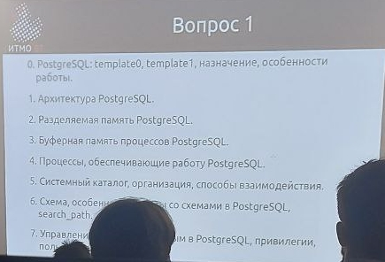
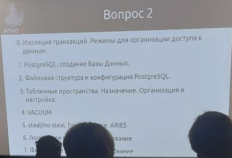
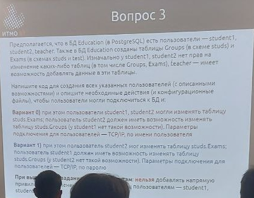

# Распределенные системы хранения данных

## Рубежная работа


> [!TIP]
> Everybody keeps talking about the SQL, but i've never seen the PREQL

---

## Вариант

### Первый поток

Вариант каждого задания определяется по ИСУ: \
`sXXXXAB`

1. Вариант для вопроса 1: `B`
2. Вариант для вопроса 2: `(A + B) % 10`
3. Вариант для задания 3: `B % 2`

### Второй поток

*TODO*

---

## Задание

### Вопрос 1

<details>
  <summary>📸 <b>Фото вопроса 1</b></summary>

  
</details>

0. PostgreSQl: template0, template1, назначение, особенности работы.
1. Архитектура PostgreSQL.
2. Разделяемая память PostgreSQL.
3. Буферная память процессов PostgreSQL.
4. Процессы, обеспечивающие работу PostgreSQL.
5. Системный каталог, организация, способы взаимодействия.
6. Схема, особенности работы со схемами PostgreSQL, search_path.
7. Управление доступом к данным в PostgreSQL, привилегии, пользователи.
8. Роли в PostgreSQL. INHERIT, NOINHERIT.
9. Установка PostgreSQL.

### Вопрос 2

<details>
  <summary>📸 <b>Фото вопроса 2</b></summary>

  
</details>

0. Изоляция транзакций. Режимы для организации доступа к данным.
1. PostgreSQL, создание Базы Данных.
2. Файловая структура и конфигурация PostgreSQL.
3. Табличные пространства. Назначение. Организация и настройка.
4. VACCUM.
5. steal/no-steal, force/no-force. ARIES.
6. Логическое резервное копирование.
7. Физическое резервное копирование.
8. UNDO-журнал.
9. REDO-журнал.

### Задание 3

<details>
  <summary>📸 <b>Фото задания 3</b></summary>

  
</details>

Предполагается, что в БД Education (в PostgreSQL) есть пользователи – `student1`, `student2`, `teacher`. Также в БД Education созданы таблицы `Groups` (в схеме `studs`) и `Exams` (в схемах `studs` и `test`). Изначально у `student1`, `student2` нет прав на изменение каких-либо таблиц (в том числе `Groups`, `Exams`), `teacher` – имеет возможность **добавлять** данные в эти таблицы.

Напишите код для создания всех указанных пользователей (с описанными возможностями) и опишите необходимые действия (и конфигурационные файлы), чтобы пользователи могли подключиться к БД и:

- **Вариант 0)** при этом пользователи `student1`, `student2` могли изменять таблицу `studs.Exams`, пользователь `student2` должен иметь возможность изменять таблицу `studs.Groups` (y `student1` нет такой возможности). Параметры подключения для пользователей – ТСP/IР, по имени пользователя.
- **Вариант 1)** при этом пользователь `student2` мог изменять таблицу `studs.Exams`; пользователь `student1` должен иметь возможность изменять таблицу `studs.Groups` (y `student2` нет такой возможности). Параметры подключения для пользователей – ТСР/IР, по паролю.

При выполнении задания: **нельзя** добавлять напрямую привилегии на изменение каких-либо таблиц пользователям – `student1`, `student2`.

---

## Разбор

### Задание 3.

#### Вариант 0

- `student1` и `student2` могут изменять таблицу `studs.Exams`;
- `student2` может изменять таблицу `studs.Groups` (у `student1` такой возможности нет);
- Подключение по TCP/IP с аутентификацией по имени пользователя (без пароля).

**1. Создание пользователей и ролей**

```sql
CREATE USER student1;
CREATE USER student2;
CREATE USER teacher WITH PASSWORD 'teacher_password';

GRANT USAGE ON SCHEMA studs TO student1, student2, teacher;
GRANT USAGE ON SCHEMA test TO teacher;

CREATE ROLE exams_access;
CREATE ROLE groups_access;

GRANT INSERT, UPDATE, DELETE ON studs.Exams TO exams_access;
GRANT INSERT, UPDATE, DELETE ON studs.Groups TO groups_access;

GRANT exams_access TO student1, student2;
GRANT groups_access TO student2;

GRANT INSERT ON studs.Groups, studs.Exams, test.Exams TO teacher;
```

**2. Настройка аутентификации**

Добавим в файл `pg_hba.conf`:

```conf
# TYPE  DATABASE     USER        ADDRESS     METHOD
host    education    student1    0.0.0.0/0   trust  # Аутентификация по имени
host    education    student2    0.0.0.0/0   trust
host    education    teacher     0.0.0.0/0   md5    # Для teacher требуется пароль
```

Перезагрузим PostgreSQL:

    pg_ctl reload -D $PGDATA

#### Вариант 1

- `student2` может изменять таблицу `studs.Exams`;
- `student1` может изменять таблицу `studs.Groups`;
- Подключение по TCP/IP с аутентификацией по паролю.

**1. Создание пользователей и ролей**

```sql
CREATE USER student1 WITH PASSWORD 'password1';
CREATE USER student2 WITH PASSWORD 'password2';
CREATE USER teacher WITH PASSWORD 'teacher_password';

GRANT USAGE ON SCHEMA studs TO student1, student2, teacher;
GRANT USAGE ON SCHEMA test TO teacher;

CREATE ROLE update_exams_role;
CREATE ROLE update_groups_role;

GRANT INSERT, UPDATE, DELETE ON studs.Exams TO update_exams_role;
GRANT INSERT, UPDATE, DELETE ON studs.Groups TO update_groups_role;

GRANT update_groups_role TO student1;
GRANT update_exams_role TO student2;

GRANT INSERT ON studs.Groups, studs.Exams, test.Exams TO teacher;
```

**2. Настройка аутентификации**

Добавим в файл `pg_hba.conf`:

```conf
# TYPE  DATABASE     USER        ADDRESS     METHOD
host    education    student1    0.0.0.0/0   md5  # Аутентификация по паролю
host    education    student2    0.0.0.0/0   md5
host    education    teacher     0.0.0.0/0   md5
```

Перезагрузим PostgreSQL:

    pg_ctl reload -D $PGDATA

---

## Полезные ссылки

| Ссылка | Описание |
| --- | --- |
| [лекции/](../лекции/) | Стоит прочитать лекции до лекции 6 часть II **включительно** |
| [github.com/Imtjl/distributed-storage-systems/frontier-prep](https://github.com/Imtjl/distributed-storage-systems/tree/master/frontier-prep) | Теоретический материал для подготовки к рубежной работе и песочница PostgreSQL для практики |
| [github.com/RedGry/ITMO/RSHD/rybej_var1.jpg](https://github.com/RedGry/ITMO/blob/master/RSHD/tests/img/rybej_var1.jpg) | Рубежная работа 2023 |
| [postgrespro.ru/docs/postgresql/17/user-manag](https://postgrespro.ru/docs/postgresql/17/user-manag) <br> [sql-ex.ru/blogs/PostgreSQL_roli_i_privilegii.html](https://sql-ex.ru/blogs/?/Osnovy_PostgreSQL_roli_i_privilegii.html) | Роли и привилегии, для задания 3 |

## Лицензия <a name="license"></a>

Проект доступен с открытым исходным кодом на условиях [Лицензии GNU GPL 3](https://opensource.org/license/gpl-3-0/). \
*Авторские права 2025 Max Barsukov*

**Поставьте звезду :star:, если вы нашли этот проект полезным.**
