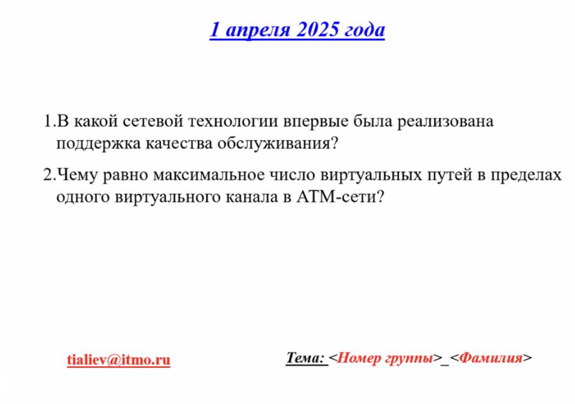

# Тестирование 01.04.2025

## Вопросы

## Ответы

**1. В какой сетевой технологии впервые была реализована поддержка качества обслуживания?**

> Frame Relay

Поддержка качества обслуживания (QoS) впервые была реализована в технологии Frame Relay. Эта технология появилась в 1990-х годах и позволила управлять трафиком, устанавливая приоритеты для различных типов данных. Frame Relay обеспечил возможность выделения ресурсов для критически важных приложений, таких как голосовая связь и видеоконференции.

---

**2. Чему равно максимальное число виртуальных путей в пределах одного виртуального канала в ATM-сети?**

> 256

В ATM-сети максимальное число виртуальных путей в пределах одного виртуального канала (VC) равно 256. Это связано с тем, что в ATM используется 8-битное поле для идентификации виртуального пути (VPI, Virtual path identifier) в заголовке ячейки, что позволяет адресовать до 256 различных виртуальных путей. Это позволяет передавать несколько потоков данных через один физический канал.

---

## Лицензия 

Проект доступен с открытым исходным кодом на условиях [Лицензии GNU GPL 3](https://opensource.org/license/gpl-3-0/). \
*Авторские права 2025 Max Barsukov*

**Поставьте звезду :star:, если вы нашли этот проект полезным.**
