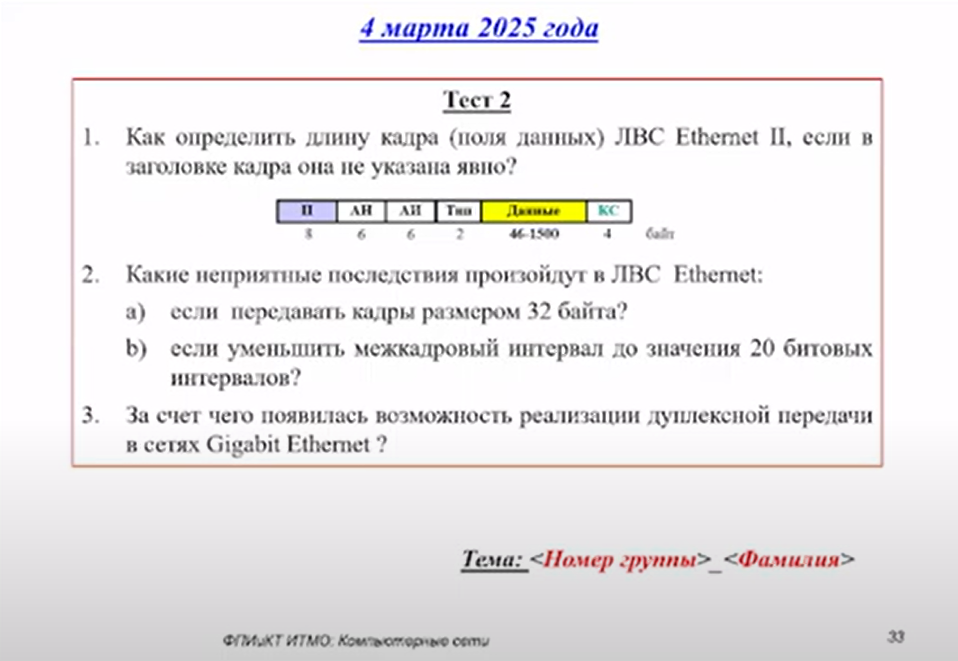

# Тестирование 04.03.2025

> [!NOTE]
> А я эту лекцию пропустил 😁

## Вопросы

## Ответы

**1. Как определить длину кадра (поля данных) ЛВС Ethernet II, если в заголовке кадра она не указана явно?**

> В Ethernet II длина данных определяется через верхнеуровневые протоколы и физическое завершение кадра.

В Ethernet II длина поля данных не указывается явно. Определение длины происходит следующим образом:
- **Физический уровень**: Конец кадра определяется по прекращению передачи сигнала. Преамбула и SFD (Start Frame Delimiter) обозначают начало кадра, а отсутствие сигнала — его конец.
- **Минимальный и максимальный размер кадра**: Кадр Ethernet II должен быть от 64 байт (включая заголовок 14 байт и трейлер 4 байта) до 1518 байт. Если данные меньше 46 байт, они дополняются до минимального размера (46 байт) с помощью **padding**.
- **Протоколы верхнего уровня**: Длина полезных данных определяется через поля заголовков инкапсулированных протоколов (например, поле *Total Length* в IPv4 или *Payload Length* в IPv6). Padding игнорируется на основе этой информации.

---

**2. Какие неприятные последствия произойдут в ЛВС Ethernet:**

> Кадры меньше 64 байт и сокращение межкадрового интервала нарушают работу сети.

**a) Если передавать кадры размером 32 байта?**
- В **полудуплексном режиме** (с CSMA/CD):
  - Кадры меньше 64 байт называются **runt frames**.
  - Невозможно обнаружить коллизии, так как передача завершится раньше, чем сигнал коллизии вернётся к отправителю.
  - Такие кадры отбрасываются оборудованием как ошибочные.
- В **полнодуплексном режиме** (без коллизий):
  - Оборудование всё равно требует минимальный размер кадра. Кадры дополняются до 64 байт, что увеличивает избыточный трафик.
  - Некоторые устройства могут отбрасывать undersized-кадры.

**b) Если уменьшить межкадровый интервал до 20 битовых интервалов?**
- Стандартный интервал — **96 бит** (9.6 мкс для 10 Мбит/с). Уменьшение до 20 бит приведёт к:
  - **Перегрузке буферов**: Устройства не успевают обработать предыдущий кадр.
  - **Ошибкам синхронизации**: Оборудование ожидает минимальный интервал для подготовки к новому кадру.
  - В **полудуплексном режиме**: Нарушение работы CSMA/CD, так как интервал используется для определения свободной среды. Возрастает число коллизий.
  - В **полнодуплексном режиме**: Риск потери кадров из-за переполнения буферов.

---

**3. За счёт чего появилась возможность реализации дуплексной передачи в сетях Gigabit Ethernet?**

> Gigabit Ethernet использует разделение каналов, коммутаторы и отказ от CSMA/CD для дуплексной передачи.

Дуплексная передача в Gigabit Ethernet стала возможна благодаря:
1. **Отказу от CSMA/CD**: В полнодуплексном режиме коллизии невозможны, так как передача и приём идут по отдельным каналам.
2. **Использованию витой пары с разделением каналов**:
   - В 1000BASE-T задействованы все 4 пары проводов, каждая работает в обоих направлениях.
   - Улучшенные методы кодирования (например, 8B/10B) обеспечивают устойчивую передачу.
3. **Коммутаторам вместо концентраторов**: Каждый порт коммутатора работает независимо, позволяя одновременную передачу и приём.
4. **Управлению потоком**: Механизмы вроде *PAUSE frames* предотвращают переполнение буферов.
5. **Увеличению скорости обработки**: Аппаратные улучшения позволили обрабатывать данные на гигабитных скоростях без задержек.

---

## Лицензия 

Проект доступен с открытым исходным кодом на условиях [Лицензии GNU GPL 3](https://opensource.org/license/gpl-3-0/). \
*Авторские права 2025 Max Barsukov*

**Поставьте звезду :star:, если вы нашли этот проект полезным.**
