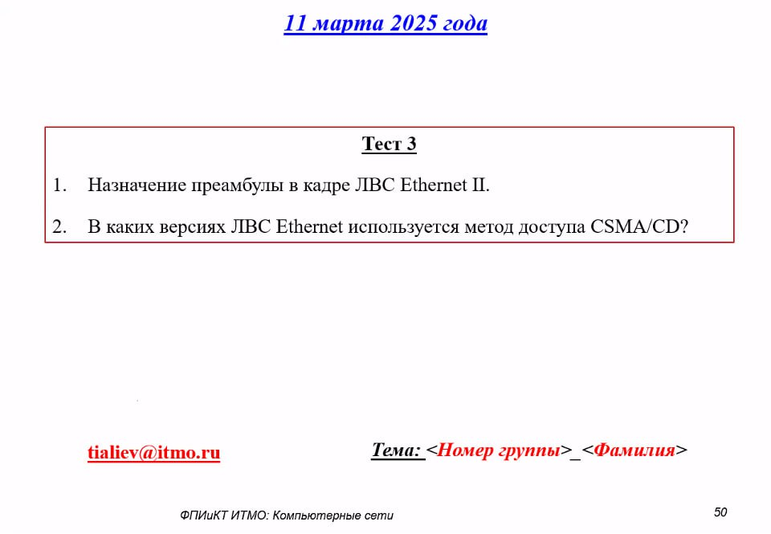

# Тестирование 11.03.2025

## Вопросы

## Ответы

**1. Назначение преамбулы в кадре ЛВС Ethernet II**

> Преамбула в кадре Ethernet II служит для синхронизации тактовых сигналов передатчика и приёмника, обозначения старта кадра и обеспечения надежности передачи на физическом уровне

Преамбула в кадре Ethernet II служит для синхронизации тактовых сигналов передатчика и приёмника. Она состоит из **7 байт** чередующихся значений `10101010`, за которыми следует **1 байт Start Frame Delimiter (SFD)** (`10101011`). Её основные функции:
- **Синхронизация**: позволяет приёмнику определить начало кадра и настроиться на частоту передатчика.
- **Подготовка к декодированию**: помогает оборудованию (например, сетевым картам) корректно распознать битовый поток перед началом обработки данных.
Преамбула не содержит полезной информации и удаляется при передаче кадра на уровень выше (например, MAC-уровень).

---

**2. Версии ЛВС Ethernet, использующие метод доступа CSMA/CD**

> CSMA/CD это метод, характерный для Ethernet до распространения гигабитных скоростей. В современных сетях (1 Гбит/с и выше) его заменили на полнодуплексную передачу через коммутаторы, где коллизии исключены

Метод **CSMA/CD (Carrier Sense Multiple Access with Collision Detection)** применяется в следующих версиях Ethernet:
- **Классический Ethernet (10 Мбит/с)**:
  - 10BASE5 (толстый коаксиал), 10BASE2 (тонкий коаксиал), 10BASE-T (витая пара).
  - Работает только в **полудуплексном режиме**, где возможны коллизии.

- **Fast Ethernet (100 Мбит/с)**:
  - 100BASE-TX, 100BASE-FX — при работе в **полудуплексе**.
  - В полнодуплексном режиме (например, на коммутаторах) CSMA/CD не используется.

- **Gigabit Ethernet (1000 Мбит/с)**:
  - Теоретически поддерживает CSMA/CD в полудуплексе, но на практике почти не применяется из-за перехода к полнодуплексным коммутируемым сетям.

**Примечание**: В современных сетях (1 Гбит/с и выше) CSMA/CD устарел, так как доминирует полнодуплексная передача через коммутаторы, где коллизии исключены.

---

## Лицензия 

Проект доступен с открытым исходным кодом на условиях [Лицензии GNU GPL 3](https://opensource.org/license/gpl-3-0/). \
*Авторские права 2025 Max Barsukov*

**Поставьте звезду :star:, если вы нашли этот проект полезным.**
