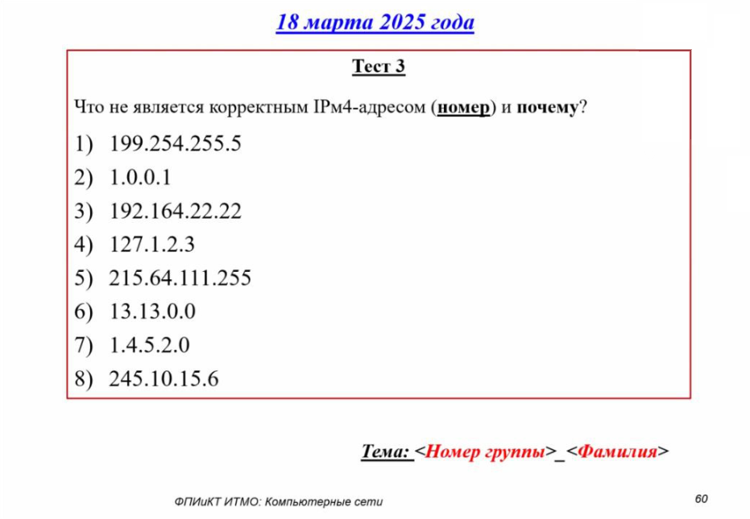

# Тестирование 18.03.2025

## Вопросы

## Ответы

Некорректные IPv4-адреса: **4, 5, 7, 8**.

**Причины:**
- **4) 127.1.2.3** — принадлежит зарезервированному loopback-диапазону (127.0.0.0/8).
- **5) 215.64.111.255** — широковещательный адрес (последний октет 255 в сети с маской /24), не может быть присвоен узлу.
- **7) 1.4.5.2.0** — содержит 5 октетов вместо 4, нарушает структуру IPv4.
- **8) 245.10.15.6** — относится к зарезервированному классу E (240.0.0.0–255.255.255.254).

Остальные адреса корректны:
1) 199.254.255.5, 2) 1.0.0.1, 3) 192.164.22.22, 6) 13.13.0.0 — соответствуют формату IPv4 и не входят в зарезервированные диапазоны.
