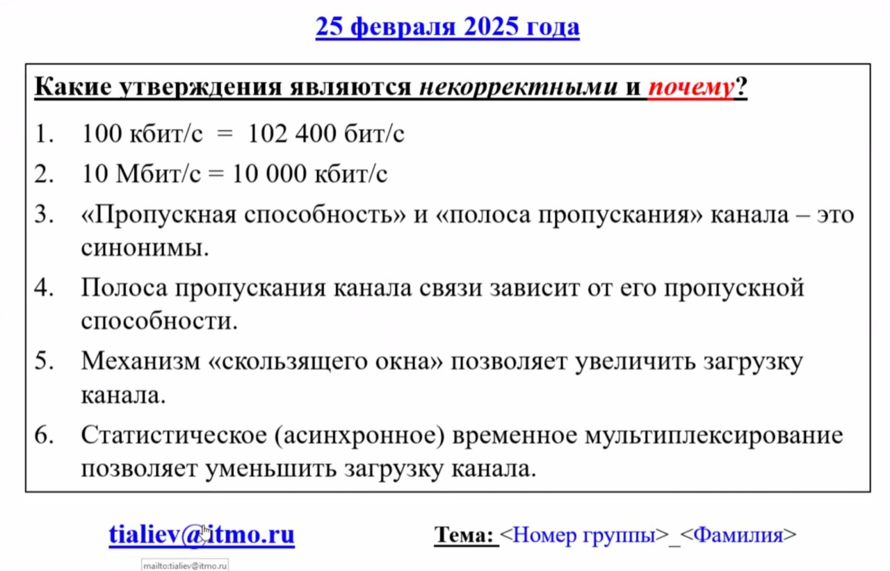

# Тестирование 25.02.2025

## Вопросы

## Ответы

Некорректными являются утверждения **1, 3, 4 и 6**.

1. **100 кбит/с = 102 400 бит/с**
   **Некорректно.** 100 кбит/с эквивалентно 100 000 бит/с (поскольку 1 кбит = 1 000 бит). Утверждение неверно, так как 102 400 бит/с — это 100,2 кбит/с.

2. **10 Мбит/с = 10 000 кбит/с**
   **Корректно.** 1 Мбит = 1 000 кбит, следовательно, 10 Мбит/с действительно равно 10 000 кбит/с.

3. **«Пропускная способность» и «полоса пропускания» канала - это синонимы.**
   **Некорректно.** Хотя оба термина связаны с передачей данных, они не являются полными синонимами. Пропускная способность (bandwidth) относится к объему данных, который может быть передан за определенный период времени, тогда как полоса пропускания (throughput) может включать факторы, влияющие на фактическую скорость передачи данных.

4. **Полоса пропускания канала связи зависит от его пропускной способности.**
   **Некорректно.** Полоса пропускания — это характеристика канала, которая определяет максимальную частоту сигналов, которые могут быть переданы. Пропускная способность — это количество данных, которое канал может передать за единицу времени. Полоса пропускания может влиять на пропускную способность, но они не всегда напрямую зависят друг от друга.

5. **Механизм «скользящего окна» позволяет увеличить загрузку канала.**
   **Корректно.** Механизм «скользящего окна» позволяет отправлять несколько пакетов данных до получения подтверждения, что действительно может увеличить загрузку канала и улучшить его использование.

6. **Статистическое (асинхронное) временное мультиплексирование позволяет уменьшить загрузку канала.**
   **Некорректно.** Статистическое временное мультиплексирование, наоборот, позволяет более эффективно использовать доступную пропускную способность канала, увеличивая загрузку за счет динамического распределения ресурсов между пользователями.
