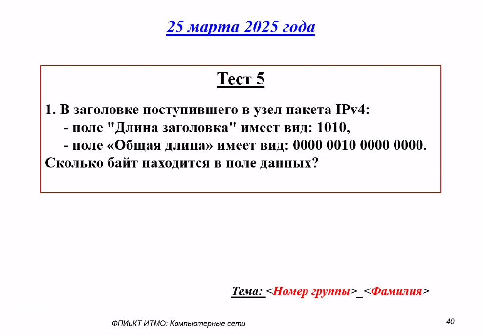

# Тестирование 25.03.2025

## Вопросы

## Ответы

Поле "Длина заголовка" (IHL) в IPv4 задаётся в 32-битных словах. Значение **1010** в двоичной системе равно **10** в десятичной. Следовательно, длина заголовка составляет:
`10 × 4 байта = 40 байт`.

Поле "Общая длина" (Total Length) задаёт размер всего пакета в байтах. Значение **0000 0010 0000 0000** в двоичной системе равно:
`2 × 256 + 0 = 512 байт`.

Чтобы найти размер поля данных, вычитаем длину заголовка из общей длины:
`512 байт − 40 байт = 472 байта`.

**Ответ:** 472 байта.

---

## Лицензия 

Проект доступен с открытым исходным кодом на условиях [Лицензии GNU GPL 3](https://opensource.org/license/gpl-3-0/). \
*Авторские права 2025 Max Barsukov*

**Поставьте звезду :star:, если вы нашли этот проект полезным.**
