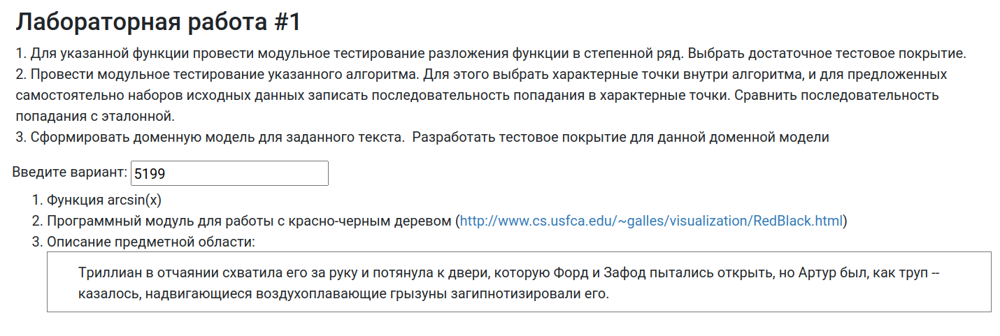

# Лабораторная работа 1

## Вариант `5199`

|.pdf|.docx|
|-|-|
| [report](./docs/report.pdf) | [report](./docs/report.docx) |

## Задание

<table>
  <tr>
    <td> </td>
  </tr>
</table>

1. Для указанной функции провести модульное тестирование **разложения функции в степенной ряд**. Выбрать достаточное тестовое покрытие.
  - Функция `arcsin(x)`;
2. Провести модульное тестирование указанного алгоритма. Для этого выбрать характерные точки внутри алгоритма, и для предложенных самостоятельно наборов исходных данных записать последовательность попадания в характерные точки. Сравнить последовательность попадания с эталонной.
  - Программный модуль для работы с [красно-черным деревом](http://www.cs.usfca.edu/~galles/visualization/RedBlack.html);
3. Сформировать доменную модель для заданного текста. Разработать тестовое покрытие для данной доменной модели:

   > Триллиан в отчаянии схватила его за руку и потянула к двери, которую Форд и Зафод пытались открыть, но Артур был, как труп — казалось, надвигающиеся воздухоплавающие грызуны загипнотизировали его.

### Вопросы к защите лабораторной работы:

1. Понятие тестирования ПО. Основные определения.
2. Цели тестирования. Классификация тестов.
3. Модульное тестирование. Понятие модуля.
4. V-образная модель. Статическое и динамическое тестирование.
5. Валидация и верификация. Тестирование методом "чёрного" и "белого" ящика.
6. Тестовый случай, тестовый сценарий и тестовое покрытие.
7. Анализ эквивалентности.
8. Таблицы решений и таблицы переходов.
9. Регрессионное тестирование.
10. Библиотека `JUnit`. Особенности API. Класс `junit.framework.Assert`.
11. Отличия `JUnit 3` от `JUnit 4`.

---

## Полезные ссылки

| Ссылка                                                                                                                                                                                                    | Описание                                                                  |
|-----------------------------------------------------------------------------------------------------------------------------------------------------------------------------------------------------------|---------------------------------------------------------------------------|
| [github.com/RedGry/ITMO/TPO/ТПО 1 - Подготовка.pdf](https://github.com/RedGry/ITMO/blob/master/TPO/docs/%D0%A2%D0%9F%D0%9E%201%20-%20%20%D0%9F%D0%BE%D0%B4%D0%B3%D0%BE%D1%82%D0%BE%D0%B2%D0%BA%D0%B0.pdf) | Подготовка к защите ЛР 1                                                  |
| [github.com/band-of-four/cheatsheets/testing/lab1.md](https://github.com/band-of-four/cheatsheets/blob/master/testing/lab1.md)                                                                            | Ответы на вопросы с [se.ifmo.ru](https://se.ifmo.ru/courses/testing#labs) |
| [youtu.be/4gAvA-8BzS0](https://youtu.be/4gAvA-8BzS0)                                                                                                                                                      | Первая лекция ТПО                                                         |
| [baeldung.com/parameterized-tests-junit-5](https://www.baeldung.com/parameterized-tests-junit-5)                                                                                                          | JUnit 5                                                                   |
| [baeldung.com/java-unit-testing-best-practices](https://www.baeldung.com/java-unit-testing-best-practices)                                                                                                | Best Practices for Unit Testing in Java                                   |

## Лицензия 

Проект доступен с открытым исходным кодом на условиях [Лицензии MIT](https://opensource.org/licenses/MIT). \
*Авторские права 2025 Max Barsukov*

**Поставьте звезду :star:, если вы нашли этот проект полезным.**
