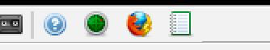
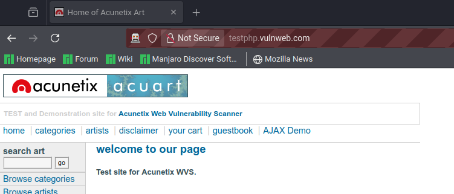
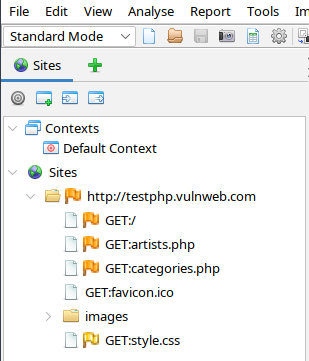
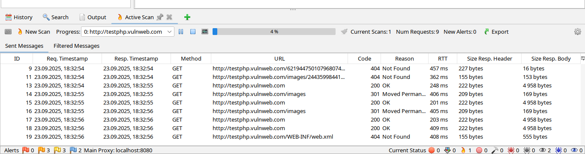

# Руководство по выполнению Работы №4

1. Установите [ZAP](https://www.zaproxy.org/) с [официального сайта](https://www.zaproxy.org/download/) или с помощью пакетного менеджера.
2. (желательно) Установите [Firefox](https://www.firefox.com/ru/).
3. Запустите ZAP и встроенный браузер:
    - Запустите OWASP ZAP. При первом запуске появится окно "Первоначальная загрузка".
    - Вам предложат сохранить сессию. Можно выбрать "Да, сохранить сессию" (сессия будет сохранена на диск) или "Нет, я не хочу сейчас сохранять сессию" (данные сканирования будут храниться в оперативной памяти и пропадут после закрытия ZAP). Для выполнения задания разницы нет, выбирайте любой вариант.
    - Нажмите кнопку "Запуск браузера" (кнопка с логотипом браузера, обычно Firefox).
        - Это автоматически откроет новый браузер, настроенный на работу через прокси-сервер ZAP. Все ваши действия в этом браузере будут перехватываться и анализироваться.
        
3. Проведите "Быстрое сканирование" (Quick Scan):
    - В открывшемся встроенном браузере перейдите на тестовый сайт. В адресной строке браузера введите: `http://testphp.vulnweb.com/` и нажмите Enter.
    
    - Походите по сайту. Перейдите по нескольким ссылкам (например, `artists`, `categories`), понажимайте кнопки, чтобы ZAP смог понять структуру сайта.
    - Вернитесь в главное окно OWASP ZAP.
    - Найдите адрес сайта (`testphp.vulnweb.com`) на вкладке "Сайты" (`Sites`) в левой части окна. Щёлкните по нему правой кнопкой мыши.
    
    - В контекстном меню выберите: `Attack -> Active Scan`.
    - В открывшемся окне `Active Scan` просто нажмите кнопку `Start Scan`. Здесь можно оставить все настройки по умолчанию (`Default Policy`).
    - Начнётся сканирование. Его прогресс можно наблюдать на вкладке `Active Scans` в нижней части интерфейса. Дождитесь его завершения (прогресс дойдёт до 100%).
    
4. Проанализируйте результаты и сделайте скриншоты После завершения сканирования результаты появятся на двух ключевых вкладках:
    1.  Разверните узел "Высокий риск" (High Risk) и другие на вкладке "Предупреждения".
        - Вкладка "Предупреждения" (`Alerts`): Здесь отображаются найденные уязвимости, отсортированные по степени риска (Высокий, Средний, Низкий, Информационный). Это главная вкладка для вашего отчета.
        - Вкладка "Сайты" (`Sites`): Здесь отображается структура сайта. Щёлкнув на "+" рядом с адресом, а затем на "Предупреждения", вы также увидите список уязвимостей для каждого конкретного URL.
    2.  Найдите 3-5 различных уязвимостей. Самые частые для этого сайта: `Cross Site Scripting (XSS)`, `SQL Injection`, `Path Traversal`.
    3.  Щёлкните по каждой уязвимости, чтобы в верхней панели появилось её подробное описание.
    4.  Сделайте скриншоты.
        - Скриншот 1: Общий вид вкладки "Предупреждения" со списком найденных проблем.
        - Скриншот 2-4: Для каждой конкретной уязвимости. Важно сделать скриншот так, чтобы было видно:
            - Название уязвимости (например, "SQL Injection") и её риск.
            - URL, на котором она была найдена.
            - Параметр (Parameter), в котором найдена уязвимость (например, `cat` или `id`).
            - Доказательство (Evidence) или Запрос (Request) в описании. Часто там можно увидеть пример вредоносной нагрузки (например, `cat=1' OR '1'='1` для SQLi).
    5. Заполните отчёт (можете использовать [шаблон отчета](../docs/template.docx)).

## Проблемы с открытием браузера

Если вы получаете ошибку `The provided browser was not found.`:
1. Ознакомьтесь с [официальным FAQ](https://www.zaproxy.org/faq/how-can-i-fix-browser-was-not-found/).
2. Если не получилось, попробуйте [советы отсюда](https://stackoverflow.com/questions/67122011/facing-the-issue-zap-browser-launch-issue).
3. Попробуйте указать актуальные бинари браузеров и веб-драйверов в `Tools -> Options -> Selenium`.

## Как сгенерировать отчёт

1. Завершите сканирование и анализ. Убедитесь, что вы провели Quick Scan и просмотрели результаты на вкладке "Предупреждения" (`Alerts`).
2. Найдите меню "Отчёт" (`Report`). В верхнем меню программы кликните на `Report -> Generate Report...`.
3. Откроется окно генерации отчета. Во вкладке `Template` нас интересуют два пункта:
    - `Modern HTML Report with themes and options` — создаст красивую HTML-страницу, которую можно открыть в любом браузере.
    - `Traditional Markdown Report` — создаст отчет в формате Markdown, который проще будет скормить GPT.

---

## Лицензия 

Проект доступен с открытым исходным кодом на условиях [Лицензии MIT](https://opensource.org/licenses/MIT). \
*Авторские права 2025 Max Barsukov*

Поставьте звезду :star:, если вы нашли этот проект полезным.
