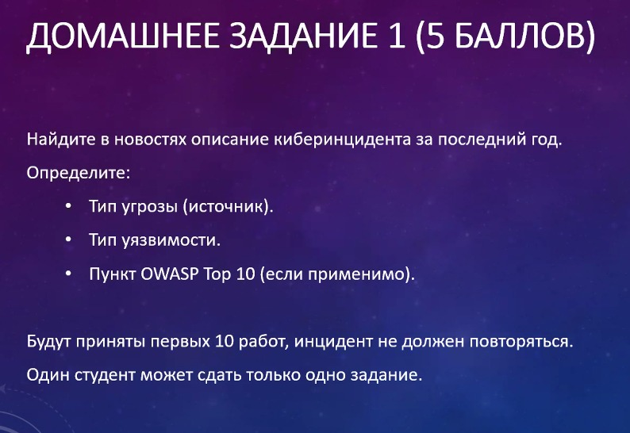
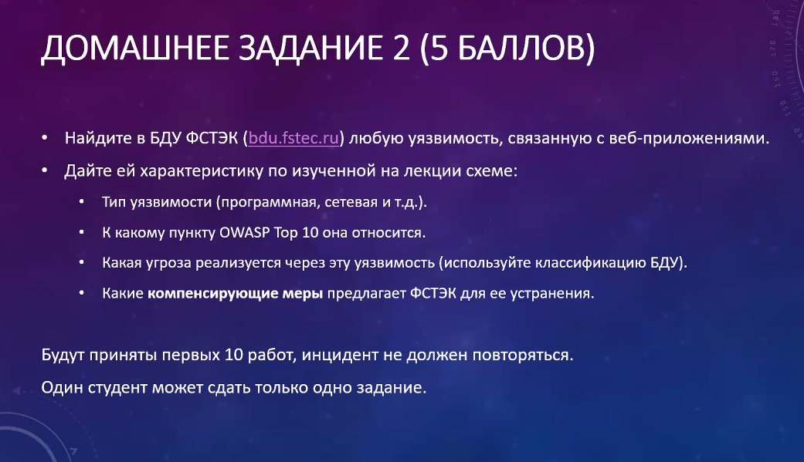
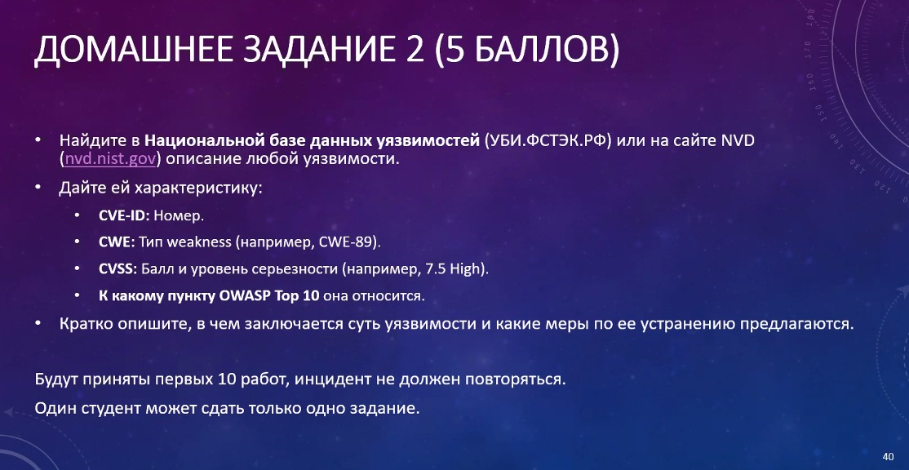

# Информационная безопасность

## Домашнее задание №1

Это домашнее задание выдавалось в конце лекции 10.09.2025.

Домашнее задание необязательное, это просто возможность получить баллы. Принимались первые 10 отправленных работ. Один студент может сдать только одно задание.

---

## Полезные ссылки

| Ссылка | Описание |
| --- | --- |
| [projectdiscovery.io/blog](https://projectdiscovery.io/blog)   [t.me/thebugbountyhunter](https://t.me/thebugbountyhunter) | Хорошие источники новостей для задания 1 |
| [bdu.fstec.ru](https://bdu.fstec.ru) | Банк данных угроз безопасности информации |
| [nvd.nist.gov](https://nvd.nist.gov) | Национальная база данных уязвимостей |

## Лицензия 

Проект доступен с открытым исходным кодом на условиях [Лицензии GNU GPL 3](https://opensource.org/license/gpl-3-0/). \
*Авторские права 2025 Max Barsukov*

**Поставьте звезду :star:, если вы нашли этот проект полезным.**
