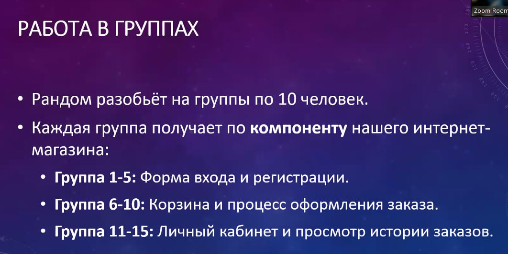
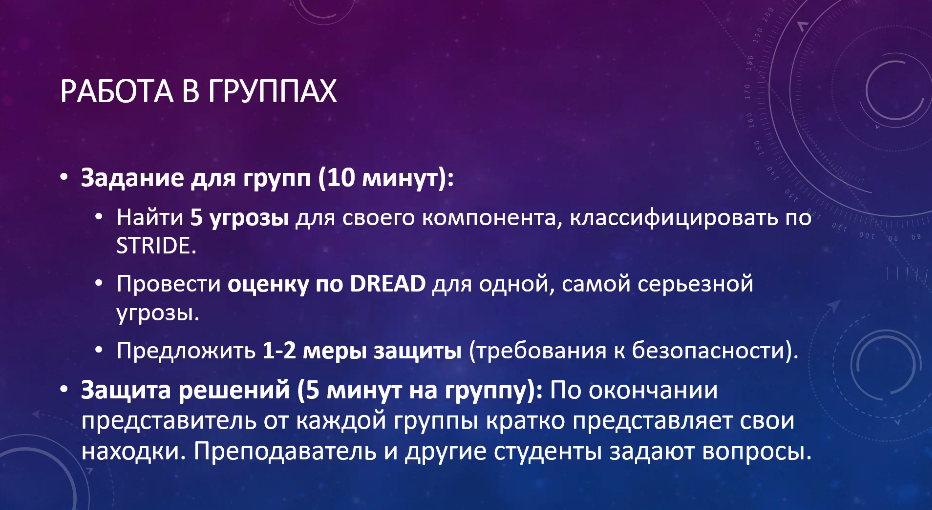

# Информационная безопасность

## Практическое задание №2

Это задание выполнялось в конце лекции 17.09.2025. За лучшее выполненное задание для каждого компонента вся группа получает 10 баллов.

- [Форма входа и регистрации (10 баллов)](./ИБ%20Практика.pdf).

---

## Полезные ссылки

| Ссылка | Описание |
| --- | --- |
| [en.wikipedia.org/wiki/STRIDE_model](https://en.wikipedia.org/wiki/STRIDE_model) | STRIDE model |
| [en.wikipedia.org/wiki/DREAD](https://en.wikipedia.org/wiki/DREAD_(risk_assessment_model)) | DREAD risk assessment model |

## Лицензия 

Проект доступен с открытым исходным кодом на условиях [Лицензии GNU GPL 3](https://opensource.org/license/gpl-3-0/). \
*Авторские права 2025 Max Barsukov*

**Поставьте звезду :star:, если вы нашли этот проект полезным.**
