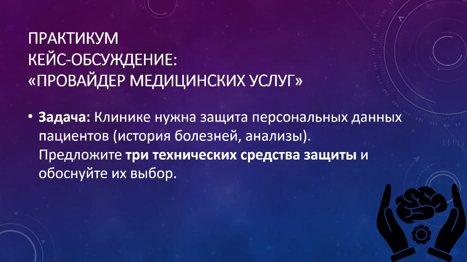

# Информационная безопасность

## Практическое задание №3

Это задание выполнялось в конце лекции 24.09.2025. В одной группе по 4-5 человек; 8 групп, выполнение которых понравились Маркиной, получили по 4 балла.

- [Пример выполнения задания](./ИБ%20прак%20клиника.pdf).

---

## Лицензия 

Проект доступен с открытым исходным кодом на условиях [Лицензии GNU GPL 3](https://opensource.org/license/gpl-3-0/). \
*Авторские права 2025 Max Barsukov*

**Поставьте звезду :star:, если вы нашли этот проект полезным.**
