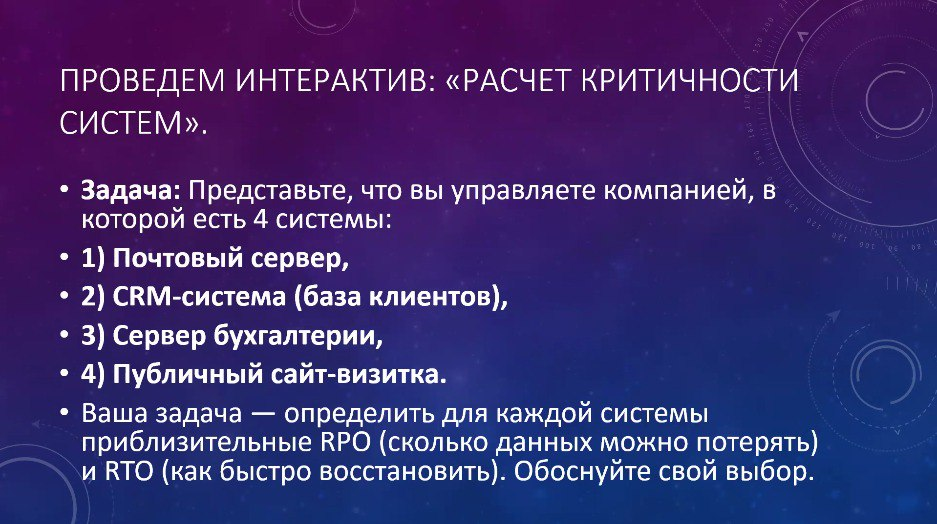

# Информационная безопасность

## Практическое задание №4 «Расчёт критичности систем»

Это задание выполнялось в конце лекции 01.10.2025.

В одной группе по 7-8 человек; группы с лучшим выполнением получили по 4 балла.

- [Пример выполнения задания](./ИБ%20практика%2001.10.pdf).

---

## Лицензия 

Проект доступен с открытым исходным кодом на условиях [Лицензии GNU GPL 3](https://opensource.org/license/gpl-3-0/). \
*Авторские права 2025 Max Barsukov*

**Поставьте звезду :star:, если вы нашли этот проект полезным.**
