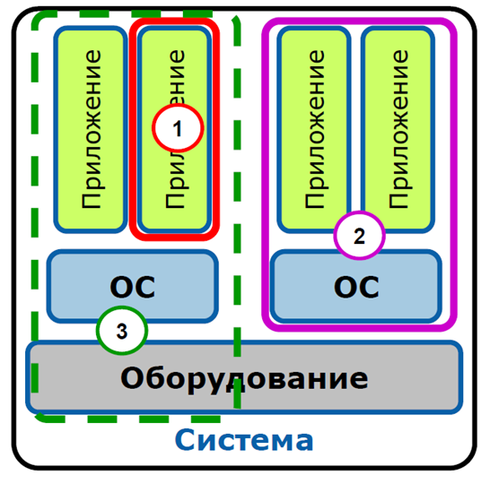

# Технологии виртуализации

## Зачёт

> [!NOTE]
> Если вам достаточно баллов, то вы можете не писать финальный тест.

На тест отводиться 1 попытка и 40 минут. Все, кто не успеет или не сможет сдать, будут сдавать в другое время, с понижением баллов.

---

## Вопросы

#### 1. Выберите основные типы облаков.

- [ ] Сервисное
- [x] Гибридное
- [x] Общественное
- [ ] Организационное
- [x] Частное

#### 2. Какие типы виртуализации вы знаете?

- [x] Виртуализация аппаратного обеспечения
- [x] Паравиртуализация
- [x] Виртуализация уровня ОС
- [ ] Виртуализация процесса
- [ ] Виртуализация работы памяти

#### 3. К какому типу виртуализации подходит определение: использует виртуальную машину (гипервизор), которая выступает как посредник между гостевой операционной системой и реальным оборудованием.

- [ ] Эмуляция аппаратуры
- [x] Полная виртуализация
- [ ] Паравиртуализация

#### 4. К какому типу виртуализации подходит определение: это когда, в хост-системе создается виртуальная машина, которая моделирует какую-то другую аппаратную архитектуру.

- [ ] Паравиртуализация
- [ ] Полная виртуализация
- [x] Эмуляция аппаратуры

#### 5. К какому типу абстракции памяти подходит определение: это именно то, что видно самому процессу гостевой ОС в качестве пространства исполнения.

- [x] Гостевая виртуальная память
- [ ] Гостевая физическая память
- [ ] Системная физическая память

#### 6. К какому типу абстракции памяти подходит определение: это то, что наблюдает VMM

- [ ] Гостевая физическая память
- [ ] Гостевая виртуальная память
- [x] Системная физическая память

#### 7. К какой модели облака можно отнести Docker?

- [ ] IaaS
- [x] PaaS
- [ ] SaaS

#### 8. Как называется гипервизор отмеченный на картинке номер 3?

- [x] Гипервизор первого типа
- [ ] Гипервизор гибридный
- [ ] Гипервизор второго типа

#### 9. Как называется гипервизор отмеченный на картинке номер 1?

- [x] Гипервизор второго типа
- [ ] Гипервизор первого типа
- [ ] Гипервизор гибридный

#### 10. К кому подходит утверждение: Свободная реализация API, демон и набор инструментов для управления виртуализацией?

- [x] Libvirt
- [ ] KVM
- [ ] QEMU

#### 11. С помощью какой команды можно выполнить подключение к консоли контейнера/запуск процесса в namespace’е контейнера

- [ ] `lxc-shell <name> -t <tty number>`
- [x] `lxc-console <name> -t <tty number>`
- [x] `lxc-attach <name> -- <command>`
- [ ] `lxc-create -n <name>`

#### 12. Укажите файл, который будет содержать инструкции, необходимые для запуска и настройки сервисов.

- [x] `docker-compose.yml`
- [ ] `Dockerfile`
- [ ] `server.py`

#### 13. Как посмотреть список контейнеров и их статусы

- [ ] `lxc container list`
- [x] `lxc-ls`
- [ ] `lxc container ls`
- [ ] `ls container`

#### 14. BYOD – это ...

- [x] Концепция, относящаяся к разрешению использовать собственное цифровое устройство вместо официального предоставленного
- [ ] Защита виртуальных машин от сетевых атак и различных уязвимостей установленных приложений на уровне гипервизора.
- [ ] Облачные хранилища

#### 15. Какие есть роли у узлов в swarm?

- [ ] Slave - подчинённый контейнер
- [x] Worker - исполнитель контейнеров
- [ ] Combo - совместная работа контейнеров
- [x] Manager - управление кластером

#### 16. С помощью какой команды можно запустить запустить ВМ без GUI?

- [ ] `vboxmanage startvm "Ubuntu" --type without-gui`
- [x] `vboxmanage startvm "Ubuntu" --type headless`
- [ ] `vboxmanage startvm "Ubuntu" --type no-gui`
- [ ] `vboxmanage startvm "Ubuntu" --default`

#### 17. Какая самая высокая степень интеграции в облачных вычислениях?

- [ ] XaaS
- [ ] IaaS
- [ ] PaaS
- [x] SaaS

#### 18. Назовите минимальный объект Kubernetes

- [ ] PC
- [x] POD
- [ ] Агент kubelet
- [ ] NOD

#### 19. Назовите виды IP-АТС

- [ ] Аналоговые
- [x] Аппаратные
- [ ] Многоканальные
- [ ] Комбо
- [ ] Системные
- [ ] Цифровые
- [x] Виртуальные

#### 20. Какие из следующих утверждений о libvirt являются правильными?

- [x] Libvirt — это универсальный интерфейс (API/toolkit) для управления различными гипервизорами, такими как KVM, Xen, VMware и Hyper-V.
- [x] Демон libvirtd должен быть запущен для обработки большинства команд управления, включая удалённое управление.
- [ ] Для работы libvirt с гипервизором KVM обязательно требуется графический интерфейс (`virt-manager`).
- [ ] Команда `virsh list --all` покажет только работающие виртуальные машины.
- [ ] Утилита virsh используется исключительно для управления сетевыми настройками виртуальных машин (NAT, мосты).
- [x] Конфигурация виртуальной машины (домена) в libvirt по умолчанию хранится в виде XML-файла, обычно в директории `/etc/libvirt/qemu/`.

---

## Лицензия 

Проект доступен с открытым исходным кодом на условиях [Лицензии GNU GPL 3](https://opensource.org/license/gpl-3-0/). \
*Авторские права 2026 Max Barsukov*

**Поставьте звезду :star:, если вы нашли этот проект полезным.**
