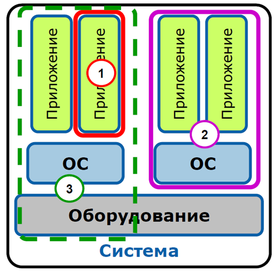

# Технологии виртуализации

## Тест

На тест отводиться 40 минут.

- [Скриншот пройденного в Google Forms теста](./test.png).

---

## Вопросы

#### 1. Выберите основные типы облаков

- [ ] Сервисное
- [x] Гибридное
- [ ] Организационное
- [x] Частное
- [x] Общественное

#### 2. Какие типы виртуализации вы знаете?

- [x] Виртуализация уровня ОС
- [ ] Эмуляция работы памяти
- [ ] Виртуализация процесса
- [x] Эмуляция аппаратуры
- [x] Паравиртуализация

#### 3. К какому типу виртуализации подходит определение: ... – использует виртуальную машину (гипервизор), которая выступает как посредник между гостевой операционной системой и реальным оборудованием.

- [x] Полная виртуализация
- [ ] Эмуляция аппаратуры
- [ ] Паравиртуализация

#### 4. К какому типу виртуализации подходит определение: ... – это когда в хост-системе создается виртуальная машина, которая моделирует какую-то другую аппаратную архитектуру.

- [x] Эмуляция аппаратуры
- [ ] Паравиртуализация
- [ ] Полная виртуализация

#### 5. К какому типу абстракции памяти подходит определение: ... – это именно то, что видно самому процессу гостевой ОС в качестве пространства исполнения.

- [ ] Системная физическая память
- [x] Гостевая виртуальная память
- [ ] Гостевая физическая память

#### 6. К какому типу абстракции памяти подходит определение: ... – это то, что наблюдает VMM

- [ ] Системная физическая память
- [x] Гостевая физическая память
- [ ] Гостевая виртуальная память

#### 7. К какой модели облака можно отнести Docker?

- [ ] SaaS
- [ ] IaaS
- [x] PaaS

#### 8. Как называется гипервизор отмеченный на картинке номер 3?

- [x] Гипервизор первого типа
- [ ] Гипервизор второго типа
- [ ] Гипервизор гибридный

#### 9. Как называется гипервизор отмеченный на картинке номер 1?

- [ ] Гипервизор первого типа
- [x] Гипервизор второго типа
- [ ] Гипервизор гибридный

#### 10. К кому подходит утверждение: Свободная реализация API, демон и набор инструментов для управления виртуализацией?

- [ ] QEMU
- [x] Libvirt
- [ ] KVM

#### 11. С помощью какой команды можно выполнить подключение к консоли контейнера/запуск процесса в namespace’е контейнера

- [ ] `lxc-shell <name> -t <tty number>`
- [x] `lxc-console <name> -t <tty number>`
- [x] `lxc-attach <name> -- <command>`
- [ ] `lxc-create -n <name>`

#### 12. Тема Docker. Укажите файл, который будет содержать инструкции, необходимые для запуска и настройки сервисов.

- [x] `docker-compose.yml`
- [ ] `Dockerfile`
- [ ] `server.py`

#### 13. Как посмотреть список контейнеров и их статусы

- [ ] `lxc container list`
- [x] `lxc-ls`
- [ ] `lxc container ls`
- [ ] `ls container`

#### 14. Верно ли утверждение, что Docker работал на базе LXC?

- [ ] Нет
- [x] Да

#### 15. BYOD – это ...

- [x] Концепция, относящаяся к разрешению использовать собственное цифровое устройство вместо официального предоставленного
- [ ] Защита виртуальных машин от сетевых атак и различных уязвимостей установленных приложений на уровне гипервизора.
- [ ] Облачные хранилища

#### 16. Перечислите различные услуги, доступные в Kubernetes

- [ ] служба маршрутизации
- [x] служба IP-кластера
- [x] служба балансировки нагрузки
- [x] служба порта узла
- [ ] служба безопасности
- [x] служба создания внешнего имени

#### 17. С помощью какой команды можно запустить запустить ВМ без GUI?

- [ ] `vboxmanage startvm "Ubuntu" --type without-gui`
- [x] `vboxmanage startvm "Ubuntu" --type headless`
- [ ] `vboxmanage startvm "Ubuntu" --type no-gui`
- [ ] `vboxmanage startvm "Ubuntu" --default`

#### 18. Какая самая высокая степень интеграции в облачных вычислениях?

- [ ] XaaS
- [ ] IaaS
- [ ] PaaS
- [x] SaaS

#### 19. Какие есть роли у узлов в swarm?

- [x] Manager - управление кластером
- [ ] Combo - совместная работа контейнеров
- [ ] Slave - подчинённый контейнер
- [x] Worker - исполнитель контейнеров

#### 20. Назовите минимальный объект Kubernetes

- [ ] PC
- [x] POD
- [ ] Агент kubelet
- [ ] NOD

#### 21. Назовите виды IP-АТС

- [ ] Аналоговые
- [x] Аппаратные
- [ ] Многоканальные
- [ ] Комбо
- [ ] Системные
- [ ] Цифровые
- [x] Виртуальные

---

## Лицензия 

Проект доступен с открытым исходным кодом на условиях [Лицензии GNU GPL 3](https://opensource.org/license/gpl-3-0/). \
*Авторские права 2025 Max Barsukov*

**Поставьте звезду :star:, если вы нашли этот проект полезным.**
